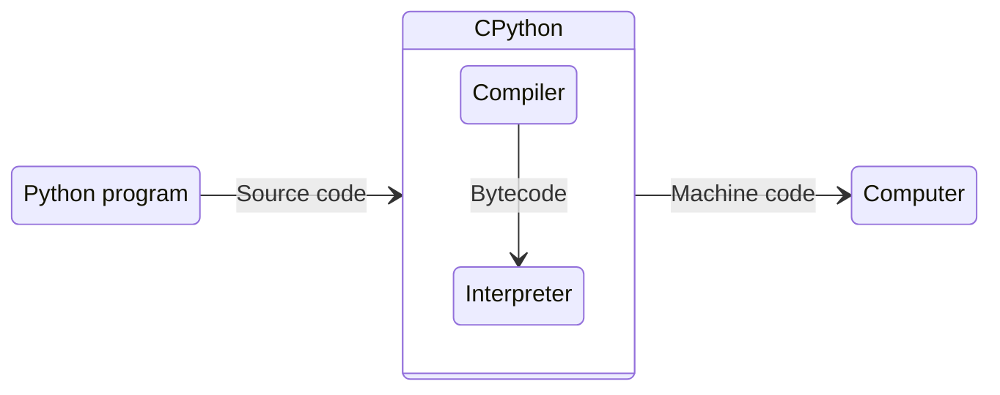

# Python: Basic stuff - Pt. 1

## Table of contents

- [1. Introduction](#1-introduction)
	- [1.1. Python](#11-python)
	- [1.2. Object-oriented programming](#12-object-oriented-programming)
	- [1.3. Static v. dynamic typing](#13-static-v-dynamic-typing)
		- [1.3.1. Statically-typed languages](#131-statically-typed-languages)
		- [1.3.2. Dynamically-typed languages](#132-dynamically-typed-languages)
	- [1.4. Compilation v. interpretation](#14-compilation-v-interpretation)
		- [1.4.1. Compilation](#141-compilation)
		- [1.4.2. Interpretation](#142-interpretation)
		- [1.4.3. Is CPython compiled or interpreted?](#143-is-cpython-compiled-or-interpreted)
	- [1.5. Interactive mode](#15-interactive-mode)
		- [1.5.1. Is CPython interactive?](#151-is-cpython-interactive)
	- [1.6. Development environment](#16-development-environment)
- [2. Types, values, and expressions](#2-types-values-and-expressions)
	- [2.1. Arithmetic operators](#21-arithmetic-operators)
	- [2.2. Types of numbers](#22-types-of-numbers)
	- [2.3. Expressions](#23-expressions)
	- [2.4. Strings](#24-strings)
	- [2.5. Values and types](#25-values-and-types)
- [3. Variables, statements, and modules](#3-variables-statements-and-modules)
	- [3.1. Variables](#31-variables)
	- [3.2. Variable names](#32-variable-names)
	- [3.3. Modules](#33-modules)
	- [3.4. Statements](#34-statements)
	- [3.5. Errors](#35-errors)
- [4. Functions](#4-functions)
	- [4.1. Arguments](#41-arguments)
	- [4.2. Function definitions](#42-function-definitions)
	- [4.3. Parameters](#43-parameters)
	- [4.4. Keyword arguments](#44-keyword-arguments)
	- [4.5. Return values](#45-return-values)
	- [4.6. Docstrings](#46-docstrings)
	- [4.7. Tracebacks](#47-tracebacks)
- [5. Conditionals](#5-conditionals)
	- [5.1. Relational operators](#51-relational-operators)
	- [5.2. Boolean expressions](#52-boolean-expressions)
	- [5.3. Logical operators](#53-logical-operators)
	- [5.4. Conditional statements](#54-conditional-statements)
	- [5.5. Chained conditionals](#55-chained-conditionals)
- [Glossary](#glossary)
- [Bibliography](#bibliography)
- [Licenses](#licenses)

## 1. Introduction

### 1.1. Python

A programming language
- Object oriented
- Dynamically typed

The **standard implementation** is [CPython](https://github.com/python/cpython), which
- Is typically classified as interpreted
- Provides an interactive mode

### 1.2. Object-oriented programming

A programming paradigm based on the concepts of objects

An object consists of
- Data in the form of fields, aka attributes
- Code in the form of procedures, aka methods

```python
class MyClass:
	def __init__(self, a):
		self.a = a # this is an attribute
		
	def f(self): # this is a method
		return self.a
```

### 1.3. Static v. dynamic typing

#### 1.3.1. Statically-typed languages

- Types are bound to variables
- Types are checked at **compile time**

```java
String s = "abcd";
```

`s` will forever be a `String`

#### 1.3.2. Dynamically-typed languages

- Types are bound to values
- Types are checked at **run time**

```python
s = "abcd"
s = 1
s = ["a", 2, "c", 4]
```

`s` was first a `str`, then an `int`, and lastly a `list`

### 1.4. Compilation v. interpretation

There is no such thing as compiled or interpreted languages
- Any programming language can be implemented either way
- Compilers and interpreters are **implementation methods**

Yes, this means that there are
- [C interpreters](https://github.com/jpoirier/picoc)
- [Python compilers](https://github.com/lcompilers/lpython) 

out there...

#### 1.4.1. Compilation

A program written in a language is translated into a program written in another language
- Source language $\rightarrow$ object language
- The compiler does this translation ($\rightarrow$)
- The translated program means the same as the original one

```shell
$ gcc hello.c   # gcc is the compiler
$ ./a.out       # a.out is the translated program
hello           # output of a.out
```

#### 1.4.2. Interpretation

The interpreter performs operations on behalf of the program being executed in order to run it
- An interpreter is just another program

```shell
$ python hello.py   # python is the interpreter
hello               # output of hello.py
```

#### 1.4.3. Is CPython compiled or interpreted?

Technically both, although typically classified as interpreted



CPython compiles the source code in bytecode and interprets it

### 1.5. Interactive mode

An interactive mode, aka read-eval-print loop (REPL)
- Takes single user prompts (read)
- Executes them (eval)
- Returns the result to the user (print)

Typically, interpreters have an interactive mode. However
- There are interpreters that are not interactive
- There are compilers that are interactive

#### 1.5.1. Is CPython interactive?

Yes

```shell
$ python            # enables interactive mode
>>> print("hello")  # read (R) and eval (E)
hello               # print (P)
>>>                 # waiting for a prompt... (L)
```

### 1.6. Development environment

| Software                                              | Version     |
| ----------------------------------------------------- | ----------- |
| [Ubuntu Desktop](https://ubuntu.com/download/desktop) | 24.04.1 LTS |
| [Python](https://www.python.org/downloads/)           | 3.13.2      |
| [VS Code](https://code.visualstudio.com/)             | last        |

[This](https://code.visualstudio.com/docs/python/python-tutorial) tutorial on how to set up Python in VS Code

## 2. Types, values, and expressions

### 2.1. Arithmetic operators

Symbols that denote an arithmetic operations

| Symbol | Meaning          |
| ------ | ---------------- |
| `+`    | Addition         |
| `-`    | Substraction     |
| `*`    | Multiplication   |
| `/`    | Division         |
| `//`   | Integer division |
| `**`   | Exponentiation   |
| `^`    | XOR              |

### 2.2. Types of numbers

A type is a category of values

| Type           | Class   | Meaning                      |
| -------------- | ------- | ---------------------------- |
| Integer        | `int`   | Numbers with no decimal part |
| Floating-point | `float` | Numbers with decimal parts   |

For example
- `+`, `-`, `*`, or  `//` integers, the result is an integer
- `/` integers, the result is a floating-point number

### 2.3. Expressions

Combinations of variables, values, and operators. Every expression has a value

Order of operations
- `**` $\rightarrow$ `*` and `/` $\rightarrow$ `+` and `-`
- Parentheses influence the order

```shell
>>> 12 + 5 * 6
42
>>> (12 + 5) * 6
102
```

### 2.4. Strings

Sequences of characters

There are only two operators that work with strings
- `+` joins two strings (concatenation)
- `*` makes multiple copies and concatenates

```shell
>>> 'Well, ' + "it's a small " + 'world.'
"Well, it's a small world."
>>> 'Spam, ' * 4
'Spam, Spam, Spam, Spam, '
```

### 2.5. Values and types

Every value has a type

| Value             | Type                  | Class   |
| ----------------- | --------------------- | ------- |
| `2`               | Integer               | `int`   |
| `42.0`            | Floating-point number | `float` |
| `"Hello, World!"` | String                | `str`   |

---

The function `type` returns the type of any value

```shell
>>> type(2)
<class 'int'>
>>> type(42.0)
<class 'float'>
>>> type("Hello, World!")
<class 'str'>
```

---

`int`, `float`, and `str` can be used as functions to convert values

```shell
>>> int(42.9)
42
>>> float(42)
42.0
>>> str(42.0)
'42.0'
```

## 3. Variables, statements, and modules

### 3.1. Variables

Names that refer to values

Assignment statements create variables. These consist of
- A variable name on the left (e.g., `n`)
- The equals operator (`=`)
- An expression on the right (e.g., `42`)

```shell
>>> n = 42
```

---

Note that
- An assignment statement has no output
- The created variable can then be used as an expression

```shell
>>> n
42
>>> n * 2
84
```

### 3.2. Variable names

What you **can** do
- As long as you like
- Letters and numbers

What you **cannot** do
- Begin with a number
- Punctuation, except for `_`
- Keywords (e.g., `class`)

---

What you **should** do (convention)
- Lower case letters
- `_` as word separator

```python
var = "hello, world"    # good
multiple_words = 42     # good
multipleWords = 84      # bad 
```

### 3.3. Modules

Collections of variables and functions (and classes)

`import` statements make available variables and functions defined in other modules
- Use such variables or functions with the dot operator (`.`)

```shell
>>> import math
>>> math.pi
3.141592653589793
>>> math.sqrt(25)
5.0
```

### 3.4. Statements

Units of code that have an effect, but no value

| Statement  | Effect                                |
| ---------- | ------------------------------------- |
| Assignment | Create a variable and give it a value |
| Import     | Import a module                       |

Evaluation v. execution
- Evaluation is to compute the value of an expression
- Execution is to run a statement

### 3.5. Errors

| Error    | About                                                       | Result                                                        |
| -------- | ----------------------------------------------------------- | ------------------------------------------------------------- |
| Syntax   | Structure of the program and the rules about that structure | Python does not even run the program                          |
| Runtime  | Exceptions that occur while the program is running          | Python displays an error message and stops the program        |
| Semantic | Meaning                                                     | The program does not what you intended, but no error messages |

---

```shell
>>> n! = 42
  File "<stdin>", line 1
    n! = 42
     ^
SyntaxError: invalid syntax
>>> '126' / 3
Traceback (most recent call last):
  File "<stdin>", line 1, in <module>
TypeError: unsupported operand type(s) for /: 'str' and 'int'
```

## 4. Functions

### 4.1. Arguments

Values provided to a function when the function is called

```shell
>>> int('101')
101
```

`int` is the function being called and `'101'` is the argument

Some functions can take any number of arguments

```shell
>>> print('Any', 'number', 'of', 'arguments')
Any number of arguments
```

### 4.2. Function definitions

A function definition specifies the name of a the function and the statements that run when the function is called

```python
def f():
	print("hello")
	print("world")
```

- `def` indicates the beginning of a function definition
- `f` is the function name (same rules as for variable names)
- `()` after `f` indicates that `f` takes no arguments

---

The first line of a function definition is the header, which must end with a colon

```python
def f():
```

The rest is the body (must be indented)

```python
	print("hello")
	print("world")
```

By convention, indentation is always 4 spaces

---

A function definition creates a function object

```shell
>>> def f():
...     print("hello")
...     print("world")
...
>>> f
<function f at 0x102fd5e40>
>>> f()
hello
world
```

### 4.3. Parameters

Variable names used inside a function to refer to the values passed as arguments

```python
def f(p):
	print(p)
```

`f` takes a single argument, whose value is assigned to `p`

Parameters and variables defined inside a function are local

### 4.4. Keyword arguments

Arguments that include the name of parameters

```shell
>>> def f(p1, p2):
...     print(p1)
...     print(p2)
...
>>> f(p2="world", p1="hello")
hello
world
```

### 4.5. Return values

Results that functions return

The `return` statement is used to return the result of a function

```python
def repeat(word, n):
	return word * n
```

If there is no `return` statement, the function returns `None`

```python
def repeat(word, n):
	print(word * n)
```

### 4.6. Docstrings

Strings at the beginning of functions that explain interfaces

By convention, docstrings are triple-quoted strings

A docstring should:
- Explain concisely what the function does (not how it works)
- Explain the effect of parameters on the behavior of the function
- Indicate parameter types (if not obvious)

---

```python
def add(num1, num2):
    """
    Add up two numbers

    num1 : first number to add
    num2 : second number to add
    """
    return num1 + num2
```

### 4.7. Tracebacks

List of functions that are executing, printed when an exception occurs

When a runtime error occurs, Python displays
- The name of the function that was running
- The name of the function that called it
- And so on...

---

```shell
>>> def f1():
...     print(p)
...
>>> def f2():
...     f1()
...
>>> f2()
Traceback (most recent call last):
  File "<stdin>", line 1, in <module>
  File "<stdin>", line 2, in f2
  File "<stdin>", line 2, in f1
NameError: name 'p' is not defined
```

## 5. Conditionals

### 5.1. Relational operators

Operators that compare their operands

| Symbol | Meaning             |
| ------ | ------------------- |
| `==`   | Equal to            |
| `!=`   | Not equal to        |
| `>`    | Greater than        |
| `<`    | Less than           |
| `>=`   | Greater or equal to |
| `<=`   | Less or equal to    |

### 5.2. Boolean expressions

Expressions whose values are either `True`or `False`

```shell
>>> 5 == 5
True
```

`True`and `False` are of type `bool` (not `str`)

### 5.3. Logical operators

Operators that combine boolean expressions

| Operation | Result                                       |
| --------- | -------------------------------------------- |
| `x or y`  | If `x` is `True`, then `x`, else `y`         |
| `x and y` | If `x` is `False`, then `x`, else `y`        |
| `not x`   | If `x` is `False`, then `True`, else `False` |

---

Boolean operations always return
- `0` or `False` for false
- `1` or `True` for true

`or` and `and` always return one of their operands

```shell
>>> 42 and True
True
>>> 1 and True
1
>>> True and 1
True
```

### 5.4. Conditional statements

Statements that control the execution flow depending on some condition

```python
if x > 0:
	print('x is positive')
```

`if` statements have same structure as function definitions
- `if x > 0:` is the header
	- `print('x is positive')` is a block

If the condition (`x > 0`) is true, then run the block

---

An `if`statement can have an `else` clause

```python
if x % 2 == 0:
    print('x is even')
else:
    print('x is odd')
```

The condition must be true or false, exactly one branch will run

### 5.5. Chained conditionals

Conditional statements with a series of alternative branches

```python
if x < y:
    print('x is less than y')
elif x > y:
    print('x is greater than y')
else:
    print('x and y are equal')
```

---

There is no limit on the number of `elif` clauses

If there is an `else` clause, it must be at the end

Conditions are checked in order
- If more than one condition is true, only the first true branch runs

## Glossary

| Term                        | Meaning                                                                                                                                   |
| --------------------------- | ----------------------------------------------------------------------------------------------------------------------------------------- |
| Argument                    | A value provided to a function when the function is called                                                                                |
| Arithmetic operator         | A symbol that denotes an arithmetic operation                                                                                             |
| Assignment statement        | A statement that assigns a value to a variable                                                                                            |
| Block                       | One or more statements indented to indicate they are part of another statement                                                            |
| Boolean expression          | An expression whose value is either `True` or `False`                                                                                     |
| Branch                      | One of the alternative sequences of statements in a conditional statement                                                                 |
| Bytecode                    | A set of instructions designed for efficient execution by an interpreter                                                                  |
| Chained conditionals        | A conditional statement with a series of alternative branches                                                                             |
| Compilation                 | A program written in a language is translated into a program written in another language                                                  |
| Compiler                    | A program that translates one language (source language) into another (object language)                                                   |
| Concatenation               | Joining two strings end-to-end                                                                                                            |
| Condition                   | The boolean expression in a conditional statement that determines which branch runs                                                       |
| Conditional statement       | A statement that controls the flow of execution depending on some condition                                                               |
| Docstring                   | A string at the beginning of a function that explains the interface                                                                       |
| Dot operator                | The operator used to access a variable or a function defined in another module                                                            |
| Dynamically-typed language  | A programming language where types are bound to values and checked at run time                                                            |
| Evaluation                  | Performing the operations in an expression in order to compute a value                                                                    |
| Exception                   | An error that is detected while the program is running                                                                                    |
| Execution                   | Running a statement                                                                                                                       |
| Expression                  | A combination of variables, values, and operators. An expression has a value                                                              |
| Floating-point              | Numbers with decimal parts                                                                                                                |
| Function                    | A named sequence of statements that performs some operation. A function may or may not take arguments and may or may not produce a result |
| Function body               | The sequence of statements inside a function definition                                                                                   |
| Function definition         | A statement that creates a function                                                                                                       |
| Function header             | The first line of a function definition                                                                                                   |
| Function object             | A value created by a function definition. The function name is a variable that refers to a function object                                |
| Import statement            | A statement that reads a module file and makes available the variables and functions it contains                                          |
| Integer                     | Numbers with no decimal part                                                                                                              |
| Interpretation              | The interpreter performs operations on behalf of the program being executed in order to run it                                            |
| Interpreter                 | A program that directly executes instructions written in a programming language without requiring compilation                             |
| Keyword                     | A special word used to specify the structure of a program                                                                                 |
| Keyword argument            | An argument that includes the name of the parameter                                                                                       |
| Local variable              | A variable defined inside a function and that can only be accessed inside that function                                                   |
| Logical operator            | An operator that combines boolean expressions                                                                                             |
| Module                      | A collection of variables, functions, and classes                                                                                         |
| Object                      | A data structure consisting of attributes and methods                                                                                     |
| Object-oriented programming | A programming paradigm based on the concepts of objects                                                                                   |
| Operand                     | One of the values on which an operator operates                                                                                           |
| Parameter                   | A variable name used inside a function to refer to the value passed as an argument                                                        |
| Relational operator         | An operator that compare its operands                                                                                                     |
| Return value                | The result of a function                                                                                                                  |
| Runtime error               | An error that causes a program to display an error message and exit                                                                       |
| Semantic error              | An error that causes a program not to do what the programmer intended (no error messages displayed)                                       |
| Statement                   | A unit of code that has an effect, but no value                                                                                           |
| Statically-typed language   | A programming language where types are bound to variables and checked at compile time                                                     |
| String                      | A sequence of characters                                                                                                                  |
| Syntax error                | An error that refers to the structure of a program and the rules about that structure                                                     |
| Tracebacks                  | A list of the functions that are executing, printed when an exception occurs                                                              |
| Type                        | A category of values                                                                                                                      |
| Variable                    | A name that refer to a value                                                                                                              |

## Bibliography

| Author     | Title                                                      | Year |
| ---------- | ---------------------------------------------------------- | ---- |
| Downey, A. | [Think Python](https://allendowney.github.io/ThinkPython/) | 2024 |

## Licenses

| Content | License                                                                                                                       |
| ------- | ----------------------------------------------------------------------------------------------------------------------------- |
| Code    | [MIT License](https://mit-license.org/)                                                                                       |
| Text    | [Creative Commons Attribution-NonCommercial-ShareAlike 4.0 International](https://creativecommons.org/licenses/by-nc-sa/4.0/) |
