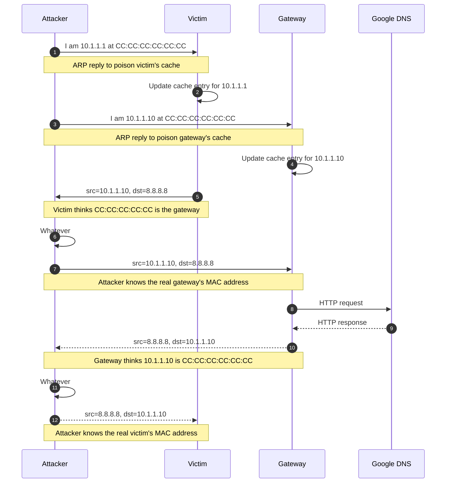
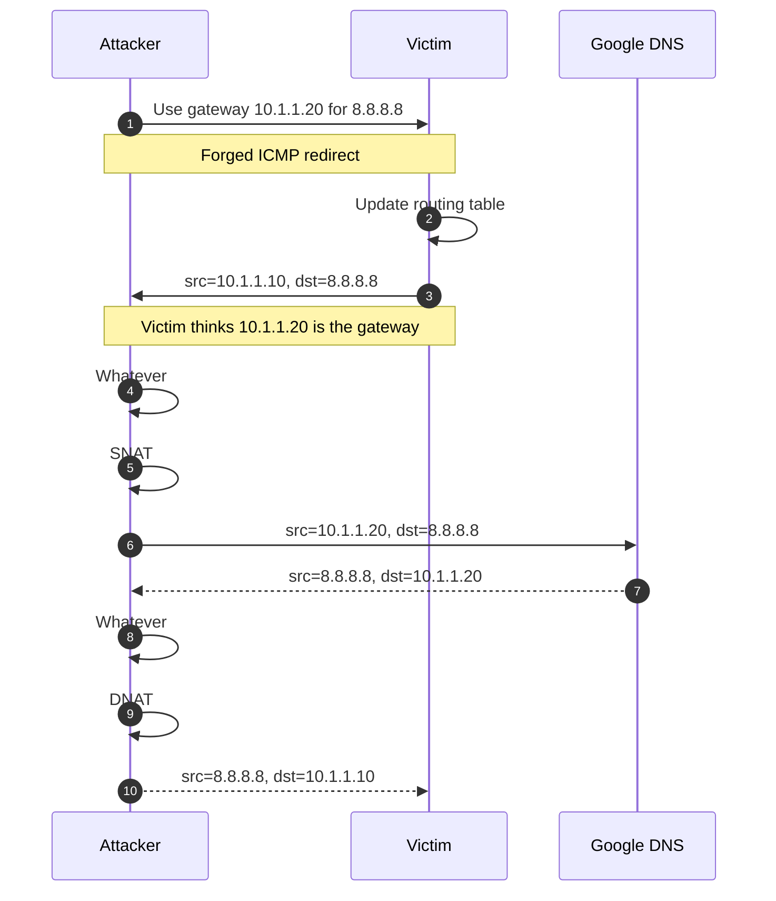
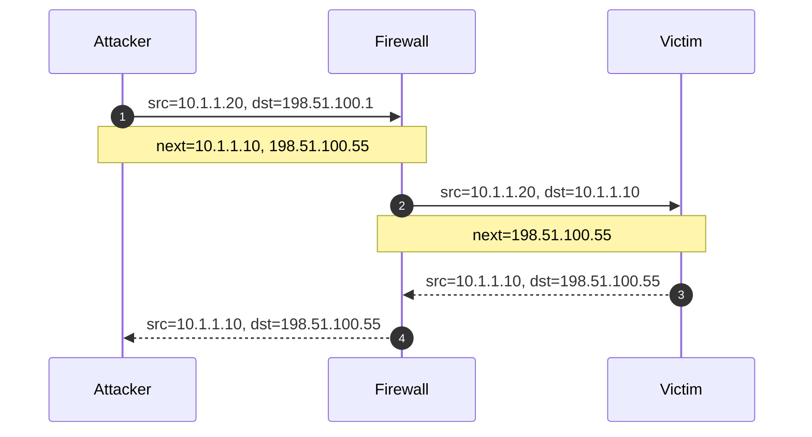

# Networking

## Table of contents

- [1. Standards and documentation](#1-standards-and-documentation)
- [2. Basics](#2-basics)
    - [2.1. Layering model](#21-layering-model)
    - [2.2. Packet encapsulation](#22-packet-encapsulation)
    - [2.3. Packet addressing](#23-packet-addressing)
    - [2.4. IPv4 address classes](#24-ipv4-address-classes)
    - [2.5. Private IPv4 addresses](#25-private-ipv4-addresses)
    - [2.6. Routing](#26-routing)
- [3. Security issues](#3-security-issues)
    - [3.1. ARP spoofing](#31-arp-spoofing)
    - [3.2. ICMP redirects](#32-icmp-redirects)
    - [3.3. IP forwarding](#33-ip-forwarding)
    - [3.4. IP spoofing](#34-ip-spoofing)
    - [3.5. Source routing](#35-source-routing)
    - [3.6. Broadcast pings](#36-broadcast-pings)
- [4. Network troubleshooting](#4-network-troubleshooting)
    - [4.1. Checking if a host is alive](#41-checking-if-a-host-is-alive)
    - [4.2. Tracing IP packets](#42-tracing-ip-packets)
    - [4.3. Sniffing packets](#43-sniffing-packets)
    - [4.4. Tracking network performance](#44-tracking-network-performance)
- [Glossary](#glossary)
- [Bibliography](#bibliography)
- [Licenses](#licenses)

## 1. Standards and documentation

The technical activities of the Internet community are summarized in documents known as RFCs. In addition to standardizing the Internet protocols, RFCs sometimes just document or explain aspects of existing practice. RFCs
- Are numbered sequentially (more than 9000 today)
- Have also descriptive titles
- Once distributed, the contents are never changed. Updates are distributed as new RFCs with their own reference number

RFCs are authoritative, concise, and [free](https://www.rfc-editor.org/)

---

In addition to a reference number, an RFC can also be assigned an FYI number, a BCP number, or an STD number

| Type | Meaning                                                                                     | Objective                                                     |
| ---- | ------------------------------------------------------------------------------------------- | ------------------------------------------------------------- |
| FYI  | An introductory or informational document intended for a broad audience                     | Good place to start research on an unfamiliar topic           |
| BCP  | A document that contains recommended procedure for Internet sites                           | The most valuable type of documents for system administrators |
| STD  | A document that describes an Internet protocol that has been formally adopted as a standard | Best place to understand how a protocol works                 |

## 2. Basics

### 2.1. Layering model

| Layer       | Protocol | Description                                                                 | RFC                                                                                                                                                                                                                                                                                 |
| ----------- | -------- | --------------------------------------------------------------------------- | ----------------------------------------------------------------------------------------------------------------------------------------------------------------------------------------------------------------------------------------------------------------------------------- |
| Application | HTTP     | Transfer web content over the Internet                                      | [1945](https://www.rfc-editor.org/rfc/rfc1945),<br>[9112](https://www.rfc-editor.org/rfc/rfc9112),<br>[9113](https://www.rfc-editor.org/rfc/rfc9113),<br>[9114](https://www.rfc-editor.org/rfc/rfc9114)                                                                             |
| Application | SSH      | Provide secure remote login and command execution over an encrypted channel | [4250](https://www.rfc-editor.org/rfc/rfc4250.html),<br>[4251](https://www.rfc-editor.org/rfc/rfc4251.html),<br>[4252](https://www.rfc-editor.org/rfc/rfc4252.html),<br>[4253](https://www.rfc-editor.org/rfc/rfc4253.html),<br>[4254](https://www.rfc-editor.org/rfc/rfc4254.html) |
| Application | DNS      | Translate human-readable domain names into IP addresses                     | [1034](https://www.rfc-editor.org/rfc/rfc1034.html), [1035](https://www.rfc-editor.org/rfc/rfc1035.html)                                                                                                                                                                            |

---

| Layer     | Protocol | Description                                                                                       | RFC                                                                                                                                                                                            |
| --------- | -------- | ------------------------------------------------------------------------------------------------- | ---------------------------------------------------------------------------------------------------------------------------------------------------------------------------------------------- |
| Transport | QUIC     | Provide secure, multiplexed communication over UDP                                                | [8999](https://www.rfc-editor.org/rfc/rfc8999), [9000](https://www.rfc-editor.org/rfc/rfc9000), [9001](https://www.rfc-editor.org/rfc/rfc9001), [9002](https://www.rfc-editor.org/rfc/rfc9002) |
| Transport | TCP      | Provide reliable, full-duplex, error-corrected communication                                      | [9293](https://www.rfc-editor.org/rfc/rfc9293)                                                                                                                                                 |
| Transport | UDP      | Provide connectionless communication with no guarantee of delivery, ordering, or error correction | [768](https://www.rfc-editor.org/rfc/rfc768.html)                                                                                                                                              |

---

| Layer   | Protocol | Description                                                                                    | RFC                                                                                                       |
| ------- | -------- | ---------------------------------------------------------------------------------------------- | --------------------------------------------------------------------------------------------------------- |
| Network | IP       | Route packets from one host to another. There are two versions of IP, i.e., IPv4 and IPv6      | [791](https://www.rfc-editor.org/rfc/rfc791.html),<br>[8200](https://www.rfc-editor.org/rfc/rfc8200.html) |
| Network | ICMP     | Provide low-level support for IP, e.g., error messages, routing assistance, and debugging help | [792](https://www.rfc-editor.org/rfc/rfc792.html)                                                         |
| Link    | ARP      | Translate IP addresses to MAC addresses                                                        | [826](https://www.rfc-editor.org/rfc/rfc826)                                                              |

### 2.2. Packet encapsulation

Data travels on a network in the form of packets. Each  consists of
- Header: where the packet comes from and where it is going. A header may also include other information, such as checksums, protocol-specific information, or handling instructions
- Payload: the data to be transferred

As a packet travels down the protocol stack, each protocol adds its own header. The packet generated by a protocol becomes the payload of the next one. On the receiver, the encapsulation is reversed as the packet travels backup the protocol stack

---

Consider an application that transmits data over UDP. Application data becomes the payload of the UDP packet. UDP adds its own header information, i.e., source port, destination port, length, and checksum

Then, the UDP packet becomes the payload of the IP packet. IP adds its own header information, e.g., source IP address and destination IP address

Finally, the IP packet becomes the payload of the Ethernet packet. The Ethernet protocol adds its own header information, e.g., source MAC address and destination MAC address

### 2.3. Packet addressing

| Addressing | Subject                                                                                                                                                                                      |
| ---------- | -------------------------------------------------------------------------------------------------------------------------------------------------------------------------------------------- |
| MAC        | For use by hardware. A NIC typically has one MAC address, which is assigned at the time of manufacture                                                                                       |
| IP         | For use by software. IP addresses are hardware independent. Within any particular network context, an IP address identifies a NIC (not a computer)                                           |
| Hostname   | For use by people. Hostnames are really just a convenient shorthand for IP addresses. As such, they refer to NICs rather than computers                                                      |
| Port       | Valid ports are in the range 1 - 65535. A port identifies a process running on a computer. UNIX systems restrict programs from binding to port numbers under 1024, unless they run as `root` |

### 2.4. IPv4 address classes

In IPv4, addresses are 4 bytes long and the boundary between network and host portions is set administratively. IPv4 addresses are written as decimal numbers, one for each byte, separated by periods

For example, `209.85.171.147` is an IPv4 address
- The leftmost byte is the most significant and is always part of the network portion
- When `127` is the first byte of an IPv4 address, it denotes the loopback network—a fictitious network that has no real hardware interface and only one host

---

| Class | 1st byte      | Implicit netmask        | Use case               |
| ----- | ------------- | ----------------------- | ---------------------- |
| A     | `0` - `127`   | `255.0.0.0` (`/8`)      | Large networks         |
| B     | `128` - `191` | `255.255.0.0` (`/16`)   | Medium networks        |
| C     | `192` - `223` | `255.255.255.0` (`/24`) | Small networks         |
| D     | `224` - `239` | n/a                     | Multicasting           |
| E     | `240` - `255` | n/a                     | Experimental addresses |

---

However
- `0.0.0.0/8` is reserved for special use
- `127.0.0.0/8` is reserved for loopback (localhost)

Part of the host portion can be reassigned to the network portion by specifying an explicit 4-byte (32 bit) netmask, where the `1`s correspond to the desired network portion and the `0`s correspond to the host portion
- The `1`s must be leftmost and contiguous
- At least 8 bits must be allocated for the network portion
- At least 2 bits must be allocated for the host portion

---

For example, consider a class B network. These networks
- Start with `128` - `191` (first byte)
- Have the `255.255.0.0` (`/16`) implicit netmask 

An explicit netmask of `/24` turns a single class B network address into 256 distinct networks. Each network can support 256 host addresses, which can accommodate 254 actual hosts
- The all-`0` host address is the network address
- The all-`1` host address is the broadcast address

---

Tricks to do the math
1. The number of hosts per network and the value of the last byte in the netmask always add up to 256
2. The last byte of a network address must be evenly divisible by the number of hosts per network

Consider `128.138.243.0/26`. The address starts with `128`, so it would be a class B address (`/16`) if no explicit netmask (`/26`) were specified. Each network can support $2^{32 - 26} = 2^6 = 64$ hosts. 
1. This means that the last netmask byte is $256 - 64 = 192$ 
2. $\dfrac{256}{64} = 4$ is the number of networks. The last byte of each network address must be evenly divisible by the number of hosts, i.e., 64, so 0, 64, 128, and 192

---

Therefore, `128.138.243.0/26` turns a class B network address into four networks, each of which support up to 62 actual hosts

| Network address   | Host addresses          | Broadcast address |
| ----------------- | ----------------------- | ----------------- |
| `128.138.243.0`   | `128.138.243.1 - 62`    | `128.138.243.63`  |
| `128.138.243.64`  | `128.138.243.65 - 126`  | `128.138.243.127` |
| `128.138.243.128` | `128.138.243.129 - 190` | `128.138.243.191` |
| `128.138.243.192` | `128.138.243.193 - 254` | `128.138.243.255` |

---

The `ipcalc` command displays almost everything one might need to know about an address. However, this command is not installed by default but it is available in the standard repository

To install `ipcalc`

```shell
$ sudo apt update
$ sudo apt install ipcalc
```

---

Once installed, use it as any other command

```shell
$ ipcalc 128.138.243.100/26
Address: 128.138.243.100      10000000.10001010.11110011.01 100100
Netmask: 255.255.255.192 = 26 11111111.11111111.11111111.11 000000
Wildcard:  0.0.0.63           00000000.00000000.00000000.00 111111
=>
Network: 128.138.243.64/26    10000000.10001010.11110011.01 000000
HostMin: 128.138.243.65       10000000.10001010.11110011.01 000001
HostMax: 128.138.243.126      10000000.10001010.11110011.01 111110
Broadcast: 128.138.243.127    10000000.10001010.11110011.01 111111
Hosts/Net: 62                 Class B 
```

### 2.5. Private IPv4 addresses

Some IPv4 addresses are reserved for private use (see [RFC1918](https://www.rfc-editor.org/rfc/rfc1918.txt)). This means that these addresses will never be globally allocated and can be used internally by any site

| IP class | From          | To                | CIDR range       |
| -------- | ------------- | ----------------- | ---------------- |
| A        | `10.0.0.0`    | `10.255.255.255`  | `10.0.0.0/8`     |
| B        | `172.16.0.0`  | `172.31.255.255`  | `172.16.0.0/12`  |
| C        | `192.168.0.0` | `192.168.255.255` | `192.168.0.0/16` |

---

The site's border router runs a system called NAT to allow the hosts that use private IPv4 addresses to talk to the Internet

NAT intercepts packets addressed with these private IPv4 addresses and rewrites their source addresses, using a public IPv4 address and perhaps a different source port number

NAT also maintains a table of the mappings between private and public address/port pairs, so that the translation can be performed in reverse when answering packets arrive from the Internet

---

Consider a site that has a single public IPv4 address, say `203.0.113.5`, and suppose an outbound packet arrives at the site's border router from `192.168.1.10:12345`
1. The site's border router must change (at least) the source address, otherwise the recipient won't be able to reply (`192.168.1.10` is a private address). This is where NAT comes into play. For example, `192.168.1.10:12345` $\rightarrow$ `203.0.113.5:55231`
2. The recipient will reply back to `203.0.113.5:55231`, which is the public IPv4 address of the site's border router that, in turn, will perform the reverse translation, i.e., `203.0.113.5:55231` $\rightarrow$  `192.168.1.10:12345` 

### 2.6. Routing

Routing is the process of directing a packet through the networks that stand between its source and its destination

Routing is similar to asking for directions in an unfamiliar city (with no Internet connection). The first person you talk to might point you toward the right city. The next person might be able to tell you how to get to the right street. Eventually, you get close enough that someone can identify the building you are looking for

Routing information takes the form of rules (technically speaking, routes), such as "to reach network A, send packet through host B." There can also be a default route that tells what to do with packets bound for a network to which no explicit route exists

---

Routing information is stored in a table in the kernel. Each table entry has several parameters, including a mask for each listed network

To route a packet to a particular address 
- The kernel picks the most specific of the matching routes, i.e., the one with the longest mask
- If the kernel finds no relevant route and no default route, then it returns a network unreachable ICMP error to the sender

---

The `ip route` command shows the routing table

```shell
$ ip route
default via 10.16.0.1 dev ens3 proto dhcp src 10.16.11.162 metric 100
10.16.11.0/24 dev ens3 proto kernel scope link src 10.16.11.162 metric 100
10.16.0.1 dev ens3 proto dhcp scope link src 10.16.11.162 metric 100

[...]
```

---

| Field              | Meaning                                                                                |
| ------------------ | -------------------------------------------------------------------------------------- |
| `default`          | Any destination that doesn’t match more specifically                                   |
| `via 10.16.0.1`    | Next hop                                                                               |
| `dev ens3`         | `ens3` is the network interface used to send out the packet                            |
| `proto dhcp`       | The DHCP configured this route                                                         |
| `src 10.16.11.162` | Source address the kernel will prefer when it creates packets that leave on this route |
| `metric 100`       | Administrative preference. Lower wins if several default routes exist                  |

---

| FIeld              | Meaning                                                                                                     |
| ------------------ | ----------------------------------------------------------------------------------------------------------- |
| `10.16.11.0/24`    | All addresses whose first 24 bits are `10.16.11`, which means addresses from `10.16.11.0` to `10.16.11.255` |
| `dev ens3`         | `ens3` is the network interface used to send out the packet                                                 |
| `proto kernel`     | The kernel automatically generated this route                                                               |
| `scope link`       | Destinations are reachable without going through a gateway                                                  |
| `src 10.16.11.162` | Source address the kernel will prefer when it creates packets that leave on this route                      |
| `metric 100`       | Administrative preference. Lower wins if several default routes exist                                       |

---

The last rule (`10.16.0.1 dev ens3 proto dhcp scope link src 10.16.11.162 metric 100`) is mandatory because the gateway (`10.16.0.1`) lives outside the `10.16.11.0/24` network

Without this rule, the kernel would not ARP for `10.16.0.1`. Therefore, every packet that tried to go `via 10.16.0.1` would be dropped with a “network is unreachable” error

---

The command `ip neigh` shows ARP cache entries

```shell
$ ip neigh
10.16.0.1 dev ens3 lladdr 00:50:56:9d:68:fa REACHABLE

[...]
```

| Field                      | Meaning           |
| -------------------------- | ----------------- |
| `10.16.0.1`                | IP address        |
| `dev ens3`                 | Network interface |
| `lladdr 00:50:56:9d:68:fa` | MAC address       |
| `REACHABLE`                | State             |

## 3. Security issues

### 3.1. ARP spoofing

When an IP packet is sent from one computer to another, the destination IP address must be resolved to a MAC address

This is where ARP comes into play
1. When someone (say, `10.1.1.10`) does not know the MAC address of the destination IP (say, `10.1.1.1`) broadcasts an ARP request to the local network. For example, `Who has 10.1.1.1?  Tell 10.1.1.10` 
2. `10.1.1.1` says its own MAC address in an ARP reply 
3. Upon receiving the ARP reply , `10.1.1.10` updates its cache of known neighbors (`ip neigh` shows these entries)

---

However
- ARP is a stateless protocol $\rightarrow$ ARP replies are automatically cached regardless whether they actually follow any ARP request 
- There is no authentication in ARP

Therefore, anyone can send an unsolicited ARP reply that rewrites a victim’s cache with false information

Typically, the attacker's goal is to associate the attacker's MAC address with the IP address of another host, such as the default gateway, causing any traffic meant for that IP address to be sent to the attacker instead

---

The attacker's goal is to intercept the communication between a victim and the gateway (i.e., a MITM attack)

| Address              | Value               |
| -------------------- | ------------------- |
| Victim MAC address   | `AA:AA:AA:AA:AA:AA` |
| Victim IP address    | `10.1.1.10`         |
| Gateway MAC address  | `BB:BB:BB:BB:BB:BB` |
| Gateway IP address   | `10.1.1.1`          |
| Attacker MAC address | `CC:CC:CC:CC:CC:CC` |
| Google DNS           | `8.8.8.8`           |

---



### 3.2. ICMP redirects

An ICMP redirect is a control message sent by an IPv4 router to a host when the router successfully forwards one of the host’s packets but notices that there is a better first-hop for that destination on the same link

When that happens
1. The router notifies the sender by sending an ICMP redirect message, which says "you should not be sending packets for host `xxx` to me, you should send them to host `yyy` instead"
2. The sender adjusts its routing table accordingly to fix the issue

However, ICMP redirects contain no authentication information

---

The attacker's goal is to intercept the communication between a victim and the gateway (i.e., a MITM attack)

| Address             | Value       |
| ------------------- | ----------- |
| Gateway IP address  | `10.1.1.1`  |
| Victim IP address   | `10.1.1.10` |
| Attacker IP address | `10.1.1.20` |
| Google DNS          | `8.8.8.8`   |

---



---

By default, Linux accepts ICMP redirects

```shell
$ grep -H . /proc/sys/net/ipv4/conf/*/accept_redirects
/proc/sys/net/ipv4/conf/all/accept_redirects:1
/proc/sys/net/ipv4/conf/default/accept_redirects:1
/proc/sys/net/ipv4/conf/ens3/accept_redirects:1
/proc/sys/net/ipv4/conf/lo/accept_redirects:1
```

- `all`: every network interface accepts ICMP redirects
- `default`: the default choice when configuring a new network interface is to accept ICMP redirects
- `ens3`: the `ens3` network interface accepts ICMP redirects
- `lo`: the `lo` loopback interface accepts ICMP redirects

---

However, Linux accepts ICMP redirects if and only if they come from a host in the default gateway list (`secure_redirects`)

```shell
$ grep -H . /proc/sys/net/ipv4/conf/*/secure_redirects
/proc/sys/net/ipv4/conf/all/secure_redirects:1
/proc/sys/net/ipv4/conf/default/secure_redirects:1
/proc/sys/net/ipv4/conf/ens3/secure_redirects:1
/proc/sys/net/ipv4/conf/lo/secure_redirects:1
```

Therefore, configure routers (and hosts acting as routers, see [§3.3](#33-ip-forwarding)) to ignore (perhaps except those coming from a default gateway) and log ICMP redirects

---

Drop a file in `/etc/sysctl.d` to configure how the system reacts on ICMP redirects, say `99-icmp-redirects.conf`:

```shell
net.ipv4.conf.all.accept_redirects      = 0
net.ipv4.conf.default.accept_redirects  = 0
net.ipv4.conf.all.secure_redirects      = 0
net.ipv4.conf.default.secure_redirects  = 0
net.ipv4.conf.all.send_redirects        = 0
net.ipv4.conf.default.send_redirects    = 0
```

The system will not accept ICMP redirects (`accept_redirects=0`), even if sent from a default gateway (`secure_redirects=0`), and will not send ICMP redirects (`send_redirects=0`) anymore

---

Run (or reboot the system) to apply `99-icmp-redirects.conf`  

```shell
$ sudo sysctl --system 

[...]

* Applying /etc/sysctl.d/99-icmp-redirects.conf 

[...]

net.ipv4.conf.all.accept_redirects = 0
net.ipv4.conf.default.accept_redirects = 0
net.ipv4.conf.all.secure_redirects = 0
net.ipv4.conf.default.secure_redirects = 0
net.ipv4.conf.all.send_redirects = 0
net.ipv4.conf.default.send_redirects = 0
```

### 3.3. IP forwarding

A host that has IP forwarding enabled can act as a router. This means that it can accept third party packets on one network interface, match them to a gateway or destination host on another network interface, and retransmits the packets

By default, IP forwarding is disabled on Linux

```shell
$ cat /proc/sys/net/ipv4/ip_forward
0
```

Add a drop-in file in `/etc/sysctl.d` to enable (`net.ipv4.ip_forward=1`) or disable (`net.ipv4.ip_forward=0`) IP forwarding, and make the kernel reload configuration files (`sysctl --system`)

---

Hosts that forward packets can sometimes be coerced into compromising security by making external packets appear to have come from inside the network, thus evading network scanners and packet filters

ARP spoofing (see [§3.1](#31-arp-spoofing)) and ICMP redirects (see [§3.2](#32-icmp-redirects)) can be used to steer traffic toward a host with IP forwarding enabled rather than the legitimate gateway

Unless your system is actually supposed to function as a router, it is best to turn IP forwarding off. It is perfectly acceptable for a host to have network interfaces on multiple subnets and to use them for its own traffic without forwarding third party packets

### 3.4. IP spoofing

The source address on an IP packet is normally filled in by the kernel's TCP/IP implementation and the IP address of the host from which the packet was sent. However, if the software that creates the packet uses a raw socket (`SOCK_RAW`), it can fill in any source address it likes

Best practices
- Block outgoing packets whose source address is not within your address space
- Protect against attackers forging the source address on external packets to fool your firewall into thinking that they originated on your internal network (see [§3.5](#35-source-routing)). In this regard, a heuristic that helps is uRPF

---

By default, uRPF is loosely (`2`) enabled on Linux

```shell
$ grep -H . /proc/sys/net/ipv4/conf/*/rp_filter
/proc/sys/net/ipv4/conf/all/rp_filter:2
/proc/sys/net/ipv4/conf/default/rp_filter:2
/proc/sys/net/ipv4/conf/ens3/rp_filter:2
/proc/sys/net/ipv4/conf/lo/rp_filter:0
```


Loose mode means that a packet is accepted if the source IP address is reachable via any interface in the routing table, regardless of the one it came in on

### 3.5. Source routing

IPv4 source routing provides a mechanism to specify an explicit series of gateways for a packet to transit on the way to its destination. This feature, part of the original IP specification, was intended primarily to facilitate testing

Source routing bypasses the next-hop routing algorithm that runs at each gateway to determine how a packet should be forwarded. Someone could cleverly route a packet to make it appear to have originated within your network instead of the Internet, thus slipping through the firewall

---

The attacker's goal is to deliver a packet to `10.1.1.10` that appears to have originated from the internal subnet `10.1.1.0/24`

| Address                      | Value           |
| ---------------------------- | --------------- |
| Victim IP address            | `10.1.1.10`     |
| Spoofed attacker IP address  | `10.1.1.20`     |
| Real attacker IP address     | `198.51.100.55` |
| External firewall IP address | `198.51.100.1`  |

---



---

Most systems drop source-routed packets by default. When the option is mistakenly allowed, some systems follow the route while others ignore it, so an attacker can’t count on receiving a reply

```shell
$ grep -H . /proc/sys/net/ipv4/conf/*/accept_source_route
/proc/sys/net/ipv4/conf/all/accept_source_route:0
/proc/sys/net/ipv4/conf/default/accept_source_route:1
/proc/sys/net/ipv4/conf/ens3/accept_source_route:1
/proc/sys/net/ipv4/conf/lo/accept_source_route:1
```

The recommendation is to neither accept nor forward (see [§3.3](#33-ip-forwarding)) source-routed packets

Add a drop-in file in `/etc/sysctl.d` to accept (`net.ipv4.conf.*.accept_source_route=1`) or block (`net.ipv4.conf.*.accept_source_route=0`) source-routed packets, and make the kernel reload configuration files (`sysctl --system`)


### 3.6. Broadcast pings

ICMP pings addressed to a network's broadcast address (instead of a particular host address) are typically delivered to every host on the network. Such packets, in combination with a spoofed IP address (see [§3.4](#34-ip-spoofing)) have been used for DDoS attacks, such as the smurf attack

By default, broadcast pings are ignored on Linux

```shell
$ cat /proc/sys/net/ipv4/icmp_echo_ignore_broadcasts
1
```

## 4. Network troubleshooting

### 4.1. Checking if a host is alive

The `ping` command sends an ICMP echo request to a target host and waits to see if the host answers back

```shell
$ ping www.google.com
PING www.google.com (142.251.209.4) [...]
64 bytes from [...] (142.251.209.4): icmp_seq=1 ttl=117 time=7.77 ms
64 bytes from [...] (142.251.209.4): icmp_seq=2 ttl=117 time=8.15 ms
64 bytes from [...] (142.251.209.4): icmp_seq=3 ttl=117 time=7.92 ms
64 bytes from [...] (142.251.209.4): icmp_seq=4 ttl=117 time=8.19 ms
64 bytes from [...] (142.251.209.4): icmp_seq=5 ttl=117 time=7.82 ms
^C
--- www.google.com ping statistics ---
5 packets transmitted, 5 received, 0% packet loss, time 4005ms
rtt min/avg/max/mdev = 7.773/7.969/8.186/0.169 ms
```

---

Use `ping` to check the status of individual hosts and to test segments of the network. Note that routing tables, physical networks, and gateways are all involved in processing an ICMP echo request message. Therefore, the network must be more or less working for `ping` to succeed. If `ping` does not work, you can be pretty sure nothing more sophisticated will work either

If your network is in a bad shape, chances are that DNS is not working. Use the numeric IP addresses when pinging, with the `-n` option to prevent reverse lookup on IP addresses, which also triggers DNS requests

---

Remember that
- Some networks block ICMP echo requests with a firewall
- It is hard to distinguish the failure of a network from the failure of a server. A failed ICMP echo requests just tells you that something is wrong
- A successful `ping` just tell you that the target host is powered on (ICMP echo requests are handled by the kernel within the IP protocol stack)

---

The `ping` command can send ICMP echo requests of any size. Use the `-s` option to set the size of the ICMP echo requests

If the size is larger than the MTU of the network (1500 bytes for Ethernet), you can force IP fragmentation

In 1998, the so-called ping of death attack crashed a large number of UNIX and Windows systems. This attack was launched simply by transmission of an overly large ICMP echo request packet. When the fragmented packet was reassembled, it filled the receiver's memory buffer and crashed the system

### 4.2. Tracing IP packets

The `traceroute` command shows the sequence of gateways through which an IP packet travels to reach its destination

Specifically, `traceroute` works by setting the TTL field of an outbound packet to an artificially low number. When a gateway decreases the TTL to 0, it discards the packet and sends an ICMP time exceed message back to the originating host

---

```shell
$ traceroute 8.8.8.8
traceroute to 8.8.8.8 (8.8.8.8), 30 hops max, 60 byte packets
 1  r16.endif.man (10.16.0.1)  0.498 ms  0.449 ms  0.465 ms
 2  gw-fe.unife.it (192.167.209.1)  1.369 ms  1.659 ms  1.946 ms

[...]

 9  dns.google (8.8.8.8)  7.622 ms  7.617 ms  7.582 ms
```

---

The first packets have TTL set to 1

The first gateway to see them determines that the TTL has been exceeded and sends back an ICMP error message. The sender's IP address (`10.16.0.1`) in the header of that message identifies the gateway 

Then, `traceroute` looks up this address in DNS to find the gateway's hostname (`r16.endif.man`)

---

To identify the second-hop gateway, `traceroute` sends out a second round of packets with TTL set to 2

The first gateway routes the packets and decreases their TTL by 1. At the second gateway (`gw-fe.unife.it`), the packets are then dropped and an ICMP error message is generated as before 

This process continues until the TTL is equal to the number of hops to the destination host and the packets reach their destination successfully

### 4.3. Sniffing packets

A packet sniffer is a tool that listens to network traffic and records or prints packets that meet criteria of your choice. It is a good idea to take an occasional sniff of your network to make sure the traffic is in order

Note that packet addresses 
- Are normally checked in hardware
- Only broadcast, multicast packets and those addresses to the local host are eventually relayed to the kernel

---

However, packet sniffers need to be able to intercept traffic that the local computer would not normally receive, so the underlying network hardware must allow access to every packet

In promiscuous mode, a network interface lets the kernel read all packets on the network, even the ones intended for other hosts

As packet sniffers read data from a raw network device, they must run as `root`

---

The `tcpdump` command is a command-line packet sniffer. `tcpdump` has long been the industry-standard packet sniffer, and most other network analysis tools read and write trace files in `tcpdump` format, aka `libpcap` format

`tcpdump` understands many of the packet formats used by standard network services, and it can print these packets in human-readable form (or write them to a file)

```shell
$ sudo tcpdump -i ens3 arp
16:06:05 ARP, Request who-has admin tell r16.endif.man, length 46
16:06:05 ARP, Reply admin is-at fa:16:3e:cd:d5:f0, length 28
```

---

Wireshark is `tcpdump` on steroids. Wireshark includes both a GUI and a command-line interface (`tshark`)

Both Wireshark and `tcpdump` use the same underlying `libpcap` library, but Wireshark has more features, such as
- Display filters, which affect what you see rather than what is actually captured by the sniffer
- Built-in dissectors for a wide variety of network protocols. These dissectors break packets into a structured tree of information in which every bit of the packet is described in plain English

### 4.4. Tracking network performance

The `iperf3` command opens a connection (TCP or UDP) between two servers, passes data between them, and records how long the process took

Start `iperf3` in server mode on a computer, say `10.10.10.10`

```shell
$ iperf3 -s
-------------------------------------------------
Server listening on 5201 (test #1)
-------------------------------------------------
```

Use the `-p` option to listen on a different port

---

Then, start `iperf3` in client mode (option `-c`) on another host

```shell
$ iperf3 -c 10.10.10.10
Connecting to host 10.10.10.10, port 5201
[ 5] [...] connected to 10.10.10.10 port 5201
[ID]  Interval        Transfer     Bitrate
[ 5]  0.00-1.00  sec  7.50 MBytes  62.6 Mbits/sec

[...]

[ 5]  9.00-10.01 sec  9.88 MBytes  82.8 Mbits/sec
- - - - - - - - - - - - - - - - - - - - - - - - -
[ID]  Interval      Transfer  Bitrate
[ 5]  0.00-10.01 s  102 MB    85.2 Mb/s  sender
[ 5]  0.00-10.12 s  100 MB    82.9 Mb/s  receiver
```

---

| Field      | Meaning                                                                                                                     |
| ---------- | --------------------------------------------------------------------------------------------------------------------------- |
| `ID`       | Internal stream ID                                                                                                          |
| `Interval` | Measurement interval. By default, a measurement interval lasts  for one  second, but this can be changed by the `-i` option |
| `Transfer` | Amount of data transferred during the interval (MiB)                                                                        |
| `Bitrate`  | Average bitrate over that interval (Mbits/sec)                                                                              |
| `sender`   | Summary of the test as seen by the client                                                                                   |
| `receiver` | Summary of the test as seen by the server                                                                                   |

## Glossary

| Term                                     | Meaning                                                                                                                                                                                            |
| ---------------------------------------- | -------------------------------------------------------------------------------------------------------------------------------------------------------------------------------------------------- |
| Address Resolution Protocol (ARP)        | A link protocol that translates IP addresses to MAC addresses                                                                                                                                      |
| ARP spoofing                             | An attack in which the attacker sends a spoofed ARP reply to associate their MAC address with the IP address of another host                                                                       |
| Best current practice (BCP)              | A type of RFC. These RFCs contain recommended procedures for Internet sites                                                                                                                        |
| Broadcasting                             | The process of sending a packet from one host to all hosts connected to the same network                                                                                                           |
| Classless Inter-Domain Routing (CIDR)    | A method to allocate IP addresses and routing that replaces the old class-based system by using variable-length subnet masks (e.g., `/24`) to define network sizes                                 |
| Denial-of-service (DoS) attack           | An attack that makes a system unavailable to its intended users by temporarily or indefinitely disrupting the victim's availability                                                                |
| Destination NAT (DNAT)                   | A technique for transparently changing the destination IP address of a routed packet and performing the inverse function for any replies                                                           |
| Distributed DoS (DDoS) attack            | A DoS attack in which the incoming traffic flooding the victim originates from many different sources                                                                                              |
| Domain Name System (DNS)                 | An application protocol that translates human-readable domain names into IP addresses. DNS works over UDP                                                                                          |
| For your information (FYI)               | A type of RFC. These RFCs are introductory or informational documents and intended for a broad audience                                                                                            |
| Hostname                                 | A human-readable name assigned to a host on a network. A hostname is just a convenient shorthand for an IP address                                                                                 |
| Hypertext Transfer Protocol (HTTP)       | An application protocol that transfers web content over the Internet. HTTP works over TCP (up to HTTP/2) or QUIC (from HTTP/3)                                                                     |
| ICMP echo request, aka ping              | A message used to test whether a host is reachable. If so, the target host replies with an ICMP echo reply message                                                                                 |
| ICMP redirect                            | A message used to inform a host that there is a more efficient route available                                                                                                                     |
| Internet Control Message Protocol (ICMP) | A network protocol that provides low-level support for IP, e.g., error messages, routing assistance, and debugging help                                                                            |
| Internet Protocol (IP)                   | A network protocol that routes packets from one host to another. There are two versions of IP, i.e., IPv4 and IPv6                                                                                 |
| IP address                               | A numerical label that is assigned to a NIC connected to a network that uses the IP for communication                                                                                              |
| IP forwarding                            | A feature of the kernel that enables a host to act as a router                                                                                                                                     |
| MAC address                              | A unique hardware identified assigned to a NIC. A MAC address is used for communication at the link layer within a local network                                                                   |
| Man-in-the-middle (MITM) attack          | An attack where the attacker secretly relays and possibly alters the communications between two parties who believe that they are directly communicating with each other                           |
| Maximum transmission unit (MTU)          | The largest size in bytes that can be transmitted in a single network layer transaction                                                                                                            |
| Multicasting                             | A communication method where data is sent from one sender to multiple specific recipients in a single transmission                                                                                 |
| Network address translation (NAT)        | A method of mapping an IP address space into another by modifying network address information in the IP header of packets while they are in transit across a router                                |
| Network interface card (NIC)             | A piece of hardware that can potentially be connected to a network                                                                                                                                 |
| Packet header                            | The portion of a packet that contains control information that is used to route and manage the packet across a network                                                                             |
| Packet payload                           | The portion of a packet that contains the actual data being transmitted                                                                                                                            |
| Packet sniffer                           | A tool that listens to network traffic and record or print packets that meet criteria of your choice                                                                                               |
| Ping of death attack                     | An attack that involves sending a malformed or otherwise malicious ping to a system                                                                                                                |
| Port                                     | A numerical identifier (from 0 to 65535) used by the transport layer (TCP or UDP) to distinguish between multiple processes running on the same IP address                                         |
| QUIC                                     | A transport protocol that provides secure, multiplexed communication over UDP. While initially proposed as the acronym for quick UDP internet connections, QUIC is just the name of the protocol   |
| Request for comments (RFC)               | A document that contains technical specifications and organizational notes about the Internet                                                                                                      |
| Routing                                  | The process of directing a packet through the networks that stand between its source and its destination                                                                                           |
| Secure Shell (SSH)                       | An application protocol that provides secure remote login and command execution over an encrypted channel. SSH works over TCP                                                                      |
| Smurf attack                             | A DDoS attack in which large numbers of ICMP pings with the victim's spoofed source IP address are broadcast to a computer network using an IP broadcast address                                   |
| Source NAT (SNAT)                        | The counterpart of DNAT                                                                                                                                                                            |
| Source routing                           | A mechanism to specify an explicit series of gateways for a packet to transit on the way to its destination                                                                                        |
| Standard (STD)                           | A type of RFC. These RFCs describe Internet protocols that have been formally adopted as standards                                                                                                 |
| Transmission Control Protocol (TCP)      | A transport protocol that provides reliable, full-duplex, error-corrected communication. TCP works over IP                                                                                         |
| Time to live (TTL)                       | A field in the header of IP packets that specifies the maximum number of hops that the packet can pass through before being discarded                                                              |
| Unicast reverse path forwarding (uRPF)   | A configuration that makes gateways discard packets that arrive on an interface different from the one on which they would be transmitted if the source IP address were the destination IP address |
| User Datagram Protocol (UDP)             | A transport protocol that provides connectionless communication with no guarantee of delivery, ordering, or error correction. UDP works over IP                                                    |

## Bibliography 

| Author                   | Title                                                                                                                       | Year |
| ------------------------ | --------------------------------------------------------------------------------------------------------------------------- | ---- |
| Bach, M.                 | [The Design of the UNIX Operating System](https://dl.acm.org/doi/10.5555/8570)                                              | 1986 |
| Kerrisk, M.              | [The Linux Programming Interface](https://man7.org/tlpi)                                                                    | 2010 |
| Stevens, R. and Rago, S. | [Advanced Programming in the UNIX Environment](https://www.oreilly.com/library/view/advanced-programming-in/9780321638014/) | 2013 |
| Nemeth, E. et al.        | [UNIX and Linux System Administration Handbook](https://www.admin.com/)                                                     | 2018 |
| Community                | [Wikipedia](https://en.wikipedia.org/)                                                                                      | 2025 |

## Licenses

| Content | License                                                                                                                       |
| ------- | ----------------------------------------------------------------------------------------------------------------------------- |
| Code    | [MIT License](https://mit-license.org/)                                                                                       |
| Text    | [Creative Commons Attribution-NonCommercial-ShareAlike 4.0 International](https://creativecommons.org/licenses/by-nc-sa/4.0/) |
