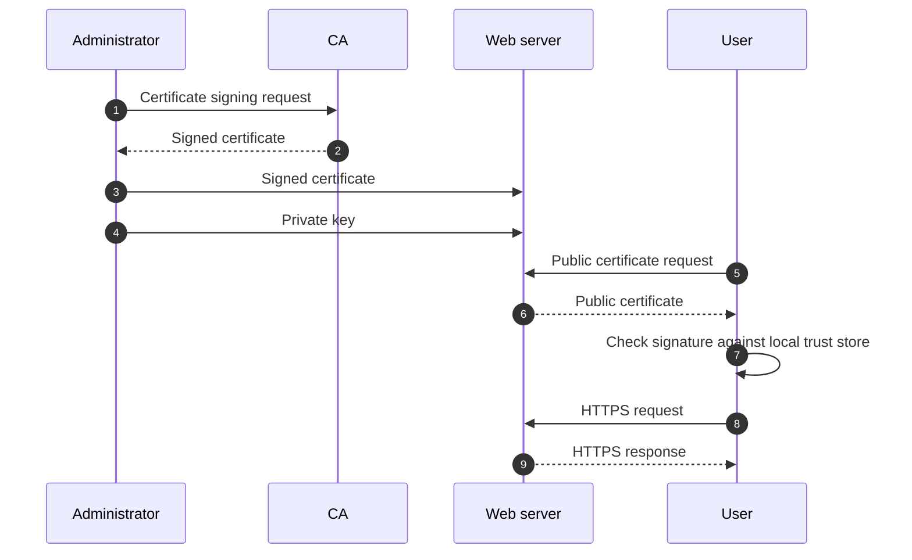

# Security

## Table of contents

- [1. Security facts](#1-security-facts)
- [2. Elements of security](#2-elements-of-security)
- [3. How security is compromised](#3-how-security-is-compromised)
    - [3.1. Social engineering](#31-social-engineering)
    - [3.2. Software vulnerabilities](#32-software-vulnerabilities)
    - [3.3. DDoS attacks](#33-ddos-attacks)
    - [3.4. Insider abuse](#34-insider-abuse)
    - [3.5. Configuration errors](#35-configuration-errors)
- [4. Basic security measures](#4-basic-security-measures)
    - [4.1. Software updates](#41-software-updates)
    - [4.2. Unnecessary services](#42-unnecessary-services)
    - [4.3. Remote event logging](#43-remote-event-logging)
    - [4.4. Backups](#44-backups)
    - [4.5. Viruses and worms](#45-viruses-and-worms)
    - [4.6. Rootkits](#46-rootkits)
    - [4.7. Packet filtering](#47-packet-filtering)
    - [4.8. Passwords and multifactor authentication](#48-passwords-and-multifactor-authentication)
    - [4.9. Vigilance](#49-vigilance)
    - [4.10. Application penetration testing](#410-application-penetration-testing)
- [5. Security power tools](#5-security-power-tools)
    - [5.1. Network port scanners](#51-network-port-scanners)
    - [5.2. Penetration testing systems](#52-penetration-testing-systems)
    - [5.3. Security auditing systems](#53-security-auditing-systems)
    - [5.4. Insecure password finders](#54-insecure-password-finders)
    - [5.5. Intrusion detection systems](#55-intrusion-detection-systems)
    - [5.6. Brute-force attack response systems](#56-brute-force-attack-response-systems)
- [6. Cryptography primer](#6-cryptography-primer)
    - [6.1. Symmetric key cryptography](#61-symmetric-key-cryptography)
    - [6.2. Public key cryptography](#62-public-key-cryptography)
    - [6.3. Public key infrastructure](#63-public-key-infrastructure)
    - [6.4. Hash functions](#64-hash-functions)
- [7. Secure shell](#7-secure-shell)
    - [7.1. OpenSSH essentials](#71-openssh-essentials)
- [8. Firewalls](#8-firewalls)
    - [8.1. Linux iptables](#81-linux-iptables)
        - [8.1.1. Chains](#811-chains)
        - [8.1.2. Tables](#812-tables)
        - [8.1.3. Rules](#813-rules)
        - [8.1.4. A complete example](#814-a-complete-example)
- [Glossary](#glossary)
- [Bibliography](#bibliography)
- [Licenses](#licenses)

## 1. Security facts

Computer security is in a sorry state. In contrast to the progress seen in virtually every other area of computing, security flaws have become increasingly dire and the consequences of inadequate security more severe

| Year | Event                      | Target                              | Effect                                                                                                                             |
| ---- | -------------------------- | ----------------------------------- | ---------------------------------------------------------------------------------------------------------------------------------- |
| 2010 | Stuxnet                    | Iran's nuclear program              | Damaged centrifuges at a uranium enrichment plant                                                                                  |
| 2013 | Snowden                    | NSA                                 | Exposed the massive NSA surveillance machine, revealing that some major Internet companies were complicit with the U.S. government |
| 2015 | OPM data breach            | U.S. Office of Personnel Management | Compromised the sensitive and private details of more than 21 million U.S. citizens                                                |
| 2016 | U.S. presidential election | Trump's candidacy                   | Mounted a campaign by Russian state-sponsored hackers to influence the election                                                    |
| 2017 | WannaCry                   | Windows OS                          | Encrypted data and demanded a payment in BTC. The attack used an exploit developed by NSA                                          |

---

Part of the challenge is that security problems are not purely technical. Unfortunately, these problems cannot be solved just by buying a particular product or service from a third party

As a system administrator you bear a heavy burden. You must push an agenda that secures your organization's systems and networks, ensures that they are vigilantly monitored, and properly educates your users and staff, familiarize yourself with current security technology, and work with experts to identify and resolve vulnerabilities at your site

As a rule of thumb, the more security you introduce, the more constrained you and your users will be. In other words, as security increases, convenience decreases, and vice versa

## 2. Elements of security

The field of information security is quite broad, but it is often described by the CIA principles

| Principle           | Goal                                                                                                                                                                                         |
| ------------------- | -------------------------------------------------------------------------------------------------------------------------------------------------------------------------------------------- |
| Confidentiality (C) | Access to information should be limited to those who are authorized to have it (privacy of data)                                                                                             |
| Integrity (I)       | Information is valid and has not been altered in unauthorized ways (authenticity and trustworthiness of information)                                                                         |
| Availability (A)    | Information must be accessible to authorized users when they need it; otherwise, the data has no value. Outages not caused by intruders also fall into the category of availability problems |

## 3. How security is compromised

### 3.1. Social engineering

Social engineering is the use of psychological influence to persuade people to take actions or reveal information
- Social engineering exploits human factors rather than software vulnerabilities
- The goal is information gathering, fraud, or system access

Human users (and administrators) of a computer system are the weakest links in the chain of security. No amount of technology can protect against the user element

A good security policy should include training for employees; communications to inform about security threats and best practices; social engineering attacks of your own (explicit permission required)

---

[Phishing](https://attack.mitre.org/techniques/T1566/) is a form of social engineering where attackers deceive people into executing malicious code or revealing sensitive information (aka [phishing for information](https://attack.mitre.org/techniques/T1598/)) 

Phishing begins with deceptive communication. Attackers may send emails  containing malicious attachments or links ([email spoofing](https://attack.mitre.org/techniques/T1672/) and thread hijacking), typically to execute malicious code on victim systems, or use social media platforms

Targeted attacks (spearphishing) can be especially hard to defend against because the communication often include victim-specific information that lends an appearance of authenticity

### 3.2. Software vulnerabilities

A vulnerability is a flaw or weakness in a system's design, implementation, or management that can be exploited by an attacker to compromise its security. Over the years, countless security bugs have been discovered in computer software

Buffer overflows are an example of a software bug with complex security implications. Developers often allocate buffers, which are predetermined amounts of temporary memory space

If the code is not careful about checking the size of the data against the size of the buffer, the memory adjacent to the allocated space is at risk of being overwritten. Hackers can input carefully composed data that crashes the program or, in the worst case, executes arbitrary code

---

Buffer overflows are a subcategory of a larger class of software bugs known as input validation vulnerabilities. Nearly all programs accept some type of input from users. If the code processes such data without rigorously checking it for appropriate format and content, bad things can happen

In general, publicly available code is thought to lead to better security

As a rule of thumb, the more people who can scrutinize the code, the greater the chance that someone will spot a security weakness

### 3.3. DDoS attacks

A DDoS attack aims to make a system unavailable to its intended users by temporarily or indefinitely disrupting the victim's availability

[Network (D)DoS attacks](https://attack.mitre.org/techniques/T1498/) flood the target with network traffic, thereby exhausting the target's network bandwidth. For example, an attacker can send 100 Gbps of traffic to a server that is hosted by a network with 1 Gbps connection to the Internet

[Endpoint (D)DoS attacks](https://attack.mitre.org/techniques/T1499/) exhaust the system resources the target's services are hosted on or exploit the system to cause a persistent crash condition. In contrast to a network (D)DoS attack, this attack denies the availability of a service without saturating the network used to provide access to that service

---

To conduct a DDoS attack, attackers typically plant malicious code on unprotected devices outside the victim's network. This code lets the attackers remotely [command and control](https://attack.mitre.org/tactics/TA0011/) these intermediary systems, which form a so-called "botnet"

In the most common DDoS scenario, the minions of the botnet are instructed to pelt the victim with network traffic

In recent years, botnets have been assembled from Internet-connected devices such as IP cameras, printers, and even baby monitors. These devices have essentially no security, and the owners usually remain unaware that their devices have been compromised

### 3.4. Insider abuse

Employees, contractors, and consultants are trusted agents of an organization and are granted special privileges. Sometimes these privileges are abused. Insiders can steal or reveal data, disrupt systems for financial gain, or create havoc for political reasons

This type of attack is often the hardest of all to detect. As most security measures guard against external threats, such measures are not effective against users who have been granted access

System administrators must never knowingly install back doors in the environment for their own use. Such facilities are too easily misinterpreted or exploited by others

### 3.5. Configuration errors

Systems can be configured securely or not-so-securely. Software is developed to be useful instead of annoying, hence not-so-securely is too often the default

An example of host configuration vulnerability is the standard practice of allowing Linux systems to boot without requiring a [boot loader](6-booting-and-system-management-daemons.md#12-boot-loader) password. GRUB can be configured at installation to require a password, but administrators almost never activate this option. This omission leaves the system open to physical attack

However, this is also a perfect example of the need to balance security against usability (see [§1](#1-security-facts)). If the system were unintentionally rebooted (e.g., after a power outage), an administrator would have to be physically there to get the computer running again

## 4. Basic security measures

Most systems do not come secured out of the box. Customizations made during and after installation change the security profile of new systems

Administrators should take steps to 
- Harden new systems
- Integrate them into the local environment
- Plan for their long-term security maintenance

When auditors come knocking, it is useful to be able to prove that you have followed some kind of standard procedure, especially if that procedure conforms to external recommendations and best practices for your industry

---

At the highest level, you can improve your site's security by keeping in mind a few rules of thumb
1. Apply the principle of least privilege. This rule applies to any situation where [access control](8-access-control-and-rootly-powers.md) is used
2. Layer security measures to achieve defense in depth. For example, don't rely only on your external firewall for network protection
3. Minimize the attack surface. The fewer the interfaces, exposed systems, unnecessary services, and unused  systems, the lower the potential for security issues

Automation is a close ally. The more security steps you automate, the less room is available for human error

### 4.1. Software updates

Keeping systems updated with the latest patches is an administrator's highest-value security chore. While patches may introduce novel security problems, most exploits target older vulnerabilities. You are much better off with regularly updated systems

| What to do                                                                                                         | Suggestion                                                                                                                                |
| ------------------------------------------------------------------------------------------------------------------ | ----------------------------------------------------------------------------------------------------------------------------------------- |
| Regular schedule for routine patches                                                                               | Design the schedule with users in mind. Monthly updates are usually sufficient, but be prepared to apply critical patches on short notice |
| Change plan that documents the impact of patches, post-installation testing steps, and how to back out the changes | Communicate the plan to all relevant parties                                                                                              |
| Understanding of which patches pertain to the environment                                                          | Subscribe to vendor-specific security mailing lists and blogs                                                                             |
| Inventory of applications and operating systems used in your environment                                           | Automate infrastructure management and use reporting software                                                                             |

### 4.2. Unnecessary services

Disable, and possibly remove, unnecessary services, especially if they are network daemons. The `ss` command is to investigate sockets. For example, to display the TCP sockets

```shell
$ ss -t
State                  ESTAB                 
Recv-Q                 0
Send-Q                 52
Local Address:Port     [10.16.11.162]:ssh
Peer Address:Port      [10.3.39.122]:57340
```

There is one established (`ESTAB`) connection TCP, with `0` bytes waiting to be read and `52` bytes ready to be sent, between `10.16.11.162:ssh` (local) and `10.3.39.122:57340` (remote)

---

The `/etc/services` file maps network services to their corresponding ports and protocols. For example, to find out which port corresponds to `ssh`

```shell
$ grep ssh /etc/services
ssh     22/tcp     # SSH Remote Login Protocol
```

The network service `ssh` communicates over `tcp` and listens on port `22`

---

The `lsof` command is to list open files. Everything is treated as a file in Linux, so you can use it to determine which process uses which port. To display Internet connections (`-i`) filtered by port (`:`)

```shell
$ sudo lsof -i :22
COMMAND  PID  NAME
systemd    1  *:ssh (LISTEN)
sshd    7309  *:ssh (LISTEN)
sshd    7311  admin:ssh->10.3.39.122:57340 (EST.)
sshd    7426  admin:ssh->10.3.39.122:57340 (EST.)
```

Once you have the PID, then you can use `ps` to identify the specific process. If a service is unneeded, stop it and make sure it won't be restarted at boot time

### 4.3. Remote event logging

The syslog service forwards log information to files, lists of users, or other hosts on your network. Consider setting up a secure host to act as a central logging machine that parses forwarded logs and raises alerts if necessary

Remote logging also prevents hackers from covering their tracks by tampering with log files on systems that have been compromised

Although syslog is the default choice on most systems, you need to customize the configuration to set up remote logging

### 4.4. Backups

A backup is a copy of computer data taken and stored elsewhere so that it may be used to restore the original after a data loss event. Regular, tested system backups are an essential part of any site security plan. Backups fall into the "availability" bucket of the CIA triad

Make sure that
- All filesystems are replicated
- Some backups are stored off-site

However, backups can also be a security hazard. Protect backups by limiting (and monitoring) access and by encrypting backup files

### 4.5. Viruses and worms

A virus is a type of malware that, when executed, replicates itself by modifying computer programs and inserting its own code into those programs. A worm is standalone malware that replicates itself to spread to other computers. Worms do not require host programs

Linux systems have historically been largely immune to viruses and worms. Some point to their smaller market share compared to Windows, while others credit their stronger access control

The latter argument holds some merit: Without `root` privileges, malware has limited reach. Counterintuitively, one valid reason to run antivirus software on Linux is to protect connected Windows systems from Windows-specific malware. Of course, doing so introduces an additional attack surface—the antivirus software itself

### 4.6. Rootkits

A rootkit is software, typically malicious, designed to enable access to a computer or an area of its software that is not otherwise allowed and often masks its existence or the existence of other software

Rootkits come in many flavors and vary in sophistication, from simple application replacements, such as hacked versions of `ls` and `ps`, to kernel modules that are nearly impossible to detect

Although there are tools to help administrators remove rootkits from compromised systems, the time it takes to perform a thorough cleaning would probably be better spent saving data and wiping the system. The most advanced rootkits are aware of common removal programs and make attempts to subvert them

### 4.7. Packet filtering

If you are connecting a system to a network that has Internet access, you **must** install a packet-filtering router or firewall between the system and the outside world. The packet filter should pass only traffic for services that you specifically want to offer from that system

Limiting the public exposure of your systems is a first-line defense. Many systems do not need to be directly accessible to the Internet

In addition to firewalling systems at the Internet gateway, you can double up with host-based packet filters, such as `iptables` or `ufw` on Linux. Determine which services run on the host, open ports only for those services, and, potentially, limit which source addresses are allowed to connect to each port

### 4.8. Passwords and multifactor authentication

Every account must have a password and it needs to be something that cannot be easily guessed. Password complexity rules may be a hassle, but they exist for a reason. Guessable passwords are one of the leading sources of compromise

MFA systems are a good choice. These systems validate your identity both through something you know (a password or passphrase) and something you have (a physical device, fingerprint, etc.)

Almost any interface can be protected with MFA, from shell accounts to bank accounts. MFA is now an absolute minimum requirement (at least) for any Internet-facing portal that gives access to administrative privileges 

---

In addition to securing all Internet-facing privileged access through MFA, it is important to select and manage passwords securely. In the world of `sudo` (see [here](8-access-control-and-rootly-powers.md#23-executing-commands-as-another-user)), administrators' personal passwords are just as important as `root` passwords

It is all too common that a large breach occurs and usernames with passwords are exposed. If those usernames and passwords were used elsewhere, all those accounts are compromised. Never use the same password for more than one purpose

Technically speaking, the most secure password of a given length consists of a random sequence of letters, punctuation, and digits

---

However, random passwords are simply impractical to commit to memory unless you write them down somewhere. It is often said that passwords should never be written down, but it is more accurate to say that they should never be left accessible to the wrong people

A password vault is a piece of software (or a combination of software and hardware) that encrypts the passwords it stores. A user can then access the passwords stored in the vault with a single master password, which becomes the only password to remember

As password security increases exponentially with length, your best bet is to use a very long password that is unlikely to appear somewhere else but is easy to remember (i.e., a passphrase) as the master password for the vault

### 4.9. Vigilance

To ensure the security of your system, monitor its health, network connections, process table, and overall status on a daily basis. Security compromises tend to start with a small foothold and expand. The earlier you identify an anomaly, the better off you will be

Many administrators find it beneficial to work with an external firm to perform a comprehensive vulnerability analysis. These projects can 
- Draw attention to issues that you had not previously considered
- Establish a baseline understanding of the areas in which you are most exposed

### 4.10. Application penetration testing

Applications that are exposed to the Internet need their own security precautions. It is a good idea to have all application penetration tested to verify that they have been designed with security in mind and have the appropriate controls in place

Security is only as strong as the weakest link in the chain. If you have a secure network and system infrastructure, but an application running on that infrastructure allows access to sensitive data without a password, you have won the battle but lost the war

Penetration testing is a poorly defined discipline. [OWASP](https://owasp.org/) tracks application vulnerabilities and methods for testing applications. If you have a professional third party perform penetration testing, make sure they adhere to the OWASP methodology

## 5. Security power tools

### 5.1. Network port scanners

A network port scanner is a tool designed to probe a target system to identify which network ports are open, closed, or filtered

Since most network services are associated with well-known port numbers, this information tells you quite a lot about the software a machine is running 

[Nmap](https://nmap.org/) is a network port scanner. Nmap also provides a [publicly available host](scanme.nmap.org) for safe scanning practice. Do not run Nmap on someone else's network without permission from one of that network's administrators

---

```shell
$ sudo nmap -sV -O scanme.nmap.org
Starting Nmap 7.94SVN [...] at 2025-05-11 14:42 UTC
Nmap scan report for scanme.nmap.org (45.33.32.156)
Host is up (0.17s latency).

[...]

Not shown: 988 closed tcp ports (reset)
PORT      STATE    SERVICE        VERSION
22/tcp    open     ssh            OpenSSH 6.6.1p1 Ubuntu [...]
25/tcp    filtered smtp
80/tcp    open     http           Apache httpd 2.4.7 ((Ubuntu))

[...]

Device type: general purpose
Running: Linux 5.X
OS CPE: cpe:/o:linux:linux_kernel:5
OS details: Linux 5.0 - 5.4
Network Distance: 21 hops
Service Info: OS: Linux; CPE: cpe:/o:linux:linux_kernel

[...]

Nmap done: 1 IP address (1 host up) scanned in 16.79 seconds
```

### 5.2. Penetration testing systems

Penetration testing is the act of breaking into a computer network with the owner's permission for the purpose of discovering security weaknesses

[Metasploit](https://www.metasploit.com/) is an open source software package that automates penetration testing. Metasploit includes a database of hundreds of ready-made exploits for known software vulnerabilities. Metasploit implements the following workflow
1. Scan the target systems to discover information
2. Select and execute exploits according to the information found
3. Document the results
4. Clean up and revert all changes to the target systems

### 5.3. Security auditing systems

Security auditing is the act of systematically evaluating the security of a system by measuring how well it conforms to an established set of criteria. A security audit system looks for things like weak settings, missing updates, or anything that could let hackers in—and then suggests how to fix them

In contrast to network port scanners (see [§5.1](#51-network-port-scanners)), security audit systems run on the target system itself

[Lynis](https://cisofy.com/lynis/) is a security audit system that performs both one-time and scheduled audits of a system's configuration, patching, and hardening state. Lynis is for UNIX-like systems and performs hundreds of automated compliance checks

### 5.4. Insecure password finders

One way to thwart poor password choices is to try to break the passwords yourself and to force users to change passwords that you have broken

[John the Ripper](https://www.openwall.com/john/) is an offline password cracker. Although most systems use a [shadow password file](8-access-control-and-rootly-powers.md#123-the-root-account) to hide encrypted passwords, it is still wise to verify that your user's passwords are crack resistant (especially for those users with `sudo` privileges)

---

```shell
$ sudo unshadow /etc/passwd /etc/shadow > mypasswd
$ john --format=crypt mypasswd

[...]

$ john --show mypasswd
root:root:0:0:root:/root:/bin/bash
ubuntu:mattia:1000:1000:Ubuntu:/home/ubuntu:/bin/bash

2 password hashes cracked, 0 left
```

### 5.5. Intrusion detection systems

Intrusion detection is the act of monitoring a system or network to identify signs of malicious activity

[Snort](https://www.snort.org/) is a network intrusion detection system that captures raw packets off the network (i.e., [packet sniffing](11-networking.md#43-sniffing-packets)) and compares them with a set of rules. When Snort detects a packet that matches against those rules, it generates an alert for system administrators

[OSSEC](https://www.ossec.net/) is a host-based intrusion detection system that runs on the systems of interest and monitors their activity in real time. OSSEC provides rootkit detection, filesystem integrity checks, log file analysis, time-based alerting, and active responses

### 5.6. Brute-force attack response systems

A brute-force attack is a trial-and-error method used by attackers to guess passwords, encryption keys, or login credentials by systematically trying all possible combinations until the correct one is found

[Fail2Ban](https://github.com/fail2ban/fail2ban) is a brute-force attack response system written in Python. Fail2Ban scans log files such as `/var/log/auth.log`. It looks for IP addresses that have too many failed login attempts. When it finds one, it updates the firewall rules. This blocks new connections from that IP address for a configurable amount of time

## 6. Cryptography primer

Most software is designed with security in mind, and that implies a strong dose of cryptography. Nearly all network protocols in modern use rely on cryptography for security

Cryptography applies mathematics to the problem of securing communications. A cryptographic algorithm, aka a cipher, is the set of mathematical steps taken to secure a message

Encryption is the process of using a cipher to convert plain text messages to unreadable ciphertext. Decryption is the reverse of that process

---

| Property        | Meaning                                                                     |
| --------------- | --------------------------------------------------------------------------- |
| Confidentiality | Messages are impossible to read for everyone except the intended recipients |
| Integrity       | It is impossible to modify the contents without detection                   |
| Non-repudiation | The authenticity of the message can be validated                            |

In other words, cryptography lets you communicate secretly over unsecured channels with the added benefits of being able to prove the correctness of the message and the identity of the sender

---

Cryptographers have traditional names for three subjects who participate in a simple message exchange

| Principal | Symbol | Role                                                                                                               |
| --------- | ------ | ------------------------------------------------------------------------------------------------------------------ |
| Alice     | $A$    | Wish to communicate privately with Bob                                                                             |
| Bob       | $B$    | Wish to communicate privately with Alice                                                                           |
| Charles   | $C$    | Want to compromise Alice and Bob's secrets, disrupt their communication, or impersonate one of the other principal |

The following adopts this convention

### 6.1. Symmetric key cryptography

$A$ and $B$ share a secret key ($K_{AB}$) that they use to encrypt and decrypt messages. They must find a way to exchange the shared secret privately. Once they both know the key, they can reuse it as long as they wish. $C$ can only inspect (or interfere with) messages if he also has the key

Symmetric keys are relatively efficient in terms of CPU usage and the size of the encrypted payloads. As a result, symmetric cryptography is often used in applications where efficient encryption and decryption are necessary

AES is perhaps the most widely used symmetric key algorithm

---

| Symbol       | Meaning                               |
| ------------ | ------------------------------------- |
| $M$          | Original message in plain text        |
| $K_{AB}$     | Shared secret key between $A$ and $B$ |
| $M_{K_{AB}}$ | Ciphertext (encrypted message)        |
| $E$          | Encryption function                   |
| $D$          | Decryption function                   |

| Who sends to whom | Encryption                  | Decryption                  |
| ----------------- | --------------------------- | --------------------------- |
| $A \rightarrow B$ | $E(K_{AB}, M) = M_{K_{AB}}$ | $D(K_{AB}, M_{K_{AB}}) = M$ |
| $B \rightarrow A$ | $E(K_{AB}, M) = M_{K_{AB}}$ | $D(K_{AB}, M_{K_{AB}}) = M$ |

### 6.2. Public key cryptography

A limitation of symmetric keys is the need to securely exchange the secret key in advance. The only way to do so with complete security is to meet in person without interference, a major inconvenience. The invention of public key cryptography, which addresses this problem, was an extraordinary breakthrough when it occurred in the 1970s

The scheme works as follows. $A$ generates a pair of keys. The private key ($K_{A}^{-1}$) remains a secret, while the public key ($K_{A}$) can be widely known. $B$ does the same. When $A$ wants to send a message ($M$) to $B$, she encrypts it with $K_B$. $B$ who holds $K_{B}^{-1}$ is the only one that can decrypt $M$

RSA is perhaps the most widely used public key cryptosystem

---

| Symbol         | Meaning                        |
| -------------- | ------------------------------ |
| $M$            | Original message in plain text |
| $K^{-1}_{A/B}$ | $A/B$'s secret key             |
| $K_{A/B}$      | $A/B$'s public key             |
| $M_{K_{A/B}}$  | Ciphertext (encrypted message) |
| $E$            | Encryption function            |
| $D$            | Decryption function            |

| Who sends to whom | Encryption                | Decryption                     |
| ----------------- | ------------------------- | ------------------------------ |
| $A \rightarrow B$ | $E(K_{B}, M) = M_{K_{B}}$ | $D(K_{B}^{-1}, M_{K_{B}}) = M$ |
| $B \rightarrow A$ | $E(K_{A}, M) = M_{K_{A}}$ | $D(K_{A}^{-1}, M_{K_{A}}) = M$ |

---

$A$ can also sign ($S$) the message with her private key ($K_{A}^{-1}$)

$$E(K_{A}^{-1}, M) = S_{K_{A}^{-1}}$$

$B$ can then use $A$'s public key ($K_{A}$) to validate the authenticity of the message

$$D(K_{A}, S_{K_{A}^{-1}}) = M$$

This process is known as digital signature

---

Public key ciphers rely on the mathematical concept of trapdoor functions, in which a value is easy to compute, and yet it is difficult to derive the steps that produced that value. The performance characteristics of asymmetric ciphers generally render them impractical for encrypting large quantities of data

Asymmetric ciphers are often paired with symmetric ones to realize the benefits of both
- Public keys to establish a session and share a symmetric key
- Symmetric key to encrypt the ongoing conversation

In digital signatures, asymmetric ciphers are only used to encrypt a hash of the message rather than the message itself (see [§6.4](#64-hash-functions))

### 6.3. Public key infrastructure

If $A$ wants to send $B$ a private message, $A$ must trust that the public key she has for $B$ is in fact his and not $C$'s. Validating the authenticity of public keys at Internet scale is a formidable challenge

The public key infrastructure used to implement TLS on the web addresses this problem by trusting a third party known as CA. $A$ and $B$ may not know each other, but they both trust the CA and know $K_{CA}$. The CA signs certificates for $K_A$ and $K_B$ with $K^{-1}_{CA}$

The CA is implicitly trusted in this system. Modern OSes trust hundreds of CAs by default. The CAs themselves are therefore high-value targets for hackers. When a CA is hacked, the entire system of trust is broken

---



### 6.4. Hash functions

A hash function accepts input data of any length and generates a fixed-length value that is somehow derived from that data. The output value is variously referred to as hash, digest, checksum, or fingerprint

Hash functions are deterministic. This means that if you run a particular hash function on a particular input, you will always generate the same digest

Because digests have a fixed length, only a finite number of possible outputs exist. For example, an 8-bit digest has only $2^8 = 256$ possible outputs. Therefore, some inputs necessarily generate the same output, an event known as a collision. Longer digests reduce the frequency of collisions but can never eliminate them entirely

---

The subset of hash functions known as cryptographic hash functions are designed to also ensure the following properties

| Property          | Meaning                                                                                                                                                                       |
| ----------------- | ----------------------------------------------------------------------------------------------------------------------------------------------------------------------------- |
| Entanglement      | Every bit of the digest depends on every bit of the input. On average, changing one bit of input should cause 50% of the digest bits to change                                |
| Pseudo-randomness | Digests, which are generated deterministically from input data, should look like random data: no detectable internal structure and no apparent relationship to the input data |
| Nonreversibility  | Given a digest, it should be computationally infeasible to discover another input that generates the same digest                                                              |

---

Digests verify the integrity of things. They can verify that a given configuration file or command binary has not been tampered with, or that a message signed by an email correspondent has not been modified in transit

The only recommended hash algorithms for general use are the SHA-2 and SHA-3 families

These algorithms exist with different digest lengths. For example, SHA3-512 is the SHA-3 algorithm configured to generate a 512-bit digest. A SHA algorithm without a version number refers to the SHA-2 family

---

The `shasum` command is to compute or check digests (aka checksum)

```shell
$ shasum -a 256 mypasswd
b24077c2 [...] 208d9d41  mypasswd
```

## 7. Secure shell

The SSH system is a protocol for remote logins and for securing network services on an insecure network. SSH capabilities range from remote command execution to port forwarding and file transfer. SSH is an indispensable tool for system administrators

SSH is a client/server protocol that uses cryptography for authentication, confidentiality, and integrity of communications between two hosts. SSH is designed for algorithmic flexibility. This means that the underlying cryptographic protocols can be updated or deprecated as the industry evolves

OpenSSH is the open source implementation of SSH that is included and enabled by default on nearly every Linux distributions

### 7.1. OpenSSH essentials

| Command                   | Description                             |
| ------------------------- | --------------------------------------- |
| `ssh`                     | Run client                              |
| `sshd`                    | Run server daemon                       |
| `ssh-keygen`              | Generate public/private key pairs       |
| `ssh-add` and `ssh-agent` | Manage authentication keys              |
| `ssh-keyscan`             | Retrieve public keys from servers       |
| `sftp-server`             | Run server for file transfer over SFTP  |
| `sftp` and `scp`          | Run clients for file transfer over SFTP |

---

Use the `ssh-keygen` to generate a key pair. You can specify which cryptographic algorithm to use with the `-t` option. For example

```shell
$ ssh-keygen -t ed25519
```

`ssh-keygen` prompts for an optional passphrase to encrypt the private key. If you use a passphrase, you must type it to decrypt the private key before `ssh` can read it. A passphrase improves security because you must both have the key file and know the passphrase that decrypts it before you can authenticate

---

By default, public and private keys are stored in `~/.ssh`

Remember to
- Set the permissions on the public (`~/.ssh/id_ed25519.pub`) and private (`~/.ssh/id_ed25519`) keys correctly as `0644` and `0600`, respectively
- Never share the private key

Now you can give your public key to the server administrator, who adds it to the server in the file `~/.ssh/authorized_keys`

---

In the most common usage, a client connects to the server, authenticates itself, and subsequently opens a shell to execute commands. Authentication methods are negotiated according to mutual support and preferences. Many users can log in simultaneously. A pseudo-terminal is allocated for each

```shel
$ ssh ubuntu@admin.unife.edu -i unife.pem
Welcome to Ubuntu 24.04 LTS [...]

[...]

Last login: Mon May 12 06:57:20 2025 from 10.3.39.122
ubuntu@admin:~$
```

---

`ssh` attempts a TCP connection on port `22`. When the connection is established, the server sends its public key for verification. If the server is not known, `ssh` prompts the user to confirm the server's public key

The administrator can communicate the server's public key to users in advance. Users can then compare the information they received from the administrator to the server's key fingerprint when they first connect. If the two match, the server's identity is proved

Once the user accepts the key, the fingerprint is added to `~/.ssh/known_hosts` for future use. `ssh` won't prompt the user again unless the key changes, in which case `ssh` displays a warning message

---

The `ssh-agent` daemon caches decrypted private keys. When you load your private keys into `ssh-agent`, `ssh` automatically offers those keys when it connects to new servers, simplifying the process of connecting

The `ssh-add` command is used to load a new key. If the key requires a passphrase, you will be prompted to enter it. For example

```shell
$ ssh-add ~/.ssh/id_ed25519
```

Use the `-d` option to delete a previously loaded key and the `-l` option to list the currently loaded keys

---

The `scp` command is to copy files from your system to a remote host, from a remote host to your system, or between remote hosts. The syntax mirrors that of `cp` with some extra decorations to designate hosts and usernames

```shell
$ echo "hello" > hello.txt
$ scp -i unife.pem hello.txt ubuntu@admin.unife.edu:~
hello.txt               100%    6     0.1KB/s   00:00
```

`scp` copied `hello.txt` from my local system to the remote host `admin.unife.edu` in the `ubuntu`'s home directory (`~`)

---

The `sftp` command provides an interactive experience similar to a traditional FTP client. Once connected to the remote host, you can download files (`get`), upload files (`put`), list files (`ls`),  navigate directories (`cd`), and remove files (`rm`) as well as empty directories (`rmdir`)

```shell
$ sftp -i unife.pem ubuntu@admin.unife.edu
Connected to admin.unife.edu.
sftp> get hello.txt
Fetching /home/ubuntu/hello.txt to hello.txt
hello.txt
```

## 8. Firewalls

A packet-filtering firewall limits the type of traffic that can pass through your Internet gateway (or through an internal gateway that separates domains within your organization) according to information in the packet header

Packet-filtering software is included in Linux in the form of `iptables` (and its easier-to-use front end, `ufw`). Although these machine-specific firewalls are capable of sophisticated filtering and bring a welcome extra dose of security, it is not a good idea to use a general-purpose OS as a firewall router

The complexity of general-purpose OSes makes them inherently less secure and less reliable than task-specific devices. Use dedicated firewall appliances for site-wide network protection

---

Two main schools of thought deal with the issue of machine-specific firewalls. The first school considers them superfluous. According to them, firewalls belong to gateway routers, where they can protect an entire network through the application of one consistent (and consistently applied) set of rules

The second school considers machine-specific firewalls an important component of a "defense in depth" security plan. Although gateway firewalls are theoretically sufficient, they can be compromised, routed around, or administratively misconfigured. Therefore, it is prudent to implement the same network traffic restrictions through multiple, redundant firewall systems

---

Most well-known services are associated with a network port in the `/etc/services` file. Service-specific filtering is predicated on the assumption that the client uses a non-privileged port to contact a privileged port on the server

For example, if you want to allow only inbound HTTP connections to a machine with the address `192.108.21.200`, install a filter that 
- Allows TCP packets destined for port `80` at that address 
- Allows outbound TCP packets from that address to anywhere

---

Modern security-conscious sites use a two-stage filtering scheme. One filter is the gateway to the internet, and a second filter lies between the outer gateway and the rest of the local network

The idea is to have inbound Internet connections terminate on systems that are administratively separate from the rest of the network. This network segment is usually called DMZ

The most secure way to use a packet filter is to start with a configuration that allows no inbound connections, liberalize the filter bit by bit as you discover things that don't work, and move any Internet-accessible services onto systems in the DMZ

### 8.1. Linux iptables

Netfilter is a framework provided by Linux that allows various networking-related operations, such as packet filtering and NAT. Netfilter
- Defines specific points (called hooks) in the network stack
- Allows kernel modules to register their own functions (called callbacks) to these hooks
- Automatically triggers these callbacks when packets reach the corresponding hooks

The `iptables` command is a user-space utility that allows system administrators to configure Netfilter by defining rules for how packets should be handled

#### 8.1.1. Chains


[Illustrated introduction to Linux iptables](https://iximiuz.com/en/posts/laymans-iptables-101/)

---


[Illustrated introduction to Linux iptables](https://iximiuz.com/en/posts/laymans-iptables-101/)

---

In the `iptables` world, hooks are called chains 

| Chain         | Target traffic | When                                                    |
| ------------- | -------------- | ------------------------------------------------------- |
| `PREROUTING`  | Incoming       | Before routing                                          |
| `INPUT`       | Incoming       | After routing, for packets destined to the local system |
| `FORWARD`     | Transit        | After routing, for packets being forwarded              |
| `POSTROUTING` | Outgoing       | After routing, just before packets leave the system     |
| `OUTPUT`      | Outgoing       | Locally-generated packets leaving the system            |

#### 8.1.2. Tables

Sets of chains make up a table, and each table is used to handle a specific kind of packet processing, such as packet filtering or NAT

| Table    | Chain                                     | Scope                                                                               |
| -------- | ----------------------------------------- | ----------------------------------------------------------------------------------- |
| `filter` | `INPUT`, `FORWARD`, and `OUTPUT`          | Decide whether packets are allowed or blocked                                       |
| `nat`    | `PREROUTING`, `OUTPUT`, and `POSTROUTING` | Modify the source (SNAT) or destination (DNAT) IP addresses and/or ports of packets |


Chains with the same name in different tables act independently. Typically, the precedence is `nat` $\rightarrow$ `filter`

#### 8.1.3. Rules

Callbacks are functions registered at specific hook points in the networking stack (e.g., `PREROUTING`, `FORWARD`, etc.). These callbacks are responsible for processing packets as they pass through the system

Rules configure how these callbacks behave. Each rule has a target clause, which determines what to do with the matching packets. When a packet matches a rule, its fate is in most cases sealed; no additional rules are checked

The targets available to rules vary depending on the table 

---

Common targets used for packet filtering (`filter` table)

| Target   | Description                                                        |
| -------- | ------------------------------------------------------------------ |
| `ACCEPT` | Allow the packet to proceed on its way                             |
| `DROP`   | Silently discard the packet                                        |
| `REJECT` | Drop the packet and return an ICMP error message                   |
| `LOG`    | Track the matching packet                                          |

---

Common targets used for network address and port translation (`nat` table) 

| Target       | Description                                       |
| ------------ | ------------------------------------------------- |
| `DNAT`       | Change destination IP address and/or port         |
| `SNAT`       | Changes source IP address and/or port             |
| `MASQUERADE` | Dynamic SNAT                                      |
| `REDIRECT`   | Redirect the packet to a local port on the system |
| `LOG`        | Track the matching packet                         |

#### 8.1.4. A complete example

Suppose your firewall has two interfaces

| NIC    | IP (CIDR)          | Scope                     |
| ------ | ------------------ | ------------------------- |
| `eth0` | `10.1.1.1/24`      | Go to an internal network |
| `eth1` | `128.138.101.4/24` | Go to the Internet        |

---

The most secure strategy is to drop any packets you have not explicitly allowed. This means
- Flush all chains in the `filter` table (`-F`)
- Set a policy (`-P`) to make `DROP` the default target for `INPUT` and `FORWARD` chains in the `filter` table

```shell
$ iptables -F
$ iptables -P INPUT DROP
$ iptables -P FORWARD DROP
```

---

The only TCP traffic that makes sense to allow to the firewall (`10.1.1.1`) is SSH, which is useful for managing the firewall itself

```shell
$ iptables -A INPUT -i eth0 \
    -d 10.1.1.1 -p tcp --dport 22 -j ACCEPT
```

This command appends (`-A`) a rule to the `INPUT` chain of the `filter` table. This rule matches TCP packets (`-p`) coming in through the `eth0` interface (`-i`) with destination IP `10.1.1.1` (`-d`) and destination port `22` (`--dport`). Matching packets are accepted (`-j`)

---

It is also useful to allow ICMP echo requests to the firewall for the internal network. This allows hosts in the `10.1.1.0/24` subnet to `ping` their default gateway

```shell
$ iptables -A INPUT -i eth0 -d 10.1.1.1 \
    -p icmp --icmp-type 8 -j ACCEPT
```

This command appends (`-A`) a rule to the `INPUT` chain of the `filter` table. This rule matches ICMP (`-p`) echo request (`--icmp-type`) packets coming in through the `eth0` interface (`-i`) with destination IP `10.1.1.1` (`-d`). Matching packets are accepted (`-j`)

---

The internal network is considered trusted. Therefore, the firewall must allow all connections that originate from within the internal network

```shell
$ iptables -A FORWARD -i eth0 -j ACCEPT
```

This command appends (`-A`) a rule to the `FORWARD` chain of the `filter` table. This rule matches packets coming in through `eth0`. Matching packets are accepted (`-j`)

---

As the internal network uses a private IP address range (i.e., `10.1.1.0/24`), NAT is required for outgoing connections to be routable on the public internet

```shell
$ iptables -t nat -A POSTROUTING -o eth1 \
    -j SNAT --to-source 128.138.101.4
```

This command appends (`-A`) a rule to the `POSTROUTING` chain of the `nat` table (`-t`). This rule matches packets going out on the `eth1` interface (`-o`). The source IP address (`-j`) of the matching packets is changed to `128.138.101.4` (`--to-source`)

---

It is also desirable that when someone from the internal network opens a connection, they can receive the response

```shell
$ iptables -A FORWARD -m conntrack \
    --ctstate ESTABLISHED,RELATED -j ACCEPT
```

This command appends (`-A`) a rule to the `FORWARD` chain of the `filter` table. This rule matches packets that are part of an already established connection or related to one (`--ctstate`) and accepts them (`-j`). The `conntrack` module (`-m`) monitors and records the state of all network connections passing through the system

---

Suppose that there is a web server with IP `10.1.1.2` and the firewall must allow SSH, HTTP, and HTTPS

```shell
$ iptables -A FORWARD -d 10.1.1.2 -p tcp \
    --dport 22 -j ACCEPT
$ iptables -A FORWARD -d 10.1.1.2 -p tcp \
    --dport 80 -j ACCEPT
$ iptables -A FORWARD -d 10.1.1.2 -p tcp \
    --dport 443 -j ACCEPT
```

These commands append (`-A`) three rules to the `FORWARD` chain of the `filter` table. These rules match TCP (`-p`) packets with destination IP `10.1.1.2` (`-d`) and destination ports `22` , `80`, and `443`, respectively. Matching packets are accepted (`-j`)

## Glossary

| Term                                          | Meaning                                                                                                                                                                                                                                                                                                         |
| --------------------------------------------- | --------------------------------------------------------------------------------------------------------------------------------------------------------------------------------------------------------------------------------------------------------------------------------------------------------------- |
| Advanced Encryption Standard (AES)            | A symmetric-key cryptographic algorithm                                                                                                                                                                                                                                                                         |
| Availability                                  | Information must be accessible to authorized users when they need it                                                                                                                                                                                                                                            |
| Backup                                        | A copy of computer data taken and stored elsewhere so that it may be used to restore the original after a data loss event                                                                                                                                                                                       |
| Bitcoin (BTC)                                 | A cryptocurrency                                                                                                                                                                                                                                                                                                |
| Botnet                                        | A network of infected devices controlled remotely without the owner's knowledge                                                                                                                                                                                                                                 |
| Brute-force attack                            | A trial-and-error method used by attackers to guess passwords, encryption keys, or login credentials by systematically trying all possible combinations until the correct one is found                                                                                                                          |
| Buffer                                        | A predetermined amount of temporary memory space to store a particular piece of information                                                                                                                                                                                                                     |
| Buffer overflow                               | A vulnerability that occurs when a program writes more data to a memory buffer than it can hold, causing data to overflow into adjacent memory and potentially allowing attackers to execute arbitrary code                                                                                                     |
| Certificate authority (CA)                    | An entity that stores, signs, and issues digital certificate                                                                                                                                                                                                                                                    |
| Ciphertext                                    | A message that has been encrypted                                                                                                                                                                                                                                                                               |
| Confidentiality                               | Access to information should be limited to those who are authorized to have it                                                                                                                                                                                                                                  |
| Cryptographic algorithm (or cipher)           | The set of mathematical steps taken to secure a message                                                                                                                                                                                                                                                         |
| Decryption                                    | The reverse of encryption                                                                                                                                                                                                                                                                                       |
| Demilitarized zone (DMZ)                      | A physical or logical subnetwork that contains and exposes an organization's external-facing services                                                                                                                                                                                                           |
| Digital certificate                           | An electronic document used to prove the validity of a public key. A digital certificate includes the public key and information about it, information about the identity of its owner (called the subject), and the digital signature of a CA that has verified the certificate's contents (called the issuer) |
| Digital signature                             | A ciphertext created using a private key to verify the authenticity and integrity of a message                                                                                                                                                                                                                  |
| Email spoofing                                | An attack where the attacker forges the sender’s address in order to establish contact with the victim under false pretenses                                                                                                                                                                                    |
| Encryption                                    | The process of using a cipher to convert plain text messages to unreadable ciphertext                                                                                                                                                                                                                           |
| Endpoint (D)DoS                               | An attack where attackers exhaust the system resources the target's services are hosted on or exploit the system to cause a persistent crash condition                                                                                                                                                          |
| Exploit                                       | A piece of code or technique that takes advantage of a software or system vulnerability for malicious purposes                                                                                                                                                                                                  |
| Firewall                                      | A device or piece of software that prevents unwanted packets from accessing networks and systems                                                                                                                                                                                                                |
| Hash (aka digest, checksum, or fingerprint)   | The output value of a hash function                                                                                                                                                                                                                                                                             |
| Hash function                                 | A function that accepts input data of any length and generates a fixed-length value that is somehow derived from that data                                                                                                                                                                                      |
| Input validation vulnerability                | A software vulnerability that occurs when a system fails to properly check or sanitize user input, allowing attackers to inject malicious data that can lead to security issues                                                                                                                                 |
| Integrity                                     | Information is valid and has not been altered in unauthorized ways                                                                                                                                                                                                                                              |
| Intrusion detection                           | The act of monitoring a system or network to identify signs of malicious activity                                                                                                                                                                                                                               |
| Malware                                       | Software intentionally designed to damage, disrupt, steal, or gain unauthorized access to computers, networks, or data                                                                                                                                                                                          |
| Multifactor authentication (MFA)              | A scheme that validates your identity both through something you know (a password or passphrase) and something you have (a physical device)                                                                                                                                                                     |
| National Security Agency (NSA)                | An intelligence agency of the US Department of Defense                                                                                                                                                                                                                                                          |
| Network (D)DoS                                | An attack where attackers flood the victim with network traffic, thereby exhausting the victim's network bandwidth                                                                                                                                                                                              |
| Network port scanner                          | Software that probes a target system to identify which network ports are open, closed, or filtered                                                                                                                                                                                                              |
| Office of Personnel Management (OPM)          | An independent agency of the US government that manages the US federal civil service                                                                                                                                                                                                                            |
| Open Web Application Security Project (OWASP) | An online community that produces freely available articles, methodologies, documentation, tools, and technologies in the fields of IoT, system software and web application security                                                                                                                           |
| Packet-filtering firewall                     | A type of firewall that allows or blocks packets based on predefined rules. These rules are applied by examining information contained in the packet header, such as source and destination IP addresses, port numbers, and the protocol type                                                                   |
| Passphrase                                    | A passphrase is a longer, more memorable alternative to a password, often used to control access to and the operation of a cryptographic program                                                                                                                                                                |
| Password                                      | Secret data, typically a string of characters, usually used to confirm a user's identity                                                                                                                                                                                                                        |
| Password vault (or password manager)          | A software program to prevent password fatigue by automatically generating, autofilling and storing passwords                                                                                                                                                                                                   |
| Patch                                         | Data intended to be used to modify an existing software, often to fix bugs and security vulnerabilities                                                                                                                                                                                                         |
| Penetration testing                           | The act of breaking into a computer network with the owner's permission for the purpose of discovering security weaknesses                                                                                                                                                                                      |
| Phishing                                      | A form of social engineering where attackers deceive people into executing malicious code or revealing sensitive information                                                                                                                                                                                    |
| Private key                                   | A secret cryptographic key used to decrypt data encrypted with the corresponding public key or to create digital signatures that prove the sender’s identity                                                                                                                                                    |
| Public key                                    | A cryptographic key that can be shared openly and is used to encrypt data or verify digital signatures                                                                                                                                                                                                          |
| Public key cryptography                       | A form of cryptography uses a pair of cryptographic keys—one public and one private—where the public key encrypts data and only the corresponding private key can decrypt it                                                                                                                                    |
| Rivest-Shamir-Adleman (RSA) cryptosystem      | A public key cryptosystem. The initialism "RSA" comes from the surnames of Ron Rivest, Adi Shamir and Leonard Adleman, who publicly described the algorithm in 1977                                                                                                                                             |
| Rootkit                                       | Software, typically malicious, designed to enable access to a computer or an area of its software that is not otherwise allowed and often masks its existence or the existence of other software                                                                                                                |
| Secure File Transfer Protocol (SFTP)          | A network protocol that provides file access, file transfer, and file management over any reliable data stream                                                                                                                                                                                                  |
| Secure Hash Algorithms (SHA)                  | A family of cryptographic hash functions                                                                                                                                                                                                                                                                        |
| Security auditing                             | The act of systematically evaluating the security of a system by measuring how well it conforms to an established set of criteria                                                                                                                                                                               |
| Social engineering                            | The use of psychological influence to persuade people to take actions or reveal confidential information                                                                                                                                                                                                        |
| Spearphishing                                 | A form of phishing where the target is a specific individual, company, or industry                                                                                                                                                                                                                              |
| Symmetric key cryptography                    | A form of cryptography that uses the same cryptographic keys for both the encryption of plaintext and the decryption of ciphertext                                                                                                                                                                              |
| Thread hijacking                              | An attack where the attacker makes the victim join an existing communication thread that includes malicious files or links                                                                                                                                                                                      |
| Transport layer security (TLS)                | A cryptographic protocol that ensures secure communication over a network by encrypting data and authenticating the parties involved                                                                                                                                                                            |
| Virus                                         | A type of malware that, when executed, replicates itself by modifying other computer programs and inserting its own code into those programs                                                                                                                                                                    |
| Vulnerability                                 | A flaw or weakness in a system's design, implementation, or management that can be exploited by an attacker to compromise its security                                                                                                                                                                          |
| Worm                                          | A standalone malware that replicates itself in order to spread to other computers                                                                                                                                                                                                                               |

## Bibliography 

| Author                   | Title                                                                                                                       | Year |
| ------------------------ | --------------------------------------------------------------------------------------------------------------------------- | ---- |
| Bach, M.                 | [The Design of the UNIX Operating System](https://dl.acm.org/doi/10.5555/8570)                                              | 1986 |
| Kerrisk, M.              | [The Linux Programming Interface](https://man7.org/tlpi)                                                                    | 2010 |
| Stevens, R. and Rago, S. | [Advanced Programming in the UNIX Environment](https://www.oreilly.com/library/view/advanced-programming-in/9780321638014/) | 2013 |
| Nemeth, E. et al.        | [UNIX and Linux System Administration Handbook](https://www.admin.com/)                                                     | 2018 |
| Community                | [Wikipedia](https://en.wikipedia.org/)                                                                                      | 2025 |
| MITRE                    | [ATT&CK](https://attack.mitre.org/)                                                                                         | 2025 |

## Licenses

| Content | License                                                                                                                       |
| ------- | ----------------------------------------------------------------------------------------------------------------------------- |
| Code    | [MIT License](https://mit-license.org/)                                                                                       |
| Text    | [Creative Commons Attribution-NonCommercial-ShareAlike 4.0 International](https://creativecommons.org/licenses/by-nc-sa/4.0/) |
