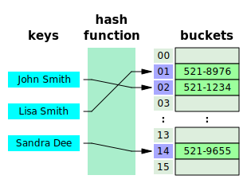

# Python: Basic stuff - Pt. 2

## Table of contents

- [1. Iteration](#1-iteration)
	- [1.1. Loops](#11-loops)
	- [1.2. Looping over a string](#12-looping-over-a-string)
	- [1.3. Looping over a file](#13-looping-over-a-file)
	- [1.4. Looping and counting](#14-looping-and-counting)
	- [1.5. Linear search](#15-linear-search)
	- [1.6. Doctests](#16-doctests)
- [2. Strings](#2-strings)
	- [2.1. Strings are sequences](#21-strings-are-sequences)
	- [2.2. String slices](#22-string-slices)
	- [2.3. Strings are immutable](#23-strings-are-immutable)
	- [2.4. String methods](#24-string-methods)
- [3. Lists](#3-lists)
	- [3.1. Lists are sequences](#31-lists-are-sequences)
	- [3.2. Lists are mutable](#32-lists-are-mutable)
	- [3.3. List slices](#33-list-slices)
	- [3.4. List operations](#34-list-operations)
	- [3.5. List methods](#35-list-methods)
	- [3.6. Lists and strings](#36-lists-and-strings)
	- [3.7. Looping through a list](#37-looping-through-a-list)
	- [3.8. Objects and values](#38-objects-and-values)
	- [3.9. References and aliases](#39-references-and-aliases)
- [4. Dictionaries](#4-dictionaries)
	- [4.1. A dictionary is a mapping](#41-a-dictionary-is-a-mapping)
	- [4.2. Key search is very fast](#42-key-search-is-very-fast)
	- [4.3. Looping and dictionaries](#43-looping-and-dictionaries)
- [5. Tuples](#5-tuples)
	- [5.1. Tuples are like lists](#51-tuples-are-like-lists)
	- [5.2. But tuples are immutable](#52-but-tuples-are-immutable)
	- [5.3. Tuple assignment](#53-tuple-assignment)
	- [5.4. Tuples as return values](#54-tuples-as-return-values)
	- [5.5. Argument packing](#55-argument-packing)
- [Glossary](#glossary)
- [Bibliography](#bibliography)
- [Licenses](#licenses)

## 1. Iteration

### 1.1. Loops

Statements that run one or more statements

```python
for i in range(3):
	print(i)
```

- `range` creates a sequence of values, i.e., `[0, 1, 2]` 
- `for` statement (with `i` as loop variable)
	1. Assigns the next value from `range` to `i`
	2. Runs the body
	3. Loops back around the header

### 1.2. Looping over a string

```python
def has_e(word):
	"""
	Check whether a word contains the letter 'e'

	word : string to be checked
	"""
    for letter in word:
        if letter == 'E' or letter == 'e':
            return True
    return False
```

### 1.3. Looping over a file

```python
for line in open("words.txt"):
	print(line)
```

`for` loops over `words.txt` line by line
- `open` returns a file object
- `words.txt` is [this](../code/data/words.txt) file

---

```shell
>>> f = open("words.txt")
>>> f.readline()
'aa\n'
>>> f.readline()
'aah\n'
```

`readline` is a method of `f`
- Reads characters from the file until it gets to a newline (`\n`)
- Returns the result as a `str`

### 1.4. Looping and counting

```python
total = 0
for line in open("words.txt"):
	total += 1
```

`total = 0` is a variable initialization
- Creates a new variable (`total`) and gives it a value (`0`)

`total += 1` is a variable update
- Gives a new value to a variable that already exists
- `+=` is an augmented assignment operator

---

Initialization $\rightarrow$ update

```python
for line in open("words.txt"):
	total += 1                   # ERROR
```

`total += 1` means `total = total + 1`
- Get the current value of `total`
- Add `1`
- Assign the result back to `total`

Python evaluates `total + 1` first, but `total` does **not** exist

### 1.5. Linear search

A computational pattern that searches through a sequence of elements  and stops when it finds what it is looking for

```python
def uses_any(word, letters):
    for letter in word.lower():
        if letter in letters.lower():
            return True
    return False
```

- `lower` is a method that can be called on `str`
- `in` is both used for iteration and membership

### 1.6. Doctests

Strings at the beginning of a function that test functions

```python
def uses_any(word, letters):
    """
	Check if a word uses any of a list of letters
    
    >>> uses_any('banana', 'aeiou')
    True
    >>> uses_any('apple', 'xyz')
    False
    """
    for letter in word.lower():
        if letter in letters.lower():
            return True
    return False
```

---

Each test consists of two lines
1.  `>>>` followed by an expression
2.  The value the expression should have if the function works correctly

For example
1. `>>> uses_any('apple', 'xyz')` 
2. `False` 

as `apple` does not use any of `xyz` 

---

`uses_any.py` (see [here](../code/uses_any.py)):

```python
def uses_any(word, letters):
    """
	Check if a word uses any of a list of letters
    
    >>> uses_any('banana', 'aeiou')
    True
    >>> uses_any('apple', 'xyz')
    False
    """
    for letter in word.lower():
        if letter in letters.lower():
            return True
    return False

if __name__ == "__main__":
	import doctest
    doctest.testmod()
```

---

The interpreter changes `__name__` as follows
- If the program runs as a script, `__name__` equals  `"__main__"`
- If the program is imported, `__name__` equals the module name

```python
if __name__ == "__main__":
	import doctest
    doctest.testmod()
```

Tests run only when the program is executed as a script

Convention is to place this `if` a the bottom for clarity

---

```shell
$ python uses_any.py -v
Trying:
    uses_any('banana', 'aeiou')
Expecting:
    True
ok
Trying:
    uses_any('apple', 'xyz')
Expecting:
    False
ok
1 items had no tests:
    __main__
1 items passed all tests:
   2 tests in __main__.uses_any
2 tests in 2 items.
2 passed and 0 failed.
Test passed.
```

`-v` prints
- A log of what the `doctest` module is trying
- A summary at the end

## 2. Strings

### 2.1. Strings are sequences

A string is a sequence of characters. In other words
- A string is an ordered collection of characters
- Each character is identified by an integer index

```shell
>>> fruit = 'apple'
>>> fruit[1]
'p'
>>> fruit[-1]
'e'
```

### 2.2. String slices

Parts of a strings specified by ranges of indices

```shell
>>> fruit = 'apple'
>>> fruit[0:3]
'app'
```

The `[n:m]` operator
- Returns from the `n`th to the `m`th character
- Including the `n`th, but excluding the `m`th

---

```shell
>>> fruit[:3]
'app'
>>> fruit[3:]
'le'
>>> fruit[3:3]
''
```

- If `[:m]` $\rightarrow$ slice starts at the beginning
- If `[n:]` $\rightarrow$ slice goes to the end 
- If `n` $\ge$ `m` $\rightarrow$ empty string

### 2.3. Strings are immutable

String elements cannot be changed

```shell
>>> fruit = 'apple'
>>> fruit[0] = 'b'
  File "<stdin>", line 1, in <module>
TypeError: 'str' object does not support item assignment
>>> new_fruit = 'b' + fruit[1:]
>>> new_fruit
'bpple'
>>> fruit
'apple'
```

### 2.4. String methods

Several methods can be called on string objects

```shell
>>> fruit = 'apple'
>>> fruit.upper()
'APPLE'
>>> fruit
'apple'
```

The dot operator specifies
- The name of the method (`upper`)
- The name of the `str` object to apply the method to (`fruit`)

## 3. Lists

### 3.1. Lists are sequences

Sequences of values, which can be of any type

```shell
>>> numbers = [42, 123]
>>> cheeses = ['Cheddar', 'Edam', 'Gouda']
>>> t = ['spam', 2.0, 5, [10, 20]]
```

`t` is a nested list, i.e., a list that is an element of another list

### 3.2. Lists are mutable

Unlike `str` objects, which are immutable

`list` indices work the same way as `str` indices

```shell
>>> numbers = [42, 123]
>>> numbers[1] = 17
>>> numbers
[42, 17]
```

### 3.3. List slices

The slice operator works on lists as it works on strings

```shell
>>> letters = ['a', 'b', 'c', 'd']
>>> letters[1:3]
['b', 'c']
>>> letters[:]
['a', 'b', 'c', 'd']
```

- If `[:]`, the slice is a copy of the whole list 

### 3.4. List operations

There are only two operators that work with lists
- `+` joins two lists (concatenation)
- `*` makes multiple copies and concatenates

| Built-in function | Description                 |
| ----------------- | --------------------------- |
| `sum`             | Add up the elements         |
| `min`             | Find the smallest element   |
| `max`             | Find the largest element    |
| `sorted`          | Sort the elements of a list |

---

```python
>>> numbers = [1, 2, 3, 4, 5]
>>> sum(numbers)
15
>>> min(numbers)
1
>>> max(numbers)
5
>>> scramble = ['c', 'a', 'b']
>>> sorted(scramble)
['a', 'b', 'c']
```

### 3.5. List methods

| Method      | Description                                                                                           |
| ----------- | ----------------------------------------------------------------------------------------------------- |
| `append(x)` | Add `x` to the end of the list                                                                        |
| `extend(l)` | Append all the elements of `l` to the end of the list                                                 |
| `pop(i)`    | Remove the `i`th element, and return it. If no index is specified, remove and return the last element |
| `remove(x)` | Remove the first element from the list whose value is equal to `x`                                    |

---

```shell
>>> numbers = [1, 2, 3, 4, 5]
>>> numbers.append(6)
>>> numbers
[1, 2, 3, 4, 5, 6]
>>> numbers.extend([7, 8])
>>> numbers
[1, 2, 3, 4, 5, 6, 7, 8]
>>> numbers.pop()
8
>>> numbers.remove(5)
>>> numbers
[1, 2, 3, 4, 6, 7]
```

### 3.6. Lists and strings

List of characters $\ne$ string

```shell
>>> s = 'apple'
>>> type(s)
<class 'str'>
>>> s.pop()
Traceback (most recent call last):
  File "<stdin>", line 1, in <module>
AttributeError: 'str' object has no attribute 'pop'
>>> t = list(s)
>>> t.pop()
'e'
```

---

- Most list methods modify the original list and return `None`
- String methods return a new string (strings are immutable)

```shell
>>> l = [1, 2, 3]
>>> l = l.remove(3)
>>> l.remove(2)
Traceback (most recent call last):
  File "<stdin>", line 1, in <module>
AttributeError: 'NoneType' object has no attribute 'remove'
```

`l` is `NoneType` because `remove` returns `None`

### 3.7. Looping through a list

```shell
>>> numbers = [1, 2, 3, 4, 5]
>>> for n in numbers:
...     print(n)
...
1
2
3
4
5
```

A `for` loop over an empty list `[]` never runs the body

### 3.8. Objects and values

`is` checks whether two variables refer to the same object

```shell
>>> a = 'apple'
>>> b = 'apple'
>>> a is b
True
```

`a` and `b` refer to the same `str` object
- Have the same value (equivalent)
- Are the same object (identical)

---

```shell
>>> a = [1, 2, 3]
>>> b = [1, 2, 3]
>>> a is b
False
```

`a` and `b` refer to two different `list` objects
- Have the same value (equivalent)
- But are not identical

### 3.9. References and aliases

A reference is the association of a variable with an object

```shell
>>> a = [1, 2, 3]
>>> b = a
>>> a is b
True
```

The object `[1, 2, 3]` has two references, i.e., `a` and `b`

An object with more than one reference is aliased

---

If the aliased object is mutable, changes made with one reference affect the other

```shell
>>> a = [1, 2, 3]
>>> b = a
>>> b[0] = 5
>>> a
[5, 2, 3]
```

In general, avoid aliasing when working with mutable objects

---

When you pass a list to a function, the function gets a reference

```shell
>>> def pop_first(l):
...     return l.pop(0)
...
>>> numbers = [1, 2, 3]
>>> pop_first(numbers)
1
>>> numbers
[2, 3]
```

`l` and `numbers`are aliases for the same object

## 4. Dictionaries

### 4.1. A dictionary is a mapping

Objects that contain key-value pairs, aka items

```shell
>>> numbers = {}          # or numbers = dict()
>>> numbers['zero'] = 0
>>> numbers['one'] = 1
>>> numbers['two'] = 2
# numbers = {'zero': 0, 'one': 1, 'two': 2}
>>> numbers
{'zero': 0, 'one': 1, 'two': 2}
```

Each key (`zero`, `one`, and `two`) maps to a value (`0`, `1`, and `2`)

### 4.2. Key search is very fast

Dictionaries are implemented using hash tables
- Significant memory overhead
- Fast access regardless of the size (as long as it fits in memory)



[Wikipedia](https://en.wikipedia.org/wiki/Hash_table)

---

```python
found = 0  
for n in needles:
	if n in haystack: 
		found += 1
```

- `haystack` contains floats
- `needles` is a list of 1000 floats (50% picked from `haystack`)

---

| `haystack` | Factor | `dict` time | Factor | `list` time | Factor |
| ---------- | ------ | ----------- | ------ | ----------- | ------ |
| 1K         | 1      | 0.000202s   | 1.00   | 0.010556s   | 1.00   |
| 10K        | 10     | 0.000140s   | 0.69   | 0.086586s   | 8.20   |
| 100K       | 100    | 0.000228s   | 1.13   | 0.871560s   | 82.57  |
| 1M         | 1K     | 0.000290s   | 1.44   | 9.189616s   | 870.56 |
| 10M        | 10K    | 0.000337s   | 1.67   | 97.948056s  | 9278.9 |

---

With dictionaries, mutable types 
- Can be used as values
- Cannot be used as keys

```shell
>>> d = {'a': 1, 'b': [1, 2]}
>>> l = [3, 4]
>>> d[l] = 5
Traceback (most recent call last):
  File "<stdin>", line 1, in <module>
TypeError: unhashable type: 'list'
```

### 4.3. Looping and dictionaries

```shell
>>> d = {'a': 1, 'b': 2, 'c': 3}
>>> for k in d:
...     print(k, d[k])
...
a 1
b 2
c 3
```

---

```shell
>>> d = {'a': 1, 'b': 2, 'c': 3}
>>> for v in d.values():
...     print(v)
...
1
2
3
```

## 5. Tuples

### 5.1. Tuples are like lists

Like a list, a tuple is
- A sequence of values
- Indexed by integers

```shell
>>> t = ('a', 'b', 'c', 'd') # () are optional
>>> type(t)
<class 'tuple'>
>>> t[1]
'b'
```

---

```shell
>>> s = ('a')
>>> type(s)
<class 'str'>
>>> t = ('a',)
>>> type(t)
<class 'tuple'>
```

Note that a single value in parenthesis is not a tuple

---

Most list operators also work with tuple

```shell
>>> t1 = ('h', 'e', 'l')
>>> t2 = ('l', 'o')
>>> t1 + t2
('h', 'e', 'l', 'l', 'o')
>>> t2 * 2
('l', 'o', 'l', 'o')
>>> sorted(t1 + t2)
['e', 'h', 'l', 'l', 'o']
```

### 5.2. But tuples are immutable

Bracket operator does not work

```shell
>>> t = ('h', 'e', 'l', 'l', 'o')
>>> t[0] = 'a'
Traceback (most recent call last):
  File "<stdin>", line 1, in <module>
TypeError: 'tuple' object does not support item assignment
```

---

There are no methods like `append` or `remove`

```shell
>>> t = ('h', 'e', 'l', 'l', 'o')
>>> t.remove('l')
Traceback (most recent call last):
  File "<stdin>", line 1, in <module>
AttributeError: 'tuple' object has no attribute 'remove'
```

---

Since tuples are immutable, they are hashable

```shell
>>> d = dict()
>>> d[1, 2] = 'a'
>>> d[(3, 4)] = 'b'
>>> d
{(1, 2): 'a', (3, 4): 'b'}
```

### 5.3. Tuple assignment

Values are assigned to variables from left to right

```shell
>>> a, b = 1, 2
>>> a
1
>>> b
2
>>> a, b
(1, 2)
```

---

If the left side is a tuple, the right side can be any kind of sequence

```shell
>>> email = "mattia.fogli@unife.it"
>>> username, domain = email.split("@")
>>> username, domain
('mattia.fogli', 'unife.it')
```

---

Useful to swap the values of two variables

```shell
>>> a, b = 1, 2
>>> a, b
(1, 2)
>>> a, b = b, a
>>> a, b
(2, 1)
```

This works because the right side is evaluated before  assignments

---

Also useful to loop through dictionaries

```shell
>>> d = {'zero': 0, 'one': 1, 'two': 2}
>>> for k, v in d.items():
...     print(k, '-->', v)
...
zero --> 0
one --> 1
two --> 2
```

### 5.4. Tuples as return values

Functions can only return a single value, but if that value is a tuple...

```shell
>>> quotient, reminder = divmod(10, 3)
>>> quotient, reminder
(3, 1)
```

### 5.5. Argument packing

Collecting multiple arguments into a tuple

```shell
>>> def mean(*args):
...     return sum(args) / len(args)
...
>>> mean(1, 2)
1.5
>>> mean(1, 2, 3, 4, 5)
3.0
```

Parameters that begins with the `*` operator packs

---

```shell
>>> t = (10, 3)
>>> divmod(t)
Traceback (most recent call last):
  File "<stdin>", line 1, in <module>
TypeError: divmod expected 2 arguments, got 1
>>> divmod(*t)
(3, 1)
```

Arguments that begins with the `*` operator unpacks

## Glossary

| Term                          | Meaning                                                                                                                                                                                                                                                      |
| ----------------------------- | ------------------------------------------------------------------------------------------------------------------------------------------------------------------------------------------------------------------------------------------------------------ |
| Aliased                       | If there is more than one variable that refers to an object, the object is aliased                                                                                                                                                                           |
| Attribute                     | One of the named values (variables or methods) associated with an object                                                                                                                                                                                     |
| Augmented assignment operator | An operator that updates a variable more concisely                                                                                                                                                                                                           |
| Dictionary                    | An object that contains key-value pairs, also called items                                                                                                                                                                                                   |
| Doctest                       | A string at the beginning of a function that tests a function                                                                                                                                                                                                |
| Element                       | One of the values in a list or other sequence                                                                                                                                                                                                                |
| Empty string                  | A string that contains no characters and has length `0`                                                                                                                                                                                                      |
| Equivalent                    | Having the same value                                                                                                                                                                                                                                        |
| File object                   | An object that represents an open file and keeps track of which parts of the file have been read or written                                                                                                                                                  |
| Hash function                 | A function that can be used to map data of arbitrary size to fixed-size values                                                                                                                                                                               |
| Hash table                    | A collection of key-value pairs that uses a hash function to compute an index into an array of buckets, from which the desired value can be found. During lookup, the key is hashed and the resulting hash indicates where the corresponding value is stored |
| Identical                     | Being the same object                                                                                                                                                                                                                                        |
| Immutable object              | If the elements of an object cannot be changed                                                                                                                                                                                                               |
| Index                         | An integer value used to select an item in a sequence, such as a character in a string. In Python indices start from `0`                                                                                                                                     |
| Invocation                    | An expression, or part of an expression, that calls a method                                                                                                                                                                                                 |
| Linear search                 | A computational pattern that searches through a sequence of elements and stops when it finds what it is looking for                                                                                                                                          |
| List                          | A mutable object that contains a sequence of values                                                                                                                                                                                                          |
| Loop                          | A statement that runs one or more statements, often repeatedly                                                                                                                                                                                               |
| Loop variable                 | A variable defined in the header of a `for` loop                                                                                                                                                                                                             |
| Method                        | A function that is associated with an object and called using the dot operator                                                                                                                                                                               |
| Mutable object                | If the elements of an object can be changed                                                                                                                                                                                                                  |
| Nested list                   | A list that is an element of another list                                                                                                                                                                                                                    |
| Packing                       | Collecting multiple arguments into a tuple                                                                                                                                                                                                                   |
| Reference                     | An association between a variable and its value                                                                                                                                                                                                              |
| Sequence                      | An ordered collection of values where each value is identified by an integer index                                                                                                                                                                           |
| Slice                         | A part of a string specified by a range of indices                                                                                                                                                                                                           |
| Tuple                         | An immutable object that contains a sequence of values                                                                                                                                                                                                       |
| Unpacking                     | Treat a sequence as multiple arguments                                                                                                                                                                                                                       |
| Variable initialization       | An assignment statement that creates a new variable and give it a value                                                                                                                                                                                      |
| Variable update               | An assignment statement that give a new value to a variable that already exists, rather than creating a new variable                                                                                                                                         |

## Bibliography

| Author      | Title                                                                                  | Year |
| ----------- | -------------------------------------------------------------------------------------- | ---- |
| Downey, A.  | [Think Python](https://allendowney.github.io/ThinkPython/)                             | 2024 |
| Ramalho, L. | [Fluent Python](https://www.oreilly.com/library/view/fluent-python-2nd/9781492056348/) | 2022 |

## Licenses

| Content | License                                                                                                                       |
| ------- | ----------------------------------------------------------------------------------------------------------------------------- |
| Code    | [MIT License](https://mit-license.org/)                                                                                       |
| Text    | [Creative Commons Attribution-NonCommercial-ShareAlike 4.0 International](https://creativecommons.org/licenses/by-nc-sa/4.0/) |
