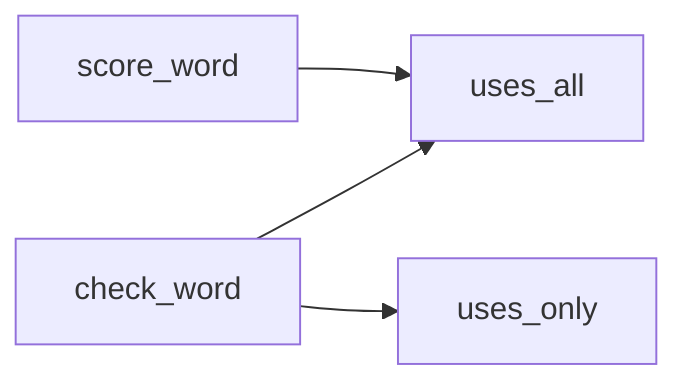

# Python: Basic stuff - Lab

## Table of contents

- [1. Get started](#1-get-started)
	- [1.1. Assignment](#11-assignment)
	- [1.2. Hints](#12-hints)
		- [1.2.1. Run a Python program](#121-run-a-python-program)
		- [1.2.2. Enable interactive mode](#122-enable-the-interactive-mode)
- [2. Spelling bee](#2-spelling-bee)
	- [2.1. Problem](#21-problem)
		- [2.1.1. Assignment 1](#211-assignment-1)
		- [2.1.2. Assignment 2](#212-assignment-2)
		- [2.1.3. Assignment 3](#213-assignment-3)
	- [2.2. Hints](#22-hints)
		- [2.2.1. Let it fail](#221-let-it-fail)
		- [2.2.2. Problem decomposition](#222-problem-decomposition)
- [3. Text inspector](#3-text-inspector)
	- [3.1. Problem](#31-problem)
		- [3.1.1. Assignment 1](#311-assignment-1)
		- [3.1.2. Assignment 2](#312-assignment-2)
	- [3.2. Hints](#32-hints)
		- [3.2.1. Reading and writing files](#321-reading-and-writing-files)
- [4. Solutions](#4-solutions)
- [Bibliography](#bibliography)
- [Licenses](#licenses)

## 1. Get started

### 1.1. Assignment

1. [Set up the development environment](1-python-basic-stuff-pt1.md#16-development-environment)
2. Try out the examples provided in the previous lectures
	1. [Python: Basic stuff - Pt. 1](1-python-basic-stuff-pt1.md)
	2. [Python: Basic stuff - Pt. 2](2-python-basic-stuff-pt2.md)

### 1.2. Hints

#### 1.2.1. Run a Python program

```shell
$ python <your_program>.py
```

Depending on your system, you may have to use `python` or `python3`

#### 1.2.2. Enable the interactive mode

```shell
$ python
```

Depending on your system, you may have to use `python` or `python3`

## 2.  Spelling bee

### 2.1. Problem

The New York Times publishes a daily puzzle called spelling bee. This game challenges readers to spell as many words as possible using only seven letters, where one of the letters is required. The words must have at least four letters.

Suppose the letters are ACDLORT, with R as the required letter. So "color" is an acceptable word, but "told" is not, because it does not use R, and "rat" is not because it has only three letters. Letters can be repeated, so "ratatat" is acceptable.

#### 2.1.1. Assignment 1

Write a function called `check_word` that checks whether a given word is acceptable. Here's an outline of the function that includes [doctests](2-python-basic-stuff-pt2.md#16-doctests). Fill in the function and then check that all tests pass.

```python
def check_word(word, available, required):
    """
    Check whether a word is acceptable

	word : word to check
	available : string of seven available letters
	required : string of the single required letter
    
    >>> check_word('color', 'ACDLORT', 'R')
    True
    >>> check_word('ratatat', 'ACDLORT', 'R')
    True
    >>> check_word('rat', 'ACDLORT', 'R')
    False
    >>> check_word('told', 'ACDLORT', 'R')
    False
    >>> check_word('bee', 'ACDLORT', 'R')
    False
    """
    return False
```

#### 2.1.2. Assignment 2

According to the rules
- Four-letter words are worth 1 point each.
- Longer words earn 1 point per letter.
- Each puzzle includes at least one “pangram” which uses every letter. These are worth 7 extra points!

Write a function called `score_word`. Assume that the word is acceptable. Here’s an outline of the function with [doctests](2-python-basic-stuff-pt2.md#16-doctests).

```python
def score_word(word, available):
    """
    Compute the score for an acceptable word

	word : word to be scored
	available : string of the available letters
    
    >>> score_word('card', 'ACDLORT')
    1
    >>> score_word('color', 'ACDLORT')
    5
    >>> score_word('cartload', 'ACDLORT')
    15
    """
    return 0
```

#### 2.1.3. Assignment 3

Search [this](../code/data/words.txt) word list for acceptable words. This search requires to [loop over a file](2-python-basic-stuff-pt2.md#13-looping-over-a-file). Print the score of each of them as well as the total score. Expected output:

```python
accord 6
actor 5
alar 1
altar 5
aorta 5
aortal 6
arco 1
ardor 5
artal 5
attar 5
attract 7
calcar 6
caracal 7
caracara 8
caracol 7
carat 5
card 1
carl 1
carload 7
carol 5
carrot 6
cart 1
cartload 15
cataract 8
claro 5
collar 6
collard 7
collator 8
color 5
colorado 8
coral 5
cord 1
corolla 7
corral 6
cottar 6
craal 5
dart 1
doctor 6
doctoral 15
dollar 6
dolor 5
door 1
dorado 6
dorr 1
dotard 6
drat 1
droll 5
drool 5
lard 1
locator 7
loral 5
lord 1
odor 1
oral 1
orator 6
orca 1
ordo 1
orra 1
ottar 5
radar 5
ratal 5
ratatat 7
rato 1
road 1
roar 1
rococo 6
roll 1
rood 1
root 1
rota 1
rotator 7
rotl 1
roto 1
rotor 5
talar 5
tardo 5
taro 1
taroc 5
tarot 5
tart 1
tartar 6
tora 1
torc 1
toro 1
torr 1
tort 1
tract 5
tractor 7
trad 1
trocar 6
trod 1
troll 5
trot 1
Total score 388
```

### 2.2. Hints

#### 2.2.1. Let it fail

1. Create the `spelling_bee.py` file
2. Copy and paste the `check_word` (see [§2.1.1](#211-assignment-1)) and `word_score` (see [§2.1.2](#212-assignment-2)) functions
3. Make sure doctests run when `spelling_bee` is executed as a script
4. Run `spelling_bee.py`

Expected output:

```shell
**********************************************************************
File "/Users/fglmtt/github.com/fglmtt/admin/code/spelling_bee.py", line 9, in __main__.check_word
Failed example:
    check_word('color', 'ACDLORT', 'R')
Expected:
    True
Got:
    False
**********************************************************************
File "/Users/fglmtt/github.com/fglmtt/admin/code/spelling_bee.py", line 11, in __main__.check_word
Failed example:
    check_word('ratatat', 'ACDLORT', 'R')
Expected:
    True
Got:
    False
**********************************************************************
File "/Users/fglmtt/github.com/fglmtt/admin/code/spelling_bee.py", line 27, in __main__.score_word
Failed example:
    score_word('card', 'ACDLORT')
Expected:
    1
Got:
    0
**********************************************************************
File "/Users/fglmtt/github.com/fglmtt/admin/code/spelling_bee.py", line 29, in __main__.score_word
Failed example:
    score_word('color', 'ACDLORT')
Expected:
    5
Got:
    0
**********************************************************************
File "/Users/fglmtt/github.com/fglmtt/admin/code/spelling_bee.py", line 31, in __main__.score_word
Failed example:
    score_word('cartload', 'ACDLORT')
Expected:
    15
Got:
    0
**********************************************************************
2 items had failures:
   2 of   5 in __main__.check_word
   3 of   3 in __main__.score_word
***Test Failed*** 5 failures.
```

#### 2.2.2. Problem decomposition

Given that
- `check_word` must check whether the required letters are used 
- `score_word` must check whether all the available letters are used to set the appropriate score

Therefore, `check_word` and `score_word` requires the same logic. This logic can be encapsulated in another function, say, `uses_all`, which will be called by both `check_word` and `score_word`.

Also, `check_word` must check whether a word uses only the available letter. This logic can also be encapsulated in a function, say, `uses_only`.



```python
def uses_all(word, required):
    """
    Check whether a word uses all the required letters

	word : word to be checked
	required: string of the required letter 
    
    >>> uses_all('banana', 'ban')
    True
    >>> uses_all('apple', 'api')
    False
    """
    return None
```

```python
def uses_only(word, available):
    """
    Checks whether a word uses only the available letters

	word : word to be checked
	available : string of the available letters
    
    >>> uses_only('banana', 'ban')
    True
    >>> uses_only('apple', 'apl')
    False
    """
    return None
```

`uses_all` and `uses_only` are **very** similar: 
1. Check out how to [loop over a string](2-python-basic-stuff-pt2.md#12-looping-over-a-string)
2. Make sure to lower case letters (see [this](2-python-basic-stuff-pt2.md#15-linear-search) example)

## 3. Text inspector

### 3.1. Problem

Let's inspect a book—The Strange Case of Dr. Jekyll and Mr. Hide by Robert Louis Stevenson. [This](../code/data/stevenson.txt) file contains the whole book.

#### 3.1.1. Assignment 1

Write a function called `clean_book` that removes everything except the book itself. In other words, `clean_book` removes everything before (and included)

`*** START OF THIS PROJECT GUTENBERG EBOOK THE STRANGE CASE OF DR. ***`

and after (and included)

`*** END OF THIS PROJECT GUTENBERG EBOOK THE STRANGE CASE OF DR. ***`

Here's an outline of the function that includes [doctests](2-python-basic-stuff-pt2.md#16-doctests). Fill in the function and then check that all tests pass.

```python
def clean_book(source_filename, destination_filename):
    """
    Remove everything except the book itself. Return the number of lines of the cleaned book

    source_filename : where to find the book to be cleaned
    destination_filename : where to store the cleaned book

    >>> clean_book("data/stevenson.txt", "data/stevenson_clean.txt")
    2530
    """
    return 0
```

#### 3.1.2. Assignment 2

Write a function called `count_unique_words` that counts the number of unique words in a file. Here's an outline of the function that includes [doctests](2-python-basic-stuff-pt2.md#16-doctests). Fill in the function and then check that all tests pass.

```python
def count_unique_words(filename):
    """
    Count the number of unique words in a file

    filename : path to a file

    >>> count_unique_words("data/stevenson_clean.txt")
    6039
    """
	return 0
```

### 3.2. Hints

#### 3.2.1. Reading and writing files

| Built-in function | Description          |
| ----------------- | -------------------- |
| `open`            | Return a file object |

```python
# open a file that will only be read
f1 = open("data/stevenson.txt")

# open a file that will only be written
f2 = open("data/stevenson_clean.txt", "w")
```

| Methods of file objects | Description                                                                      |
| ----------------------- | -------------------------------------------------------------------------------- |
| `readline`              | Read a single line from the file, up to `\n`. Return a `str`                     |
| `readlines`             | Read all the lines of a file. Return a `list`                                    |
| `write(string)`         | Write the content of `string` to a file. Return the number of characters written |
| `close`                 | Close the file                                                                   |

```python
# print the number of lines in a file
print(len(f1.readlines()))

f2.write("this is a test\n")

# close the opened files
f1.close()
f2.close()
```

## 4. Solutions

| Problem                 | Program                                        | Input                                       | Output                                                  |
| ----------------------- | ---------------------------------------------- | ------------------------------------------- | ------------------------------------------------------- |
| [§2](#2-spelling-bee)   | [spelling_bee.py](../code/spelling_bee.py)     | [words.txt](../code/data/words.txt)         | n/a                                                     |
| [§3](#3-text-inspector) | [text_inspector.py](../code/text_inspector.py) | [stevenson.txt](../code/data/stevenson.txt) | [stevenson_clean.txt](../code/data/stevenson_clean.txt) |

## Bibliography

| Author                     | Title                                                                                                      | Year |
| -------------------------- | ---------------------------------------------------------------------------------------------------------- | ---- |
| Downey, A.                 | [Think Python](https://allendowney.github.io/ThinkPython/)                                                 | 2024 |

## Licenses

| Content | License                                                                                                                       |
| ------- | ----------------------------------------------------------------------------------------------------------------------------- |
| Code    | [MIT License](https://mit-license.org/)                                                                                       |
| Text    | [Creative Commons Attribution-NonCommercial-ShareAlike 4.0 International](https://creativecommons.org/licenses/by-nc-sa/4.0/) |
