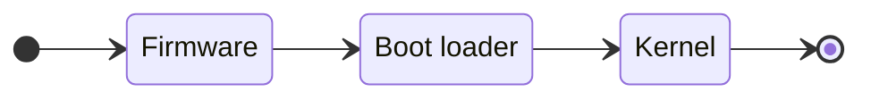
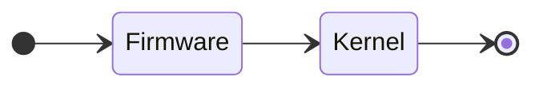
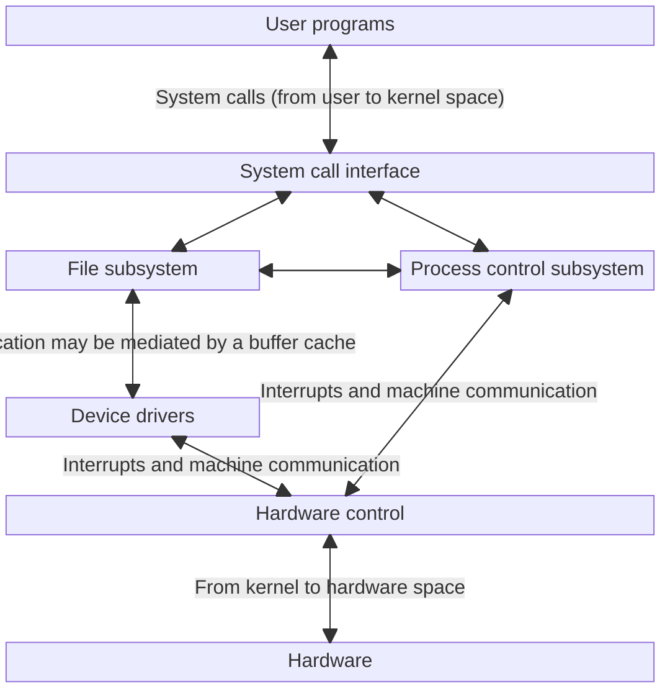
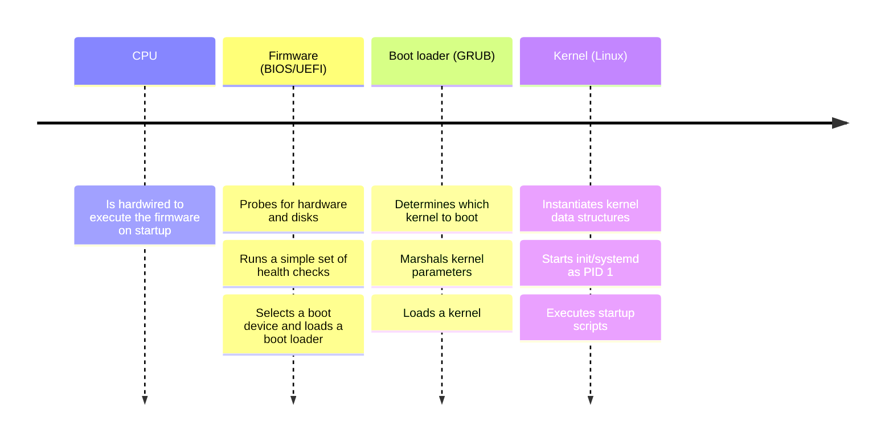
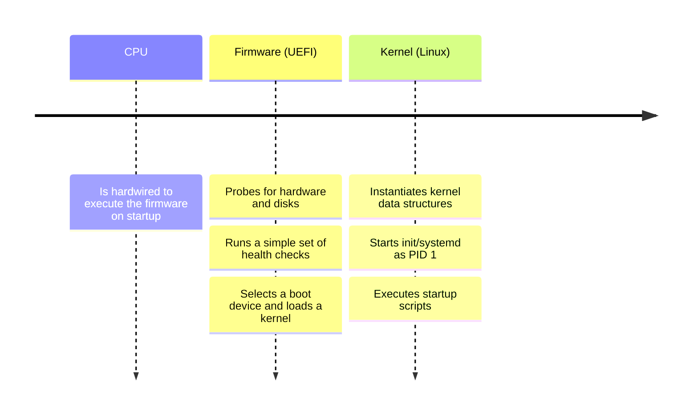

# Booting and system management daemons

## Table of contents

- [1. Booting](#1-booting)
    - [1.1. Firmware](#11-firmware)
    	- [1.1.1. BIOS v. UEFI](#111-bios-v-uefi)
    	- [1.1.2. BIOS](#112-bios)
    	- [1.1.3. UEFI](#113-uefi)
    - [1.2. Boot loader](#12-boot-loader)
    	- [1.2.1. GRUB](#121-grub)
    - [1.3. Kernel](#13-kernel)
        - [1.3.1. Kernel parameters](#131-kernel-parameters)
        - [1.3.2. Kernel operating modes](#132-kernel-operating-modes)
        - [1.3.3. Daemon processes](#133-daemon-processes)
        - [1.3.4. System management daemon](#134-system-management-daemon)
    - [1.4. Summary](#14-summary)
        - [1.4.1. Traditional booting](#141-traditional-booting)
        - [1.4.2. Loader-less booting](#142-loader-less-booting)
- [2. System and service management in Linux](#2-system-and-service-management-in-linux)
    - [2.1. Units and unit files](#21-units-and-unit-files)
    - [2.2. Controlling systemd](#22-controlling-systemd)
        - [2.2.1. Listing units](#221-listing-units)
        - [2.2.2. Listing unit files](#222-listing-unit-files)
        - [2.2.3. Showing unit statuses](#223-showing-unit-statuses)
        - [2.2.4. Switching between targets](#224-switching-between-targets)
    - [2.3. Dependencies among units](#23-dependencies-among-units)
    - [2.4. Execution order](#24-execution-order)
- [Glossary](#glossary)
- [Bibliography](#bibliography)
- [Licenses](#licenses)

## 1. Booting

The process of starting up a computer. This consists of
1. Finding, loading, and running boot code
2. Finding, loading, and running the kernel
3. Running startup script and system daemons
4. Maintaining process hygiene and managing system state transitions

Point (4) continues as long as the system remains up

---

Traditional booting:



Loader-less booting:



### 1.1. Firmware

Software that 
- Provides low-level control of computer hardware
- Stored in non-volatile memory, such as ROM

When a computer is powered on, the CPU is hardwired to execute the firmware

---

The firmware knows the devices on the motherboard and allows
- Hardware-level configuration of such devices
- Either expose such devices to the OS or disable and hide them

During normal booting, the firmware 
- Probes for hardware and disks
- Runs a simple set of health checks
- Selects the boot device and loads boot loader

#### 1.1.1. BIOS v. UEFI

BIOS is the traditional firmware

UEFI is the modern standard
- Most UEFI firmware can fall back to a BIOS implementation
- UEFI support is pretty much universal
- But BIOS systems remain in the field

#### 1.1.2. BIOS

BIOS assumes that the boot device starts with the MBR, which includes
- A first-stage boot loader, aka firmware loader (512 bytes)
- A primitive disk-partitioning table

As the first-stage boot loader is less than 512 bytes, it is not sophisticated enough to read any type of filesystem

---

Option 1
1. Reads the disk-partitioning table
2. Identifies the disk partition marked as "active"
3. Executes the second-stage boot loader

Option 2
- The second-stage boot loader can live in the dead zone that lies between the MBR and the beginning of the first disk partition 
- This dead zone contains around 32KB, enough for a filesystem driver

#### 1.1.3. UEFI

This specification
- Includes a modern disk-partitioning scheme, i.e., GPT
- Understands FAT filesystem
- Defines ESP

At boot time, the firmware
1. Looks into the GPT to identify the ESP
2. Reads the boot target
3. Executes it

---

As ESP is just a generic FAT filesystem, the UEFI boot target can be
- A kernel $\rightarrow$ loader-less booting
    - EFI boot stub is an example of firmware loader
- A boot loader

UEFI saves the path to the boot target as a configuration parameter

Although no boot loader at all is technically required, most systems still use one

---

```shell
$ efibootmgr -v
BootCurrent: 0004
BootOrder: 0000,0001,0002,0004,0003
Boot0000* EFI DVD/CDROM [...] 
Boot0001* EFI Hard Drive [...]
Boot0002* EFI Network [...] 
Boot0003* EFI Internal Shell [...]
Boot0004* ubuntu HD(1,GPT, [...])/File(\EFI\ubuntu\shimx64.efi)
```

---

| Entry                                 | Meaning                                                                                |
| ------------------------------------- | -------------------------------------------------------------------------------------- |
| `BootCurrent: 0004`                   | The boot device that was used                                                          |
| `BootOrder: 0000,0001,0002,0004,0003` | The order in which the firmware tries the available boot devices                       |
| `Boot0000` - `Boot0004`               | Available boot devices                                                                 |
| `Boot0004`                            | A GPT partitioned hard drive with the boot loader located at `\EFI\ubuntu\shimx64.efi` |

### 1.2. Boot loader

A computer program that is responsible for booting the kernel

As there may be multiple kernels available, most boot loaders have a boot-time user interface where it is possible to make a choice

A boot loader also takes care of marshalling configuration arguments for the kernel. This arguments can be either hardwired or provided on the fly through the user interface

---

| Boot loader      | Meaning                                                                                           |
| ---------------- | ------------------------------------------------------------------------------------------------- |
| ELILO            | Developed by HP for EFI-based firmware                                                            |
| GRUB             | Developed by the GNU project                                                                      |
| GRUB2            | Evolution of GRUB. Current standard. Default boot loader for most Linux distributions             |
| LILO             | Was the default boot loader on most Linux distribution before GRUB (then GRUB2). Now discontinued |
| Syslinux project | A suite of lightweight boot loaders                                                               |

#### 1.2.1. GRUB

| File                  | Description                                                              |
| --------------------- | ------------------------------------------------------------------------ |
| `/boot/grub/grub.cfg` | GRUB configuration file. Do not edit this file                           |
| `grub-mkconfig`       | Command line utility to generate `grub.cfg`                              |
| `update-grub`         | Stub for `grub-mkconfig`                                                 |
| `/etc/default/grub`   | `grub-mkconfig` generates `grub.cfg` using these settings                |
| `/etc/grub.d`         | `grub-mkconfig` generates `grub.cfg` using the scripts in this directory |

---

`/etc/default/grub`:

```
GRUB_DEFAULT=0
GRUB_TIMEOUT_STYLE=hidden
GRUB_TIMEOUT=0
GRUB_DISTRIBUTOR=`( . /etc/os-release; echo ${NAME:-Ubuntu} ) 2>/dev/null || echo Ubuntu`
GRUB_CMDLINE_LINUX_DEFAULT="quiet splash"
GRUB_CMDLINE_LINUX=""
```

---

| Shell variable               | Meaning                                                                                                                   |
| ---------------------------- | ------------------------------------------------------------------------------------------------------------------------- |
| `GRUB_DEFAULT`               | Default boot entry                                                                                                        |
| `GRUB_TIMEOUT`               | Boot the default entry this many seconds after the menu is displayed, unless a key is pressed                             |
| `GRUB_TIMEOUT_STYLE`         | How the menu is displayed during boot. `hidden` means the menu is not shown unless a key is pressed before `GRUB_TIMEOUT` |
| `GRUB_DISTRIBUTOR`           | Specify the OS name                                                                                                       |
| `GRUB_CMDLINE_LINUX`         | Kernel parameters that apply to all boot modes                                                                            |
| `GRUB_CMDLINE_LINUX_DEFAULT` | Additional kernel parameters that apply to default boot mode only                                                         |

### 1.3. Kernel

A computer program at the core of an operating system that
- Controls the hardware resources of the computer
- Provides an environment under which programs can run



#### 1.3.1. Kernel parameters

| Parameter        | Meaning                                                              |
| ---------------- | -------------------------------------------------------------------- |
| `quiet`          | Disable most log messages                                            |
| `debug`          | Enable kernel debugging                                              |
| `init=/bin/bash` | Run `bash` as init process (typically useful for emergency recovery) |
| `root=/dev/foo`  | Tell the kernel where to find the root filesystem (`/`)              |
| `single`         | Boot to single user mode                                             |

#### 1.3.2. Kernel operating modes

| Operating mode | Meaning                                                                                                                                                                                                              |
| -------------- | -------------------------------------------------------------------------------------------------------------------------------------------------------------------------------------------------------------------- |
| Single-user    | Local filesystems are mounted, a few services are running, and a root shell is started on the console (useful for resolving problems when the system boots but does not function properly or you cannot log into it) |
| Multi-user     | All filesystems are mounted, all configured services are running, along with a graphical user interface                                                                                                              |
| Server         | Similar to multiuser mode, but with no graphical user interface                                                                                                                                                      |

#### 1.3.3. Daemon processes

Processes that lives for a long time. Daemon processes  
- Start when the system is bootstrapped 
- Run in the background (no controlling terminal)
- Terminate only when the system is shut down

Kernel daemons (aka kernel threads or processes)
- Exist for the entire lifetime of the system
- Run with superuser privileges

---

Kernel daemons are part of the kernel itself. This means that
- There is no corresponding program in the filesystem
- They are not configurable
- They do not require administrative attention

In general, each kernel component that 
- Needs to perform work in a process context 
- But that is not invoked from the context of a user-level process 

will usually have its own kernel daemon

---

```shell
$ ps -ef
PID  PPID  TTY   CMD
  1     0    ?   /usr/lib/systemd/systemd
  2     0    ?   [kthreadd]
  3     2    ?   [pool_workqueue_release]
  4     2    ?   [kworker/R-rcu_g]
  
[...]

700     1    ?   /usr/lib/systemd/systemd-logind

[...]
```

---

Anything with `PPID 0` is a kernel daemon started during booting
- `systemd` is the only exception (`PID 1`)

`TTY` identifies the controlling terminal
- `?` means that there is no controlling terminal

Kernel daemons have brackets around their names

`[kthreadd]` is the parent of the other kernel daemons

#### 1.3.4. System management daemon 

The kernel starts the system management daemon with `PID 1`
- Traditionally called `init`
- Nowadays called `systemd` on most Linux distributions

The goal of the system management daemon is to make sure the system runs the right set of services and daemons at any given time

This depends on the mode in which the system should be operating (see [§1.3.2](#132-kernel-operating-modes))

---

Booting $\rightarrow$ multiuser mode
- Set the computer name and time zone
- Check disks and mount filesystems
- Remove old files from `/tmp`
- Configure network interfaces and packet filters
- Startup other daemons and services

The system management daemon has very little knowledge about these tasks, it simply runs a set of commands or scripts that have been designated for execution in that particular order

### 1.4. Summary

#### 1.4.1. Traditional booting


 
#### 1.4.2. Loader-less booting



## 2. System and service management in Linux

`systemd` is the default system daemon for most Linux distributions, which
- Runs with `PID 1`
- Starts the rest of the system

`systemctl` is the command to
- Investigate the status of `systemd`
- Make changes to `systemd` configuration

### 2.1. Units and unit files

A unit is an entity managed by `systemd`

The behavior of each unit is defined in a unit file. These files 
- Are plain text files encoded in ini style
- End with a suffix that identifies the type of unit (e.g., `.service`)

For example, in the case of a service, the unit file tells `systemd`
- The location of the executable file for the service
- How to start and stop the service
- Dependencies, if any

---

`systemd` reads unit files from [several directories](https://www.freedesktop.org/software/systemd/man/latest/systemd.unit.html#Unit%20File%20Load%20Path)

| Directory                    | Meaning                                       |
| ---------------------------- | --------------------------------------------- |
| `/usr/lib/systemd/system`    | System units installed by the package manager |
| `/etc/systemd/system`        | System units created by the administrator     |
| `/usr/lib/systemd/user`      | User units installed by the package manager   |
| `/etc/systemd/user`          | User units created by the administrator       |
| `$HOME/.config/systemd/user` | User configuration                            |

Files in `/etc` have the highest priority

---

In addition to the `systemd` system-wide instance, which
- Has `PID 1`
- Controls system units

There are also `systemd` user instances. A user instance
- Is started (stopped) as the user logs in (logs off)
- Controls user units

The system-wide instance is managed by the administrators, while a user instance is managed by either the user or an administrator

---

```shell
$ cat /usr/lib/systemd/system/rsync.service
[Unit]
Description=fast remote file copy program daemon
ConditionPathExists=/etc/rsyncd.conf
After=network.target
Documentation=man:rsync(1) man:rsyncd.conf(5)

[Service]
ExecStart=/usr/bin/rsync --daemon --no-detach
RestartSec=1
Restart=on-failure

[...]

[Install]
WantedBy=multi-user.target
```

---

| Section     | Directive             | Meaning                                                           |
| ----------- | --------------------- | ----------------------------------------------------------------- |
| `[Unit]`    | `Description`         | Human-readable description                                        |
| `[Unit]`    | `ConditionPathExists` | `systemd` starts `rsyncd` if and only if `/etc/rsyncd.conf`exists |
| `[Unit]`    | `After`               | `systemd` starts `rsyncd` after `network.target`                  |
| `[Unit]`    | `Documentation`       | Links to manual pages                                             |
| `[Service]` | `ExecStart`           | Command used to run `rsyncd`                                      |
| `[Service]` | `RestartSec`          | `systemd` waits `1` second before restarting `rsyncd` if it fails |
| `[Service]` | `Restart`             | `systemd` automatically restarts `rsyncd` if it fails             |
| `[Install]` | `WantedBy`            | `systemd` starts `rsyncd` when the system is in multiuser mode    |

### 2.2. Controlling systemd

`systemctl` 
- First argument is typically a subcommand
- Subsequent arguments are specific to that particular subcommand

| Subcommand        | Argument  | Meaning                                                        |
| ----------------- | --------- | -------------------------------------------------------------- |
| `daemon-reload`   | n/a       | Reload unit files and `systemd` config                         |
| `disable`         | `unit`    | Prevent `unit` from activating at boot                         |
| `enable`          | `unit`    | Enable `unit` to activate at boot                              |
| `isolate`         | `target`  | Change operating mode to `target`                              |
| `kill`            | `pattern` | Send a signal to units matching `pattern`                      |
| `list-unit-files` | `pattern` | List the unit files matching `pattern` installed in the system |
| `list-units`      | `pattern` | List the units matching `pattern` currently in memory          |
| `reboot`          | n/a       | Reboot the computer                                            |
| `restart`         | `unit`    | Restart `unit` immediately                                     |
| `start`           | `unit`    | Activate `unit` immediately                                    |
| `status`          | `unit`    | Show the status of `unit` and recent logs                      |
| `stop`            | `unit`    | Deactivate `unit` immediately                                  |

#### 2.2.1. Listing units

`list-units` lists the units currently in memory
- `--type=service` filters for services

```shell
$ systemctl list-units --type=service
UNIT               LOAD   ACTIVE SUB     DESCRIPTION
apparmor.service   loaded active exited  Load AppArmor profiles

[...]
```

---

| Column        | Meaning                                                   |
| ------------- | --------------------------------------------------------- |
| `LOAD`        | Whether the unit file was properly loaded into memory     |
| `ACTIVE`      | High-level unit activation state (this generalizes `SUB`) |
| `SUB`         | Low-level unit activation state (unit type specific)      |
| `DESCRIPTION` | Human-readable description (same as unit file)            |

The unit file `apparmor.service` was properly loaded into memory (`loaded`), the unit was started (`active`), but now the service is not running anymore (`exited`)

#### 2.2.2. Listing unit files

`list-unit-files` lists the unit files installed in the system
- `--type=service` filters for services

```shell
$ systemctl list-unit-files --type=service
UNIT FILE          STATE           PRESET
apparmor.service   enabled         enabled

[...]
```

---

| Column      | Meaning                                          |
| ----------- | ------------------------------------------------ |
| `UNIT FILE` | Unit file name                                   |
| `STATE`     | Unit file state                                  |
| `PRESET`    | Default unit file state as defined by the system |

`apparmor.service` starts on boot (`STATE=enabled`) as defined by the system (`PRESET=enabled`)

---

| Unit file state | Meaning                                                                                                                          |
| --------------- | -------------------------------------------------------------------------------------------------------------------------------- |
| `bad`           | Some kind of problem within `systemd` (usually a bad unit file)                                                                  |
| `disabled`      | Installed, but not configured to start on boot. The unit can be started manually                                                 |
| `masked`        | Completely disabled. The unit cannot even started manually                                                                       |
| `enabled`       | Installed, will start on boot                                                                                                    |
| `indirect`      | Enabled by another service                                                                                                       |
| `static`        | Started when another service depends on it. The unit file does not have an `[Install]` section. The unit can be started manually |
| `linked`        | The unit file is a symbolic link that points to a unit file that lives outside the standard `systemd` directories                |
| `alias`         | A reference to another unit file                                                                                                 |

---

`enabled` and `disabled` 
- Apply only to unit files that live in a standard `systemd` directory
- Have an `[Install]` section

`enabled` means that
- The directives in the `[Install]`have been executed
- The unit will start on boot

`static` is for those units that do not have an `[Install]` section

As a rule of thumb
- Avoid `linked` unit files $\rightarrow$ just make copies
- Use `systemctl disable` to turn off `enabled` units
- Use `systemctl mask` to turn off `static` units

#### 2.2.3. Showing unit statuses

`status` shows runtime status information

```shell
$ systemctl status rsync.service
○ rsync.service - fast remote file copy program daemon
     Loaded: loaded (/usr/lib/systemd/system/rsync.service; disabled; preset: enabled)
     Active: inactive (dead)
       Docs: man:rsync(1)
             man:rsyncd.conf(5)
```

- The unit file of `rsync.service` was properly loaded into memory (`loaded`)
- The service does not start on boot (`disabled`), although the default setting is to start it on boot (`preset: enabled`)
- The service is not running right now (`Active: inactive (dead)`)

---

```shell
$ systemctl status systemd-journald.service -l
● systemd-journald.service - Journal Service
     Loaded: loaded (/usr/lib/systemd/system/systemd-journald.service; static)
     Active: active (running) since Wed 2025-02-26 06:29:29 UTC; 5 days ago
TriggeredBy: ● systemd-journald.socket
             ● systemd-journald-dev-log.socket
             ○ systemd-journald-audit.socket
       Docs: man:systemd-journald.service(8)
             man:journald.conf(5)
   Main PID: 75103 (systemd-journal)
     Status: "Processing requests..."
      Tasks: 1 (limit: 2320)
   FD Store: 14 (limit: 4224)
     Memory: 5.1M (peak: 5.4M)
        CPU: 16.909s
     CGroup: /system.slice/systemd-journald.service
             └─75103 /usr/lib/systemd/systemd-journald

Feb 26 06:29:28 admin systemd-journald[75103]: Collecting audit messages is disabled.
Feb 26 06:29:28 admin systemd-journald[75103]: Journal started
```

#### 2.2.4. Switching between targets

`get-default` shows the target the system boots into by default

```shell
$ systemctl get-default
graphical.target
```

| Operating mode | Target                                                                                                        |
| -------------- | ------------------------------------------------------------------------------------------------------------- |
| Single-user    | `rescue.target`                                                                                               |
| Multi-user     | `graphical.target`, which includes everything included in `multi-user.target` plus a graphical user interface |
| Server         | `multi-user.target`                                                                                           |

---

There are also other targets, such as
- `poweroff.target` that halts the system
- `reboot.target` that reboots the system

`isolate` changes operating mode to a given target

```shell
$ sudo systemctl isolate reboot.target
Connection to admin.unife.edu closed by remote host.
Connection to admin.unife.edu closed.
```

### 2.3. Dependencies among units

Runtime dependencies define how units behave at runtime, i.e., when `systemd` starts or stops them

| Directive  | Section  | Type    | Meaning                                                                                              |
| ---------- | -------- | ------- | ---------------------------------------------------------------------------------------------------- |
| `Wants`    | `[Unit]` | Runtime | The wanted unit starts if available, but failure does not stop the main unit (optional dependencies) |
| `Requires` | `[Unit]` | Runtime | If a required unit fails or stops, the main unit also stops (critical dependencies)                  |

---

Install-time dependencies define what happens when  `systemd` enables them

| Directive    | Section     | Type         | Meaning                                                    |
| ------------ | ----------- | ------------ | ---------------------------------------------------------- |
| `WantedBy`   | `[Install]` | Install-time | The main unit starts even if wanted units are missing      |
| `RequiredBy` | `[Install]` | Install-time | The main unit fails to start if a required unit is missing |

---

```shell
$ cat /usr/lib/systemd/system/rsync.service

[...]

[Install]
WantedBy=multi-user.target
```

When the system boots in `multi-user.target`, `rsync.service` is started. If `rsync.service` fails (the wanted unit), `multi-user.target` starts anyway (the main unit). In other words, the system still boots in multi-user mode if `rsync` fails. Put yet another way, `rsync` is an optional dependency of `multi-user.target`

### 2.4. Execution order

Do **not** assume that if `A Requires B`, then `A` is started before `B`

When the system transitions to a new state, `systemd`
1. Identify the units that will be affected
2. Uses `Before` and `After` directives in `[Unit]` to sort the work
    1. Units with no `Before/After` are adjusted in parallel

## Glossary

| Term                                            | Meaning                                                                                                                                                                                                                                                              |
| ----------------------------------------------- | -------------------------------------------------------------------------------------------------------------------------------------------------------------------------------------------------------------------------------------------------------------------- |
| Basic input/output system (BIOS)                | A type of firmware used to provide runtime services for operating systems and programs and to perform hardware initialization during the booting process                                                                                                             |
| Boot device                                     | The storage device from which the kernel is loaded                                                                                                                                                                                                                   |
| Boot loader                                     | A computer program that is responsible for booting the kernel                                                                                                                                                                                                        |
| Booting                                         | The process of starting up a computer                                                                                                                                                                                                                                |
| Central processing unit (CPU)                   | The primary processor of a computer                                                                                                                                                                                                                                  |
| Controlling terminal                            | The terminal device, either physical or virtual, associated with a process                                                                                                                                                                                           |
| Daemon process                                  | A process that is often started when the system is bootstrapped and terminate only when the system is shut down. Daemons run in the background, i.e., they do not have a controlling terminal                                                                        |
| Disk partitioning                               | The creation of one or more regions on secondary storage, so that each region can be managed separately                                                                                                                                                              |
| Driver                                          | A computer program that controls a particular type of device that is attached to a computer                                                                                                                                                                          |
| EFI system partition (ESP)                      | A partition on a storage device that is used by computers that have UEFI                                                                                                                                                                                             |
| File allocation table (FAT)                     | A type of filesystem                                                                                                                                                                                                                                                 |
| Filesystem                                      | A structure used by an OS to organize and manage files on a storage device                                                                                                                                                                                           |
| Firmware                                        | Software that provides low-level control of computer hardware. Firmware is stored in non-volatile memory, such as ROM                                                                                                                                                |
| Grand unified bootloader (GRUB)                 | A boot loader from the GNU project                                                                                                                                                                                                                                   |
| GUID partition table (GPT)                      | A standard for the layout of partition tables. This standard is part of UEFI                                                                                                                                                                                         |
| Kernel                                          | A computer program at the core of an operating system that controls the hardware resources of the computer and provides an environment under which programs can run                                                                                                  |
| Kernel daemon (aka kernel threads or processes) | A daemon process that exists for the entire lifetime of the system and runs with superuser privileges                                                                                                                                                                |
| Kernel mode                                     | The mode in which the kernel and device drivers run. Processes that run in kernel mode have full control over hardware and system resources                                                                                                                          |
| Master boot record (MBR)                        | A type of boot sector in the first block of partitioned computer mass storage devices                                                                                                                                                                                |
| Non-volatile memory                             | A type of computer memory that can retain stored information even after power is removed                                                                                                                                                                             |
| Operating system (OS)                           | A software system that manages computer hardware and software resources, and provides common services for computer programs                                                                                                                                          |
| Parent process identifier (PPID)                | A non-negative integer that uniquely identifies the parent process                                                                                                                                                                                                   |
| Partition table                                 | A table maintained on a disk by the operating system that describes the partitions on that disk                                                                                                                                                                      |
| Primary storage                                 | A volatile type of memory directly accessible by the CPU, such as RAM                                                                                                                                                                                                |
| Process                                         | A program in execution                                                                                                                                                                                                                                               |
| Process identifier (PID)                        | A non-negative integer that uniquely identifies a process                                                                                                                                                                                                            |
| Random-access memory (RAM)                      | A type of computer memory that can be read and changed in any order, typically used to store working data and machine code                                                                                                                                           |
| Read-only memory (ROM)                          | A type of non-volatile memory. Data stored in ROM cannot be electronically modified after the manufacture of the memory device                                                                                                                                       |
| Secondary storage                               | A non-volatile type of storage that is not directly accessible by the CPU, such as hard disk drives or solid state drives                                                                                                                                            |
| Shell                                           | A special application that provides an interface for running other applications. Technically, a shell is a command-line interpreter that reads user input and executes commands. User inputs are from either a terminal (interactive shell) or a file (shell script) |
| Stub                                            | A wrapper for another program                                                                                                                                                                                                                                        |
| System calls                                    | A layer of software that provides the interface to the kernel                                                                                                                                                                                                        |
| Unified extensible firmware interface (UEFI)    | A firmware specification                                                                                                                                                                                                                                             |
| Unit                                            | An entity managed by `systemd`                                                                                                                                                                                                                                       |
| Unit file                                       | A plain text file encoded in ini style that defines the behavior of a unit                                                                                                                                                                                           |
| User mode                                       | The mode in which regular applications run. Processes that run in user mode do not have direct access to hardware and they request services to the OS through system calls                                                                                           |
| Volatile memory                                 | A type of computer memory that loses the information when not powered                                                                                                                                                                                                |

## Bibliography 

| Author                   | Title                                                                                                                       | Year |
| ------------------------ | --------------------------------------------------------------------------------------------------------------------------- | ---- |
| Bach, M.                 | [The Design of the UNIX Operating System](https://dl.acm.org/doi/10.5555/8570)                                              | 1986 |
| Kerrisk, M.              | [The Linux Programming Interface](https://man7.org/tlpi)                                                                    | 2010 |
| Stevens, R. and Rago, S. | [Advanced Programming in the UNIX Environment](https://www.oreilly.com/library/view/advanced-programming-in/9780321638014/) | 2013 |
| Nemeth, E. et al.        | [UNIX and Linux System Administration Handbook](https://www.admin.com/)                                                     | 2018 |
| Community                | [Wikipedia](https://en.wikipedia.org/)                                                                                      | 2025 |

## Licenses

| Content | License                                                                                                                       |
| ------- | ----------------------------------------------------------------------------------------------------------------------------- |
| Code    | [MIT License](https://mit-license.org/)                                                                                       |
| Text    | [Creative Commons Attribution-NonCommercial-ShareAlike 4.0 International](https://creativecommons.org/licenses/by-nc-sa/4.0/) |
