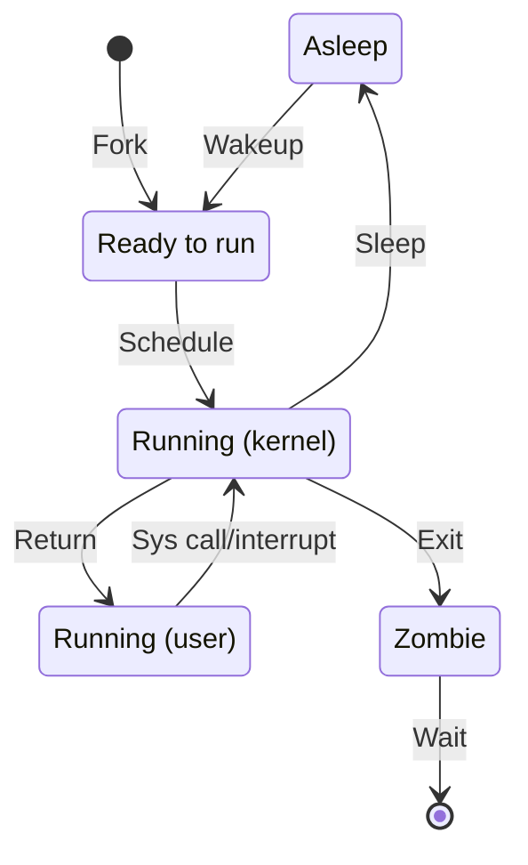

# Process control

## Table of contents

- [1. Components of a process](#1-components-of-a-process)
    - [1.1. Address space](#11-address-space)
    - [1.2. Kernel data structures](#12-kernel-data-structures)
    - [1.3. Threads](#13-threads)
    - [1.4. PIDs and PPIDs](#14-pids-and-ppids)
    - [1.5. Real, effective, and saved IDs](#15-real-effective-and-saved-ids)
    - [1.6. Niceness](#16-niceness)
    - [1.7. Controlling terminal](#17-controlling-terminal)
- [2. The life cycle of a process](#2-the-life-cycle-of-a-process)
    - [2.1. Parents and children](#21-parents-and-children)
    - [2.2. Signals](#22-signals)
    - [2.3. Sending signals](#23-sending-signals)
- [3. Process monitoring](#3-process-monitoring)
    - [3.1. Static monitoring](#31-static-monitoring)
    - [3.2. Interactive monitoring](#32-interactive-monitoring)
- [4. Influencing scheduling priority](#4-influencing-scheduling-priority)
- [5. The proc filesystem](#5-the-proc-filesystem)
- [6. Tracing signals and system calls](#6-tracing-signals-and-system-calls)
- [7. Periodic processes](#7-periodic-processes)
    - [7.1. Structure of timers](#71-structure-of-timers)
    - [7.2. Time expressions](#72-time-expressions)
    - [7.3. Cleaning temporary files](#73-cleaning-temporary-files)
- [Glossary](#glossary)
- [Bibliography](#bibliography)
- [Licenses](#licenses)

## 1. Components of a process

A process represents a running program. A process consists of
- An address space
- A set of data structures within the kernel

### 1.1. Address space

The address space is the range of memory addresses that the kernel makes available for a process

| Segment | Description                                                                                                               |
| ------- | ------------------------------------------------------------------------------------------------------------------------- |
| Stack   | Where automatic variables are stored along with information that is saved each time a function is called (grows downward) |
| Heap    | For dynamic memory allocation (grows upward)                                                                              |
| BSS     | Where uninitialized static variables are stored                                                                           |
| Data    | Where initialized static variables are stored                                                                             |
| Text    | Where instructions live                                                                                                   |

### 1.2. Kernel data structures

A set of data structures that record various pieces of information about the process. Some examples are
- Address space map
- Current status
- Execution priority
- Resource usage
- Open files and network ports
- Signal mask (i.e., a record of which signals are blocked)
- Owner

### 1.3. Threads

A thread is an execution context within a process

Every process has at least one thread, but some processes have many

Each thread has its own stack and CPU context, but it operates within the address space of its enclosing process

Modern computer hardware includes multiple CPUs and, potentially, multiple cores per CPU $\rightarrow$ the threads of a process can run simultaneously on different cores (parallelism)

### 1.4. PIDs and PPIDs

The kernel assigns a PID to every process
- PIDs are assigned in order as processes are created
- Most commands and system calls for process control require a PID to identify the target

There is not a system call that initiates a new process running a particular program. Instead
1. An existing process (parent) clones itself to create a new process (child)
2. The child can then exchange the program it is running for a different one

The PPID of a process is the PID of the parent from which it was cloned

### 1.5. Real, effective, and saved IDs

| ID        | Meaning                                                                                                                                    |
| --------- | ------------------------------------------------------------------------------------------------------------------------------------------ |
| UID       | A copy of the UID of the parent process. Usually, only the creator (aka, the owner) and `root` can control a process. This is for identity |
| EUID      | Most of the time, it is the same as UID. Executable files with set-UID are the usual exception (e.g., `passwd`). This is for permission    |
| Saved UID | A copy of the EUID when the process first begins to execute                                                                                |
| GID       | A copy of the GID of the parent process                                                                                                    |
| EGID      | Most of the time, it is the same as GID. Similar to the EUID, it can be "upgraded" when the set-GID permission is set                      |
| Saved GID | A copy of the EGID when the process first begins to execute                                                                                |

### 1.6. Niceness

Niceness is a value that specifies how nice you are planning to be to other users of the system

The scheduling priority of a process determines how much CPU time the process will receive. The algorithm that the kernel uses to compute priorities takes into account
- The amount of CPU time that a process has recently consumed
- The length of time the process has been waiting to run
- Niceness

### 1.7. Controlling terminal

Most non-daemon processes have a controlling terminal, which
- Determines the default linkages for the standard input, standard output, and standard error channels
- Distributes signals to processes in response to keyboard events

## 2. The life cycle of a process

### 2.1. Parents and children

`fork.py` (see [here](../code/fork.py))

```python
import os
import sys


def main():
    pid = os.fork()

    if pid < 0:
        print("fork failed", file=sys.stderr)
        sys.exit(1)

    if pid == 0:
        try:
            os.execl("/bin/ls", "ls", "-l")
        except Exception as e:
            print(f"exec failed: {e}", file=sys.stderr)
            os._exit(1)

    if pid > 0:
        os.wait()
        print("child done")


if __name__ == "__main__":
    main()
```

---

1. `fork` creates a new process (child) by duplicating the calling process (parent). Although the child and the parent run in different address spaces, at the time of `fork` both spaces have the same content.  The child is an almost exact duplicate of the parent (see exceptions [here](https://man7.org/linux/man-pages/man2/fork.2.html)) 
2. `fork` has the unique properties of returning two different values
    1. From the child's perspective $\rightarrow$ 0
    2. From the parent's perspective $\rightarrow$ child's PID
3. `exec` replaces the program that is currently being run by the calling process with a new program (including stack, heap, etc.)
4. `wait` suspends execution of the calling process until one of its children terminates

---

All processes except kernel daemons are descendants of `systemd` (`PID 1`)

1. When a process completes, it calls `_exit` to notify the kernel it is ready to die and supplies an exit code that tells why it is exiting. By convention, `0` indicates a normal termination
2. Before a dead process can be allowed to disappear completely, the kernel requires that its death be acknowledged by the parent, which receives a copy of the child's exit code (`wait`)
3. This scheme works if parents outlive their children and `wait` for their termination. If a parent dies before its children, the kernel adjusts the orphans to make them children of `systemd`, which performs the `wait` needed to get rid of them when they die

---

`orphan.py` (see [here](../code/orphan.py))

```python
import os
import sys
import time


def main():
    pid = os.fork()

    if pid < 0:
        print("fork failed", file=sys.stderr)
        sys.exit(1)

    if pid == 0:
        print(f"child: pid {os.getpid()}, ppid {os.getppid()}")
        time.sleep(10)
        print(f"child: pid {os.getpid()}, ppid {os.getppid()}")

    if pid > 0:
        time.sleep(5)
        print(f"parent: pid {os.getpid()}, child's pid {pid}")


if __name__ == "__main__":
    main()
```

```shell
$ python orphan.py
child: pid 1266, ppid 1265
parent: pid 1265, child's pid 1266
child: pid 1266, ppid 1
```

---



### 2.2. Signals

A signal is a notification sent to a process that some condition has occurred. Signals can be sent
- Among processes as a means of communication
- By the controlling terminal to kill, interrupt, or suspend processes when some key are pressed
- By an administrator
- By the kernel when a process commits an infractions (e.g., division by zero)
- By the kernel to notify a process of an "interesting" condition (e.g., the death of a child or the availability of data on an I/O channel)

---

When a process receives a signal, one of two things can happen
- If the receiving process has designated a handler routine for that particular signal, the handler is called. When the handler completes, execution restarts from the point at which the signal was received
- Otherwise, the kernel takes some default action on behalf of the process

A process can prevent signals from arriving. Specifically, a signal can be
- Ignored $\rightarrow$ discarded, no effect on the process
- Blocked $\rightarrow$ queued for delivery, but the kernel does not require the process to act on it until the signal is unblocked. When a signal is unblocked, the handler is called only once even if the signal was delivered multiple times while reception was blocked

---

| #   | Name   | Description      | Default   | Dump | Catch | Block |
| --- | ------ | ---------------- | --------- | ---- | ----- | ----- |
| 1   | `HUP`  | Hangup           | Terminate | No   | Yes   | Yes   |
| 2   | `INT`  | Interrupt        | Terminate | No   | Yes   | Yes   |
| 3   | `QUIT` | Quit             | Terminate | Yes  | Yes   | Yes   |
| 9   | `KILL` | Kill             | Terminate | No   | No    | No    |
| 10  | `BUS`  | Bus error        | Terminate | Yes  | Yes   | Yes   |
| 11  | `SEGV` | Segm. fault      | Terminate | Yes  | Yes   | Yes   |
| 15  | `TERM` | Software term.   | Terminate | No   | Yes   | Yes   |
| 17  | `STOP` | Stop             | Stop      | No   | No    | No    |
| 18  | `TSTP` | Keyboard stop    | Stop      | No   | Yes   | Yes   |
| 19  | `CONT` | Cont. after stop | Ignore    | No   | Yes   | No    |
| 30  | `USR1` | User-defined 1   | Terminate | No   | Yes   | Yes   |
| 31  | `USR2` | User-defined 2   | Terminate | No   | Yes   | Yes   |

---

`BUS` and `SEGV` are common when a program crashes, they indicate an attempt to use or access memory improperly

`KILL` and `STOP` cannot be caught, blocked, or ignored
- `KILL` destroys the receiving process
- `STOP` suspends the receiving process until `CONT` is received

`TSTP` (a soft version of `STOP`) is a request to stop. Usually, programs that catch `TSTP` clean up their state and then send `STOP` to themselves to complete the stop operation

`USR1` and `USR2` have no set meaning, programs are free to use them as they like

---

`KILL`, `INT`, `TERM`, `HUP`, and `QUIT` may sound as if they mean almost the same thing, but they did not

| Signal | Meaning                                                                                                                                              |
| ------ | ---------------------------------------------------------------------------------------------------------------------------------------------------- |
| `KILL` | Terminate a process at the kernel level. The receiving process can never handle this signal                                                          |
| `INT`  | Sent by the controlling terminal when the user presses `Ctrl-C`. The receiving process is requested to terminate the current operation               |
| `TERM` | The receiving process is requested to terminate execution completely. It is expected that the receiving process will clean up and exit               |
| `HUP`  | Understood by daemons as a reset request. The receiving daemon re-reads its configuration file and adjusts to changes accordingly without restarting |
| `QUIT` | Similar to `TERM` except that it defaults to producing a core dump if not caught                                                                     |

### 2.3. Sending signals

The `kill` command sends any signal (by default it sends `TERM`). This command can be used by a user on their own process or by `root` on any process

The syntax is `kill [-signal] pid`. For example

```shell
$ kill -9 100
```

`kill` sends the signal `KILL`, whose identifier is `9` (see [§2.2](#22-signals)), to the process identified by `PID 100`

## 3. Process monitoring

### 3.1. Static monitoring

The `ps` command is the main tool for system administrators for process monitoring 

A peculiarity of this command is that `ps` accepts command-line arguments with or without dashes, but it might assign different interpretations to those forms. For example, `ps -a` is not the same as `ps a`

Implementations of `ps` may vary significantly from one vendor to another and some of them have become quite complex over the years. However, this complexity is mainly there for developers. System administrators will typically use `ps` in a few configurations

---

```shell
$ ps aux
USER PID %CPU %MEM   VSZ   RSS TTY STAT START   TIME COMMAND
root   1  0.0  0.6 22108 13172 ?   Ss   11:22   0:02 /sbin/init
root   2  0.0  0.0     0     0 ?   S    11:22   0:00 [kthreadd]

[...]
```

- `a` shows all processes
- `x` shows even processes without a controlling terminal
- `u` selects the user-oriented output

---

| Field     | Description                                                                                         |
| --------- | --------------------------------------------------------------------------------------------------- |
| `USER`    | Username of the process owner                                                                       |
| `PID`     | Process identifier                                                                                  |
| `%CPU`    | Percentage of CPU the process is using                                                              |
| `%MEM`    | Percentage of memory (RAM) the process is using                                                     |
| `VSZ`     | Virtual memory size, i.e., the total amount of memory given to the process in KiB (1024-byte units) |
| `RSS`     | Resident set size, i.e., the actual amount memory (RAM) the process is using in KiB                 |
| `TTY`     | Controlling terminal                                                                                |
| `STAT`    | Current process status                                                                              |
| `TIME`    | CPU time the process has consumed                                                                   |
| `COMMAND` | Command name and arguments                                                                          |

---

`RSS` is the actual amount of RAM that a process is actually using. As memory may be shared by multiple processes (e.g., shared libraries), $\sum_{n}^{N} RSS_n$, where $N$ is the total number of processes running the system, may be greater than the memory available in the system

`%MEM` is a relative measure of the amount of RAM usage of a process compared to the entire system

$$\%MEM = \frac{RSS}{RAM} \times 100$$

`VSZ` is the total memory allocated to a process, including memory that is not actually in RAM (e.g., memory swapped to disk). Therefore, $VSZ \ge RSS$

---

Consider what happens when a process `A` forks a child process `B`

1. `A` executes a `fork`, then `B` moves into a state where is ready to run 
2. The process scheduler eventually picks `B` to be executed
3. `B` completes its part of the `fork`, which happens in kernel space, and then executes in user space
4. After a while, the system clock interrupts the processor, and then the kernel may decide to schedule another process, say `C`
5. Suppose that `C` must wait for the I/O to complete, then `C` puts itself to sleep until the I/O has completed
6. Suppose the system is executing many processes that do not fit simultaneously in memory, that the swapper swaps out `C` to make room for another process 

---

| State | Meaning                                                                                                     |
| ----- | ----------------------------------------------------------------------------------------------------------- |
| `R`   | The process is running or ready to run                                                                      |
| `T`   | The process has received a `STOP` signal                                                                    |
| `S`   | The process is sleeping, waiting for an event to complete                                                   |
| `D`   | The process is sleeping and cannot be interrupted (this usually occurs when the process is waiting for I/O) |
| `Z`   | The process is a zombie, i.e., the process has terminated, but its parent has not yet waited for it         |

---

| Flag | Meaning                                                                      |
| ---- | ---------------------------------------------------------------------------- |
| `W`  | The process is swapped out                                                   |
| `<`  | The process has higher than normal priority                                  |
| `N`  | The process has lower than normal priority                                   |
| `L`  | The process has some memory pages locked into memory. This prevents swapping |
| `s`  | The process is a session leader                                              |

---

System administrators frequently need to find out the PID of a process

```shell
$ ps aux | grep -v grep | grep bash
ubuntu 3129 0.0 0.2 9060 5376 pts/0 Ss 15:06 0:00 -bash
```

```shell
$ pidof bash
3129
```

```shell
$ pgrep bash
3129
```

### 3.2. Interactive monitoring

`ps` shows a snapshot of the system. `top` is a sort of real-time version of `ps`. Specifically, `top`
- Updates the view periodically (~ 3 s)
- Displays the most CPU-consumptive processes at the top of the list
- Accepts inputs from keyboard to send signals or renice processes

---

```shell
$ top
top - 18:09:15 up 20:45, 1 user, load average: 0.00, 0.00, 0.00
Tasks: 93 total, 1 running, 92 sleeping, 0 stopped, 0 zombie
%Cpu(s): 0.3 us, 0 sy, 0 ni, 99.7 id, 0 wa, 0 hi, 0.0 si, 0 st
MiB Mem: 1968.1 total, 1242 free, 297.7 used, 586.8 buff/cache
MiB Swap: 0.0 total, 0.0 free, 0.0 used. 1670.4 avail Mem
PID USER   PR NI VIRT   RES  SHR  S %CPU %MEM TIME+   COMMAND
686 syslog 20 0  222508 6144 4608 S 0.3  0.3  0:00.73 rsyslogd
350 ubuntu 20 0  12372  5760 3584 R 0.3  0.3  0:00.89 top

[...]
```

---

The 1st line provides system-level statistics

| Field                           | Meaning                                                                              |
| ------------------------------- | ------------------------------------------------------------------------------------ |
| `18:09:15`                      | Current system time                                                                  |
| `up 20:45`                      | The system has been running for `20` hours and `45` minutes                          |
| `1 user`                        | There is `1` user logged into the system                                             |
| `load average 0.00, 0.00, 0.00` | The system load over the last 1, 5, and 15 minutes. `0.00` means the system was idle |

---

The 2nd line (`Tasks`) provides process-level statistics

| Field         | Meaning                      |
| ------------- | ---------------------------- |
| `93 total`    | Total number of processes    |
| `1 running`   | Number of running processes  |
| `92 sleeping` | Number of sleeping processes |
| `0 stopped`   | Number of stopped processes  |
| `0 zombie`    | Number of zombie processes   |

---

The 3rd line provides (`%Cpu(s)`) CPU-level statistics (press `1` to switch to per-core statistics)

| Field     | Meaning                                                       |
| --------- | ------------------------------------------------------------- |
| `0.3 us`  | % of CPU time spent for processes in user space               |
| `0 sy`    | % of CPU time spent for processes in kernel space             |
| `0 ni`    | % of CPU time spent for lower-than-default priority processes |
| `99.7 id` | % of CPU time spent doing nothing (idle time)                 |
| `0 wa`    | % of CPU time spent waiting for I/O operations                |
| `0 hi`    | % of CPU time spent handling hardware interrupts              |
| `0 si`    | % of CPU time spent handling software interrupts              |
| `0 st`    | % of CPU time "stolen" by the hypervisor                      |

---

The 4th line (`MiB Mem`) provides RAM-level statistics

| File               | Meaning                                                                                                                               |
| ------------------ | ------------------------------------------------------------------------------------------------------------------------------------- |
| `1968.1 total`     | Total memory (`1968.1` MiB)                                                                                                           |
| `1242 free`        | Free memory (`1242` MiB)                                                                                                              |
| `297.7 used`       | Memory used by running processes (`297.7` MiB)                                                                                        |
| `586.8 buff/cache` | Memory used by the kernel to optimize I/O operations (`buff`) or access to files (`cache`). This memory can be reclaimed if necessary |

---

The 5th line (`MiB Swap`) provides swapped-memory-level statistics

| Field              | Meaning                                                                             |
| ------------------ | ----------------------------------------------------------------------------------- |
| `0.0 total`        | Total swap space available                                                          |
| `0.0 free`         | Free swap space                                                                     |
| `0.0 used`         | Used swap space                                                                     |
| `1670.4 avail Mem` | Estimated memory available, including the memory that is reclaimable (`buff/cache`) |

---

| Field     | Meaning                                                                                                  |
| --------- | -------------------------------------------------------------------------------------------------------- |
| `PID`     | Process identifier                                                                                       |
| `USER`    | Effective username of the process owner                                                                  |
| `PR`      | Scheduling priority                                                                                      |
| `NI`      | Nice value                                                                                               |
| `VIRT`    | Same as `VSZ` (in KiB)                                                                                   |
| `RES`     | Same as `RSS` (in KiB)                                                                                   |
| `SHR`     | Shared memory size, i.e., a subset of `RES` that may be used by other processes (e.g., shared libraries) |
| `S`       | Process state                                                                                            |
| `%CPU`    | Percentage of CPU the process is using                                                                   |
| `%MEM`    | Percentage of memory (RAM) the process is using                                                          |
| `TIME`    | CPU time the process has consumed                                                                        |
| `COMMAND` | Command name and arguments                                                                               |

## 4. Influencing scheduling priority

As mentioned in [§1.6](#16-niceness), the niceness of a process is a numeric hint to the kernel about how the process should be treated in relation to other processes
- The higher the niceness, the lower the priority—you are going to be nice
- In Linux, the range of allowable nice values is -20 to +19
- Unless the user takes special action, a newly created process inherits the niceness of its parent process
- The process owner can increase the niceness, but not lower it
- `root` can set nice values arbitrarily

---

The `nice` command is to set niceness at creation time, while `renice` is to adjust niceness while the process is already running

```shell
$ nice -n 10 python app.py
$ ps -p 5155 -o pid,ni,cmd
 PID  NI CMD
5155  10 python app.py
```

---

```shell
$ renice --priority 15 5155
5155 (process ID) old priority 10, new priority 15
$ ps -p 5155 -o pid,ni,cmd
 PID  NI CMD
5155  15 python app.py
$ renice --priority 10 5155
renice: failed to set priority for 5155 (process ID): Permission denied
$ sudo renice --priority 10 5155
5155 (process ID) old priority 15, new priority 10
```

## 5. The proc filesystem

`ps` and `top` read information from the `/proc` directory, which is a pseudo-filesystem that provides an interface to kernel data structures
- Most files are read-only
- Those files that are writable change kernel variables

`/proc` lives in RAM (pseudo-filesystem), it does not occupy space on disk

```shell
$ du -sh /proc
0       /proc
```

---

Process-specific information is divided into subdirectories named by PID. For example, `/proc/1` is always the directory that contains information about `systemd`. The following are the most useful per-process files

| File      | Content                                                                |
| --------- | ---------------------------------------------------------------------- |
| `cgroup`  | The control groups to which the process belongs                        |
| `cmdline` | Complete command line of the process                                   |
| `cwd`     | Symbolic link to the current directory of the process                  |
| `environ` | Environment variables of the process                                   |
| `exe`     | Symbolic link to the file being executed                               |
| `fd`      | Subdirectory containing links for open file descriptor                 |
| `fdinfo`  | Subdirectory containing further info for each open file descriptor     |
| `maps`    | Memory layout of the process                                           |
| `ns`      | Subdirectory with links to each namespace used by the process          |
| `root`    | Symbolic link to the root directory of the process (set with `chroot`) |
| `stat`    | General process status information (best decoded with `ps`)            |
| `statm`   | Memory usage information                                               |

## 6. Tracing signals and system calls

It is often difficult to figure out what a process is actually doing. The first step is generally to make a guess based on indirect data collected from the filesystem, logs, and tools (e.g., `ps`)

The `strace` command comes into play when such sources of information prove insufficient. `strace` displays 
- System calls made by a process, as well as arguments and result codes
- Signals that a process receive

---

`cpu_logger.py` (see [here](../code/cpu-logger/app.py)):

```shell
$ sudo strace -p 5360
strace: Process 5360 attached
clock_nanosleep(CLOCK_MONOTONIC, [...], NULL) = 0
openat(AT_FDCWD, "/proc/stat", O_RDONLY|O_CLOEXEC) = 3
fstat(3, {st_mode=S_IFREG|0444, st_size=0, ...}) = 0
lseek(3, 0, SEEK_CUR)                   = 0
read(3, "cpu  6421 1370 6067 13140802 862"..., 32768) = 780
close(3)                                = 0
write(1, "1742205790.180012 - 1.0", 23) = 23
write(1, "\n", 1)                       = 1

[...]
```

---

1. `clock_nanosleep`: Suspend the process for a while. Return `0`, which means success
2. `openat`: Open `/proc/stat` in read-only (`O_RDONLY`) and ensure the file is closed on `exec` (`O_CLOEXEC`). `AT_FDCWD` indicates to consider the path from the current working directory. However, the path is absolute, so the kernel ignores `AT_FDCWD`. Return `3`, which is the file descriptor
3. `fstat`: Verify that file descriptor `3` is a regular file (`S_IFREG`), readable (`0444`), and empty (`0`). Return `0`, which means success
4. `lseek`: Return the current pointer position, i.e., `0`
5. `read`: Read from `3` up to `32768` bytes. `"cpu  6421 1370 6067 13140802 862"...` is the actual content being read. Return `780`, which is the number of bytes actually read
6. `close`: Close file descriptor `3`. Return `0`, which means success
7. `write`: Write `"1742205790.180012 - 1.0"` (`23` bytes) to STDOUT (file descriptor `1`). Return `23`, which is the number of bytes actually written
8. `write`: Write `"\n"` (`1` byte) to STDOUT (file descriptor `1`). Return `1`, which is the number of bytes actually written

## 7. Periodic processes

It's often useful to have a program executed without any human intervention on a predefined schedule. The traditional tool for running programs on a predefined schedule is the `cron` daemon. `cron` starts when the system boots and runs as long as the system is up

`systemd` can also be used to run periodic processes. In fact, `systemd` includes the concept of timers, which activate a given `systemd` service on a predefined schedule

Some Linux distributions have abandoned `cron` entirely in favor of `systemd`. However, most distributions continue to include `cron` and to run it by default. Unfortunately, there is no standard. Software packages add their jobs to a random system of their own choice. Always check both systems 

### 7.1. Structure of timers

A `systemd` timer comprises two [unit files](6-booting-and-system-management-daemons.md#21-units-and-unit-files) 
- A timer unit that describes the schedule and the unit to activate
- A service unit that specifies the details of what to run

| Type                | Meaning                                                   |
| ------------------- | --------------------------------------------------------- |
| `OnActiveSec`       | Relative to the time at which the timer was started       |
| `OnBootSec`         | Relative to system boot time                              |
| `OnStartupSec`      | Relative to the time at which `systemd` was started       |
| `OnUnitActiveSec`   | Relative to the time the specified unit was last active   |
| `OnUnitInactiveSec` | Relative to the time the specified unit was last inactive |
| `OnCalendar`        | A specific day and time                                   |

### 7.2. Time expressions

| Time units          | Accepted syntax                     |
| ------------------- | ----------------------------------- |
| Microseconds        | `usec` and `us`                     |
| Milliseconds        | `msec` and `ms`                     |
| Seconds             | `seconds`, `second`, `sec`, and `s` |
| Minutes             | `minutes`, `minute`, `min`, and `m` |
| Hours               | `hours`, `hour`, `hr`, and `h`      |
| Days                | `days`, `day`, and `d`              |
| Weeks               | `weeks`, `week`, and `w`            |
| Months (30.44 days) | `months`, `month`, and `M`          |
| Years (365.25 days) | `years`, `year`, and `y`            |

---

Time expressions can be relative, such as

```
OnBootSec=2h 1m 
OnStartupSec=1week 2days 3hours 
OnActiveSec=1hr20m30sec10msec
```

`systemd-analyze timespan` parses timings and outputs the normalized form and the equivalent value in microseconds

```shell
$ systemd-analyze timespan 2M1hour2minutes120s
Original: 2M1hour2minutes120s
      μs: 5263440000000
   Human: 2month 1h 4min
```

---

Timers can also be scheduled at specific times (with `OnCalendar`), such as
- `2025-07-04`: July 4, 2025 at 00:00:00
- `Mon..Fri *-7-4`: July 4 each year at 00:00:00, but only if it falls from Monday to Friday
- `Mon,Tue *-7-4 12:30:00`: July 4 each year at 12:30:00, but only if it falls on Monday or Tuesday
- `weekly`: Mondays at 00:00:00
- `monthly`: The 1st day if the month at 00:00:00
- `*:0/10`: Every 10 minutes, starting at the 0th minute of each hour

---

`systemd-analyze calendar` parses calendar time events and outputs the normalized form and calculates when they elapse next

```shell
$ systemd-analyze calendar 'Mon,Tue *-7-4 12:30:00'
  Original form: Mon,Tue *-7-4 12:30:00
Normalized form: Mon,Tue *-07-04 12:30:00
    Next elapse: Tue 2028-07-04 12:30:00 UTC
       From now: 3 years 3 months left
```

---

```shell
$ systemd-analyze calendar '*:0/10' --iteration=5
  Original form: *:0/10
Normalized form: *-*-* *:00/10:00
    Next elapse: Mon 2025-03-17 13:50:00 UTC
       From now: 7min left
   Iteration #2: Mon 2025-03-17 14:00:00 UTC
       From now: 17min left
   Iteration #3: Mon 2025-03-17 14:10:00 UTC
       From now: 27min left
   Iteration #4: Mon 2025-03-17 14:20:00 UTC
       From now: 37min left
   Iteration #5: Mon 2025-03-17 14:30:00 UTC
       From now: 47min left
```

### 7.3. Cleaning temporary files

The following is the `systemd` timer that cleans up temporary files once a day

```shell
$ systemctl list-timers
NEXT         Mon 2025-03-17 21:39:20 UTC            
LEFT         7h 
LAST         Sun 2025-03-16 21:39:20 UTC       
PASSED       16h ago 
UNIT         systemd-tmpfiles-clean.timer   
ACTIVATES    systemd-tmpfiles-clean.service
```

---

```shell
$ cat /usr/lib/systemd/system/systemd-tmpfiles-clean.timer
[Unit]
Description=Daily Cleanup of Temporary Directories
Documentation=man:tmpfiles.d(5) man:systemd-tmpfiles(8)
ConditionPathExists=!/etc/initrd-release

[Timer]
OnBootSec=15min
OnUnitActiveSec=1d
```

`ConditionPathExists` makes sure the timer does not run if `/etc/initrd-release` exists, which is a temporary root filesystem used during the early stages of booting

---

As this timer unit does not specify which service unit to run, `systemd` automatically looks for a service unit that has the same name as the timer unit

```shell
$ cat /usr/lib/systemd/system/systemd-tmpfiles-clean.service
[Unit]
Description=Cleanup of Temporary Directories

[...]

[Service]
ExecStart=systemd-tmpfiles --clean

[...]
```

## Glossary

| Term                                     | Meaning                                                                                                                                                                               |
| ---------------------------------------- | ------------------------------------------------------------------------------------------------------------------------------------------------------------------------------------- |
| Address space (or virtual address space) | The range of memory addresses that the kernel makes available for a process                                                                                                           |
| Automatic variable                       | A variable that is created when a function is called and destroyed when it returns. Automatic variables are stored on the stack                                                       |
| Control group                            | A Linux feature that allows processes to be organized into hierarchical groups whose usage of various types of resources can then be limited and monitored                            |
| Core dump                                | A file containing the address space (memory) of a process when the process terminates unexpectedly                                                                                    |
| Dynamic variable                         | A variable whose memory is manually allocated at runtime and must be manually freed. Dynamic variables are stored on the heap                                                         |
| File descriptor                          | A reference to an open file description                                                                                                                                               |
| Namespace                                | A namespace wraps a global system resource in an abstraction that makes it appear to the processes within the namespace that they have their own isolated instance of that resource   |
| Open file description                    | An entry in the system-wide table of open files that records the file offset and the file status flags                                                                                |
| Orphan                                   | A process that has not terminated yet, but whose parent has already terminated                                                                                                        |
| Parent process identifier (PPID)         | The PID of the parent from which a process was forked                                                                                                                                 |
| Process                                  | An abstraction that represents a program in execution                                                                                                                                 |
| Process data structures                  | Data structures maintained by the kernel that provide information about a process                                                                                                     |
| Process group                            | A collection of one or more processes that can receive signals from the same terminal                                                                                                 |
| Process identifier (PID)                 | Unique identification number assigned by the kernel to a process                                                                                                                      |
| Session                                  | A collection of one or more process groups                                                                                                                                            |
| Session leader                           | The first process in a session                                                                                                                                                        |
| Static variable                          | A variable whose lifetime is the entire run of the program. Initialized static variables are stored in the data segment. Uninitialized static variables are stored in the BSS segment |
| Swapping                                 | When the kernel moves a process from RAM to disk                                                                                                                                      |
| Symbolic link                            | A special type of file whose content is a string that is the pathname of another file, i.e., the file to which the link refers                                                        |
| Thread                                   | An execution context within a process                                                                                                                                                 |
| Zombie                                   | A process that has terminated, but whose parent has not yet waited for it                                                                                                             |

## Bibliography 

| Author                   | Title                                                                                                                       | Year |
| ------------------------ | --------------------------------------------------------------------------------------------------------------------------- | ---- |
| Bach, M.                 | [The Design of the UNIX Operating System](https://dl.acm.org/doi/10.5555/8570)                                              | 1986 |
| Kerrisk, M.              | [The Linux Programming Interface](https://man7.org/tlpi)                                                                    | 2010 |
| Stevens, R. and Rago, S. | [Advanced Programming in the UNIX Environment](https://www.oreilly.com/library/view/advanced-programming-in/9780321638014/) | 2013 |
| Nemeth, E. et al.        | [UNIX and Linux System Administration Handbook](https://www.admin.com/)                                                     | 2018 |
| Community                | [Wikipedia](https://en.wikipedia.org/)                                                                                      | 2025 |

## Licenses

| Content | License                                                                                                                       |
| ------- | ----------------------------------------------------------------------------------------------------------------------------- |
| Code    | [MIT License](https://mit-license.org/)                                                                                       |
| Text    | [Creative Commons Attribution-NonCommercial-ShareAlike 4.0 International](https://creativecommons.org/licenses/by-nc-sa/4.0/) |
